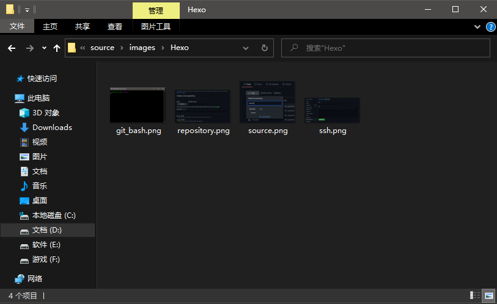
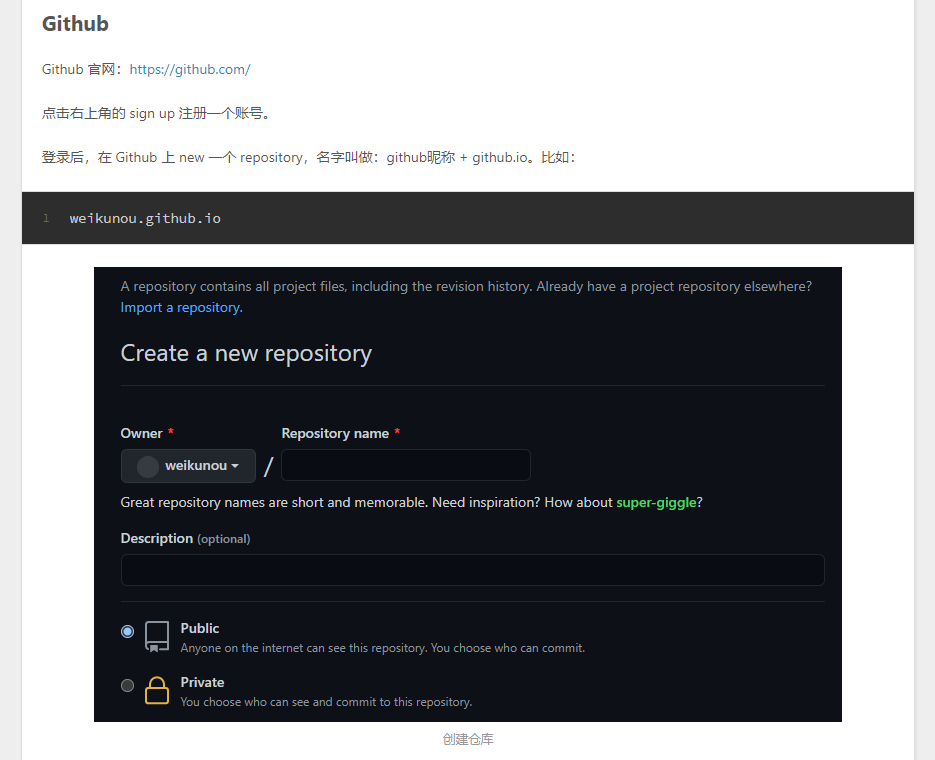

在写文章的过程中，有时需要插入图片。

如果直接在 Markdown 文件中使用相对路径引用图片，当网站发布时，首页显示了图片，文章页面却不会显示图片。

经过一番探索和尝试，我使用以下的方法插入图片。

<!--more-->

首先，在 source 文件夹下创建一个 images 文件夹。

为了便于分类，在 images 文件夹下，还有一个 Hexo 文件夹，表示这个文件夹下的图片是 Hexo.md 这篇文章使用的。



接着，在 Typora 编辑器中插入图片，例如

```

```

在输入图片路径时，要使用 / 而不是 \，虽然两种写法在 Typora 编辑器中都可以显示图片，但是在 Hexo 发布时却会导致路径出现问题。

另外，图片和文件夹的名称也不能带有连字符 - ，因为这个符号同样会让图片显示不出来。

然后，安装一个插件。这个插件也是为了让文章被渲染后的图片路径变得正常。

```
$ npm install hexo-renderer-marked --save
```

在 config.yml 里配置一下，找到 Writing 这个标题下，新增字段

```
marked:
  prependRoot: true
```

还要检查一下 URL 这个标题下，root 字段是否是一个斜杠

```
root: /
```

这个 prependRoot 字段的作用是，在图片的路径前，加上 root 设置的路径。

在这里，因为我设置的图片路径是

```

```

按照上述的配置，生成的页面的图片路径就会变成

```

```

原本发布后，文章页面的图片路径应该是

```
http://localhost:4000/2021/01/26/images/Hexo/repository.png
```

就是路径的问题导致文章页面的图片显示不出来，而配置后的路径则是

```
http://localhost:4000/images/Hexo/repository.png
```

路径正确，图片也就正常地显示出来了。

不过此处有个小问题，就是按照上述流程配置后，文章的图片还是显示不出来，经过测试发现，需要在文章里写一次

```
<!--more--> // 首页会出现 Read More 的按钮，隐藏后面的内容
```

然后神奇的是，图片正常显示了。

之后，即使把这个代码去掉，图片也是正常显示的。

可能是这个插件的某个地方出了问题吧。

如果直接写

```
<!--more-->
```

也是显示不出来的，还是需要先安装插件，配置 config.yml，再写 Read More 的代码才行。

最后，生成一下页面。

```
$ hexo g
```

在本地测试一下，可以看到图片已经显示出来了。

```
$ hexo s
```

