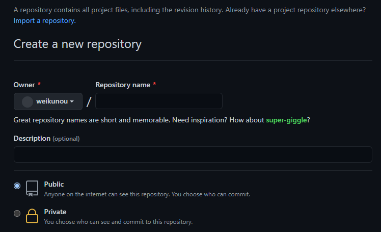

在写文章的过程中，有时需要插入图片。

如果直接在 Markdown 文件中引用图片，当网站发布时，却不会显示图片。

经过一番探索和尝试，我使用以下的方法插入图片。

<!--more-->

首先，在 source 文件夹下创建一个 images 文件夹。

为了便于分类，在 images 文件夹下，还有一个 Hexo 文件夹，表示这个文件夹下的图片是 Hexo.md 这篇文章使用的。


接着，在 Typora 编辑器中插入图片，例如

```

```

在输入图片路径时，要使用 / 而不是 \，虽然两种写法在 Typora 编辑器中都可以显示图片，但是在 Hexo 发布时却会导致路径出现问题。

然后，安装一个插件。这个插件也是为了让文章被渲染后的图片路径变得正常。

```
$ npm install hexo-renderer-marked --save
```

最后，生成一下页面。

```
$ hexo g
```

在本地测试一下，可以看到图片已经显示出来了。

```
$ hexo s
```

