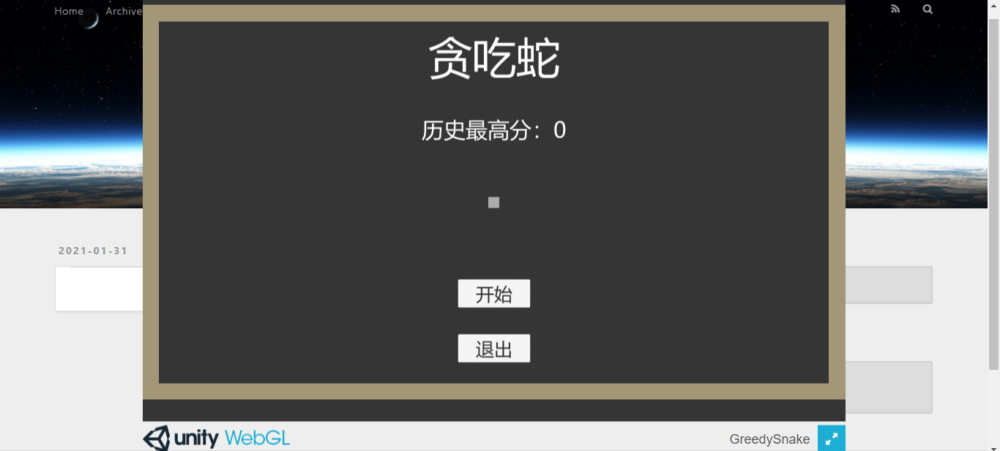
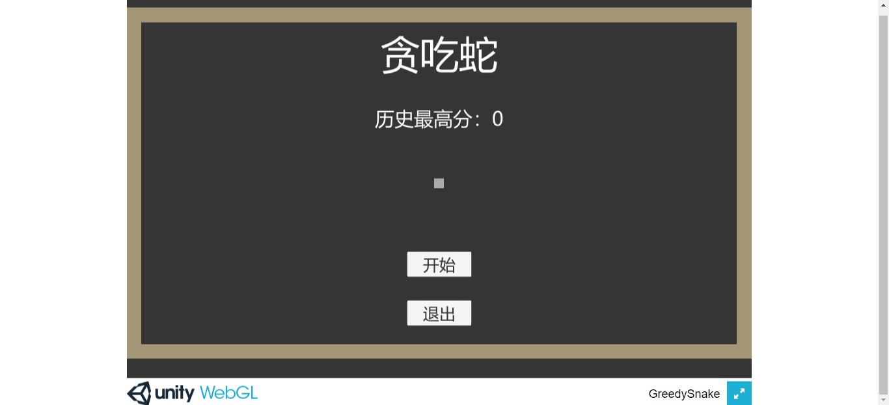

在文章中引入超链接，直接在 Typora 中写

```
[GreedySnake](../WebGL/GreedySnake/index.html)
```

这里的文件夹层级是，_posts 和 WebGL 都放在 source 里。

和插入图片一样，首页显示了链接，并且可以正常打开，而文章页面却不能正常打开，找不到页面。

同样是路径的问题。

<!--more-->

在 Hexo-Image 这篇文章中，我使用了 hexo-renderer-marked 这个插件修改网站发布后的图片的路径。

不过，超链接这一块，我还没有找到合适的插件去修正。

所以这里就先用一个土方法，自己在路径前加上很多个 ../ 。

```
[GreedySnake](../../../../WebGL/GreedySnake/index.html)
```

加多少个，要看文件夹的层级，根据实际情况去选择。这里我加上了三个 ../ ，因为我的文章页面的上级目录，有年月日三个层级。

这样，文章页面的超链接路径就会回到根目录下去找 WebGL 这个文件夹，而主页同样是在根目录下找，因为根目录已经没有上级目录了，所以加多少个 ../ 也没关系（好像有点矛盾了）。

不过，我觉得这个方法并不是最好的，以后估计会找到更好的解决方案吧。

另外，超链接的路径里不能有空格，如果有空格，超链接会变成 p 标签。

还有一个问题，就是 index.html 在发布时会被渲染，导致页面出现某些问题。比如，我打开的链接是 Unity WebGL 的页面，这个页面会直接在我的网站背景上显示，而不是打开一个新的页面。



所以还需要去到 config.yml 文件里，找到 skip_render，让一些页面跳过渲染。

```
skip_render:
  - 'README.md'
  - 'WebGL/GreedySnake/*.html'
```

参数前加的连字符 - 是 yml 的数组写法。这里我添加了 GreedySnake 下的所有 html 文件。

清理一下数据库，清理之前，如果 public 文件夹下的有需要保存的东西，比如 README.md，需要先备份一下，因为清理的命令也会把 public 文件夹给删除。

```
$ hexo clean
```

重新启动本地服务器，会发现，WebGL 页面已经在新页面打开了。

