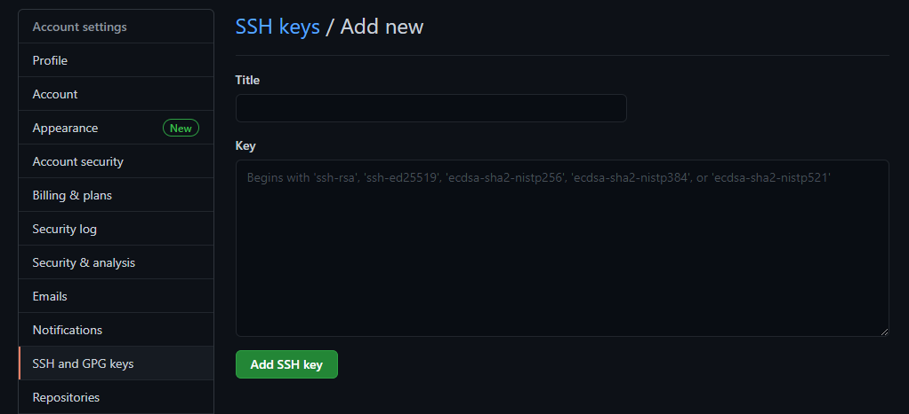

Hexo 是一个网站框架，可以快速地搭建一个属于自己的网站。

下面介绍一下我的搭建过程。

<!--more-->

# 准备

- 注册一个 Github 账号并创建远程仓库
- 安装 Git
- 安装 node.js
- 配置 SSH Key

## Github

Github 官网：https://github.com/

点击右上角的 sign up 注册一个账号。

登录后，在 Github 上 new 一个 repository，名字叫做：github昵称 + github.io。比如：

```
weikunou.github.io
```


创建好之后，点击分支按钮，输入 source，创建一个新的分支，用于存储源文件。


而默认的 main 分支是用来存储发布后的静态页面文件的。

## 安装

Git 官网： https://git-scm.com/

Node.js 官网：https://nodejs.org/zh-cn/

## SSH Key

这个是用来提交代码到远程仓库的密钥，可以安全地将本地文件上传到 Github 服务器。

打开 Git Bash，输入如下代码，先检查一下本机是否已经有 SSH Key：

```
$ cd ~/. ssh
```

如果提示 No such file or directory 则说明没有 SSH Key。

那么，输入如下代码创建 SSH Key：

```
$ ssh-keygen -t rsa -C "注册 Github 的邮箱地址"
```

如果保持默认设置，可以直接连续按回车键。完成配置后，打开 C 盘里的用户文件夹，可以看到一个 .ssh 的文件夹，用文本编辑器打开 id_rsa.pub，复制所有的内容。

回到 Github 主页，点击右上角的头像，点击 Settings，进入设置页面，找到 SSH and GPG keys，点击 New SSH key 按钮，Title 可以随意起，把复制的内容粘贴到 Key 的文本框内，最后点击 Add SSH key。



然后，测试一下是否配置成功。回到 Git Bash 面板，输入代码：

```
$ ssh -T git@github.com
```

如果有提示

```
Hi weikunou! You've successfully authenticated, but GitHub does not provide shell access.
```

就说明已经配置成功了。

另外，还需要配置一下 Git 的用户名和邮箱，用来记录每次提交代码的人是谁。

```
$ git config --global user.name "github 用户名"
$ git config --global user.email "github 注册邮箱"
```

# Hexo

## 安装

在 Git Bash 窗口（或者 cmd 命令提示符窗口），输入

```
$ npm install -g hexo
```

就安装好了 Hexo。

## 使用

在电脑的某个盘上准备好要存放 Hexo 的文件夹。

然后在 Git Bash 窗口下转到目录，比如 D 盘上的 Projects 文件夹下的 Hexo 子文件夹。这个文件夹必须是空的，否则会报错。

```
$ cd /d/Projects/Hexo
```

然后执行 Hexo 命令

```
$ hexo init
```

此时 Hexo 文件夹下就有了一些文件。耐心等待一段时间，Hexo 会自动安装 node_modules 依赖包，如果没有发现这个文件夹，那么可以输入

```
$ npm install
```

手动安装 node_modules 依赖包。

接下来，执行

```
$ hexo server
```

启动服务，然后打开浏览器，在地址栏输入 http:// localhost:4000/ 即可打开网站。