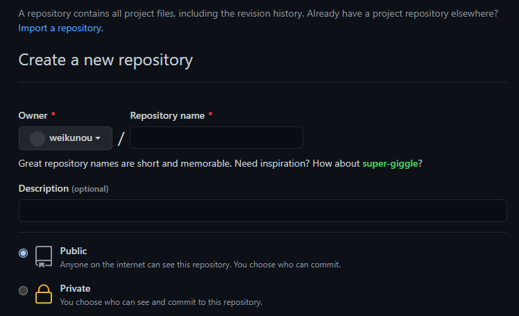

Hexo 是一个网站框架，可以快速地搭建一个属于自己的网站。

下面介绍一下我的搭建过程。

# 准备

- 注册一个 Github 账号并创建远程仓库
- 安装 Git
- 安装 node.js
- 配置 SSH Key

## Github

Github 官网：https://github.com/

点击右上角的 sign up 注册一个账号。

登录后，在 Github 上 new 一个 repository，名字叫做：github昵称 + github.io。比如：

```
weikunou.github.io
```



创建好之后，点击分支按钮，输入 source，创建一个新的分支，用于存储源文件。


而默认的 main 分支是用来存储发布后的静态页面文件的。

## 安装

Git 官网： https://git-scm.com/

Node.js 官网：https://nodejs.org/zh-cn/

## SSH Key

这个是用来提交代码到远程仓库的密钥，可以安全地将本地文件上传到 Github 服务器。

打开 Git Bash，输入如下代码，先检查一下本机是否已经有 SSH Key：

```
cd ~/. ssh
```

如果提示 No such file or directory 则说明没有 SSH Key。

那么，输入如下代码创建 SSH Key：

```
ssh-keygen -t rsa -C "注册 Github 的邮箱地址"
```

如果保持默认设置，可以直接连续按回车键。完成配置后，打开 C 盘里的用户文件夹，可以看到一个 .ssh 的文件夹，用文本编辑器打开 id_rsa.pub，复制所有的内容。