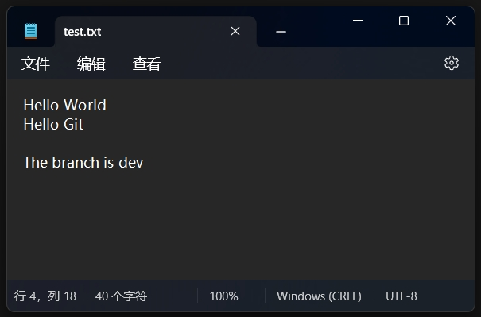
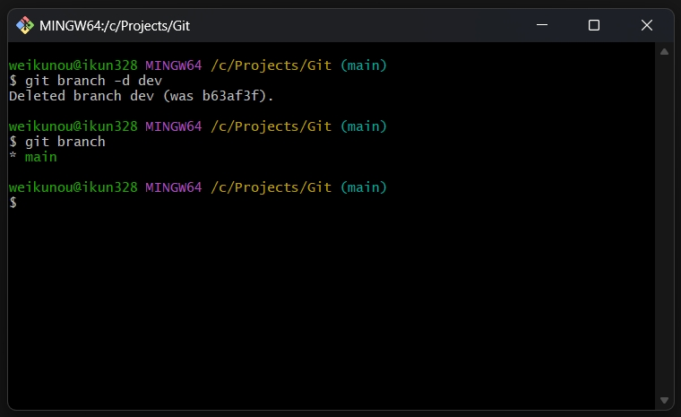
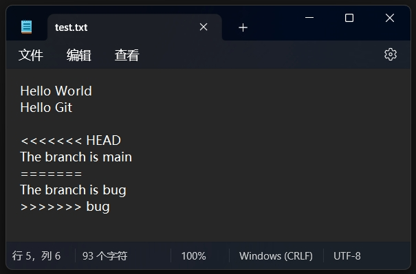
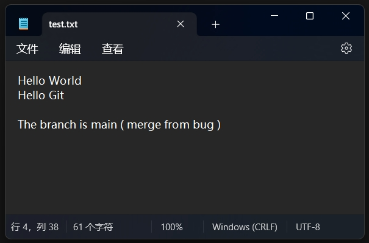
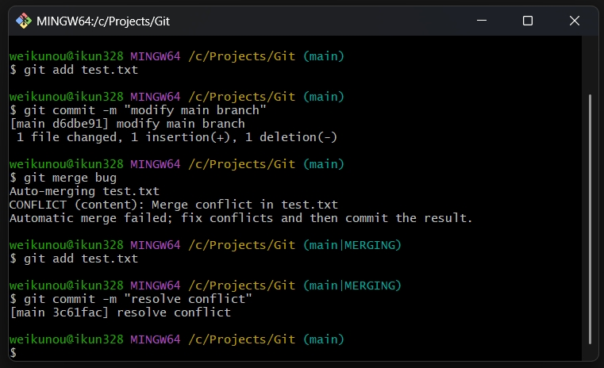

Git 入门笔记 分支

<!--more-->

# Git 分支管理

Git 分支是版本控制中最强大的功能之一，它允许开发者在不影响主线开发的情况下进行并行开发。

本文将详细介绍 Git 分支的概念和常用操作。

## 分支基础

### 什么是分支
分支本质上是指向提交对象的可变指针。

Git 默认分支名称是 `master`（现在推荐使用 `main`）。

每次提交，分支指针都会自动向前移动。

### 基本命令
- 创建分支：`git branch 分支名`
- 切换分支：`git checkout 分支名` 或 `git switch 分支名`
- 创建并切换：`git checkout -b 分支名` 或 `git switch -c 分支名`
- 查看所有分支：`git branch`
- 删除分支：`git branch -d 分支名`
- 丢弃修改：`git checkout -- 文件名`

### 合并分支

合并分支使用以下命令：

- 合并指定分支到当前分支：`git merge 分支名`
- 使用快进模式合并：`git merge --ff 分支名`
- 禁用快进模式合并：`git merge --no-ff -m "合并信息" 分支名`
- 终止合并：`git merge --abort`

合并分支时，默认使用快进模式进行合并，删除分支后，会丢掉分支信息。

如果禁用快进模式，在合并时会产生一个新的提交，需要填写提交信息，可以写明是从哪个分支合并过来的。

合并时可能会遇到冲突，需要手动解决冲突后再提交。

### 解决冲突

当两个分支修改了同一个文件的同一部分时，Git 无法自动合并，会产生冲突。

冲突文件会包含如下标记：

```plaintext
<<<<<<< HEAD
当前分支的内容
=======
要合并分支的内容
>>>>>>> branch-name
```

解决冲突的步骤：

1. 打开冲突文件，找到冲突位置（由上述标记标识）
2. 决定保留哪些内容，删除冲突标记
3. 添加修改后的文件到暂存区：`git add 文件名`
4. 提交更改：`git commit -m "解决冲突"`

## 分支操作实践

### 创建和查看分支

查看分支：

```sh
git branch
```

当前只有一个 main 分支。

创建并切换到 dev 分支：

```sh
git checkout -b dev
```

再次查看分支：

```sh
git branch
```

可以看到当前有两个分支 dev 和 main，并且 dev 前面有个 * 号，表示当前处于 dev 分支。


### 修改分支内容及合并

修改文本内容，添加 The branch is dev



提交修改的内容：

```sh
git add test.txt
git commit -m "modify dev branch"
```

切换回 main 分支：

```sh
git checkout main
```

把 dev 分支合并到当前 main 分支：

```sh
git merge dev
```

可以看到 merge 的时候，显示的是 Fast-forward，表示这次合并很顺利，使用了快进模式。


此时可以删掉 dev 分支，保持分支整洁：

```sh
git branch -d dev
```

再次查看分支：

```sh
git branch
```

可以看到，已经没有 dev 分支了，只剩下一个 main 分支。



### 合并时产生冲突并解决

创建并切换到 bug 分支：

```sh
git checkout -b bug
```

修改文本内容为 The branch is bug


然后提交本次修改：

```sh
git add test.txt
git commit -m "modify bug branch"
```


切换到 main 分支，同样修改文本内容，并提交。

```sh
git checkout main
```


```sh
git add test.txt
git commit -m "modify main branch"
```

此时 bug 分支和 main 分支都对同一行文本进行了修改，并且在各自的分支上提交了。

现在执行合并，把 bug 分支合并到当前的 main 分支上。

```sh
git merge bug
```

可以看到，现在产生了一个冲突，不能自动合并提交了。


文本的内容也出现了标记。

```plaintext
<<<<<<< HEAD 下面的内容是当前 main 分支的内容

======= 是分隔行

>>>>>>> bug 上面的内容是要合并过来的 bug 分支的内容
```



现在需要手动修改这个文本，把认为正确的内容写上去，并删除标记。



然后把这次修改冲突的内容提交：

```sh
git add test.txt
git commit -m "resolve conflict"
```

可以看到，在提交的过程中，main 分支后面显示 MERGING，表示正在进行合并，提交后就没有这个状态了。



如果产生冲突的时候，不想解决，而是想取消这次合并，恢复到原来的样子，可以使用以下命令：

```sh
git merge --abort
```

这样也可以消除 MERGING 状态和冲突。
