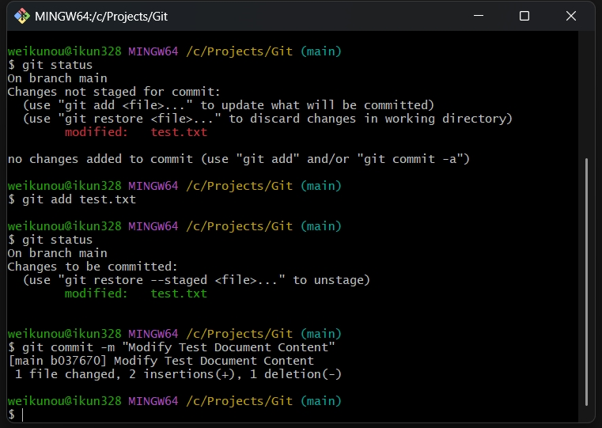
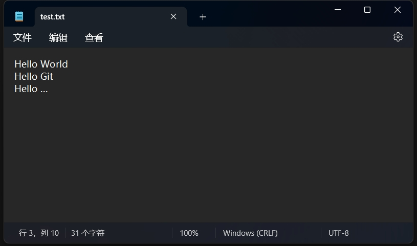
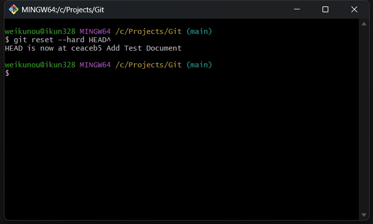
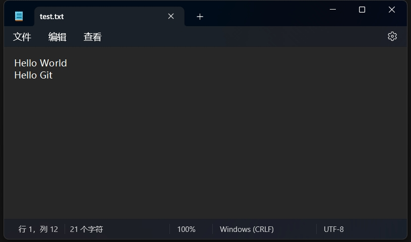

Git 入门笔记

<!--more-->

# Git 入门

Git 是一个分布式版本控制系统，广泛用于软件开发中。

它可以帮助开发者跟踪代码的变化，协作开发，并管理项目的不同版本。

## 安装 Git

### 在 Windows 上安装

1. 下载 Git 安装程序：[Git for Windows](https://git-scm.com/downloads/win)
2. 运行下载的安装程序，并按照提示完成安装。

### 在 macOS 上安装

1. 打开终端。
2. 输入以下命令并按回车：
    ```sh
    brew install git
    ```
    这将使用 Homebrew 包管理器安装 Git。

### 在 Linux 上安装

1. 打开终端。
2. 输入以下命令并按回车：
    ```sh
    sudo apt-get install git
    ```
    这将使用 APT 包管理器安装 Git。

## 基本操作

首先，创建一个空文件夹，然后右键点击空白处，选择 Open Git Bash here，打开 Bash 界面。


### 配置 Git

先配置一下 Git 的用户名和邮箱：
```sh
git config --global user.name "你的名字"
git config --global user.email "你的邮箱"
```

这个用户名和邮箱，主要是用于提交时的作者信息。

### 创建仓库

要创建一个新的 Git 仓库，使用以下命令：
```sh
git init
```
这将在当前目录下创建一个新的 Git 仓库。


### 创建文件

在空文件夹下，右键，创建一个文本文档 test.txt。


然后在文档中写入一行文本。


### 提交更改

1. 添加文件到暂存区：
    ```sh
    git add 文件名
    ```
2. 提交更改：
    ```sh
    git commit -m "提交信息"
    ```


现在，仓库里记录了 test.txt 这个文件，并且有一条提交记录，提交信息为 Add Test Document。

### 查看状态

要查看当前仓库的状态，使用以下命令：
```sh
git status
```

我们修改一下 test.txt 的内容，加上一行文本。


然后使用上述的命令，查看一下仓库的状态。


可以看到一行红色的字体，它告诉我们，test.txt 这个文件被 modified（修改）了。

我们可以再次使用 git add 和 git commit 命令，把这次的修改提交到 Git 仓库里。



### 查看历史记录

要查看提交历史，使用以下命令：
```sh
git log
```

可以看到我们已经在仓库中提交了两次。


### 查看文件差异

要查看文件差异，使用以下命令：

```sh
git diff
```

我们再修改一下 test.txt 的内容，加上一行文本。



然后查看这个文件的差异。


可以看到，原来的 Hello Git 被删除，新增了 Hello Git 和 Hello ... 两行，因为 Hello Git 后面多了一个换行符，所以会被 Git 认为原来那行被删除了。

### 回退版本

要回退版本，使用以下命令：

```sh
git reset --hard HEAD^   回到上个版本的已提交状态
git reset --soft HEAD^   回到上个版本的未提交状态
git reset --mixed HEAD^  回到上个版本的已添加但未提交状态

HEAD^     上个版本
HEAD^^    上上个版本
HEAD~100  往上 100 个版本
```

我们使用第一行命令，让文件回退到上个版本。



可以看到，现在 HEAD 已经指向了第一次提交（Add Test Document），第二次提交的内容、第三次修改但未提交的内容就都不见了。


### 查看命令历史

要查看命令历史，使用以下命令：

```sh
git reflog
```

如果我们现在后悔了，想要恢复到最新版本，找回第二次提交的内容，可以先查看命令历史。


可以看到，我们提交了两次，又回退了一次。

第二次的提交命令，它的 id 是 b037670，我们就可以使用回退命令，带上这个命令的 id，就能够回到最新版本。


现在，文本文档的内容就恢复到第二次提交的状态了。


