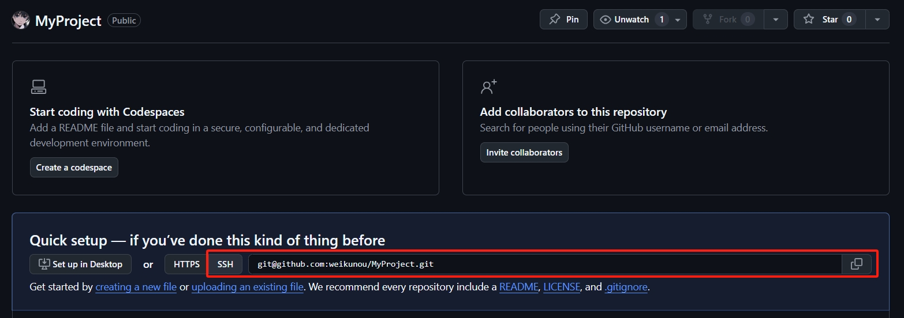
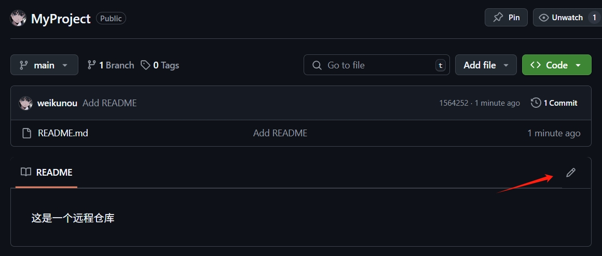

Git 入门笔记 远程仓库

<!--more-->

# Git 远程仓库

Git 远程仓库是一个托管在网络服务器上的代码仓库，它是团队协作开发的核心。

通过远程仓库，开发者可以共享代码、同步更新，实现分布式协作。

## SSH 密钥

SSH 密钥可以让你在使用 Git 时安全地连接远程仓库，无需每次都输入用户名和密码。

1. 检查现有 SSH 密钥

检查 `C:\Users\你的用户名` 文件夹，看看有没有 `.ssh` 文件夹，再看看有没有 `id_rsa` 和 `id_rsa.pub` 文件。

如果有的话，就不用生成了，直接跳过下一步。

如果没有的话，就需要进行下一步，生成密钥。

2. 生成新的 SSH 密钥对

打开 Git Bash，输入以下指令：（最后那个字符串是你的邮箱地址）

```sh
$ ssh-keygen -t rsa -b 4096 -C "your_email@example.com"
```

可以保持默认值，一直按回车键。

完成后，可以在第一步提到的文件夹里，看到那两个文件。


3. 添加密钥

登录 Github，点击右上角的头像，找到 `Settings`，在左侧的导航栏中，找到 `SSH and GPG keys` 选项。


点击 `New SSH key`，填写 Title，把 `id_rsa.pub` 文件的内容复制，粘贴到 Key 那一栏，最后点击 `Add SSH key` 就添加完成了。


## 远程仓库操作

### 远程仓库管理
- 克隆远程仓库：`git clone 仓库地址`
- 查看远程仓库：`git remote -v`
- 添加远程仓库：`git remote add 远程仓库名 仓库地址`
- 删除远程仓库：`git remote remove 远程仓库名`
- 重命名远程仓库：`git remote rename 旧名称 新名称`

### 远程分支操作
- 查看远程分支：`git branch -r`
- 查看所有分支：`git branch -a`
- 查看分支跟踪：`git branch -vv`
- 拉取远程分支：`git pull origin 分支名`
- 推送本地分支：`git push origin 分支名`
- 删除远程分支：`git push origin --delete 分支名`
- 跟踪远程分支：`git branch --track 分支名 origin/分支名`

## 实践

### 创建远程仓库

登录 Github，点击右上角的加号，点击 `New repository`，填写仓库名称，点击 `Create repository` 即可创建远程仓库。


创建完成后，仓库默认是空的，点击 SSH 按钮，右侧显示了仓库的地址。点击最右侧的复制按钮，可以把这个地址复制下来。



### 克隆到本地

在本地找一个空的文件夹，打开 Git Bash 窗口，执行命令：

```sh
$ git clone 仓库地址
```

就可以把远程仓库克隆到本地了。


### 创建本地文件

进入 MyProject 文件夹，创建一个 README.md 文件，输入一行文本。


### 提交并推送

回到 Git Bash 窗口，执行命令：

```sh
$ cd MyProject
```

进入 MyProject 文件夹，然后执行简单的提交命令：

```sh
$ git add README.md
$ git commit -m "Add README"
```

由于我们是从远程仓库克隆到本地，只有一个 main 分支，本地的 main 分支和远程的 main 分支是关联的，所以可以直接执行命令：

```sh
$ git push
```

此时，我们提交的 README.md 文件就被推送到远程仓库了。


### 远程修改文件

在 Github 页面上，点击编辑按钮。



修改一下文件内容，点击 `Commit changes` 按钮进行提交。


此时远程仓库就有了两次提交，而本地仓库只有一次。

### 拉取更新

现在要从远程仓库拉取更新，把本地仓库的内容也更到最新版本，执行命令：

```sh
$ git pull
```

执行完成后，本地的文件就跟远程仓库同步版本了。


