Unity3D 基础系列（第一期）

<!--more-->

# 安装编辑器

Unity 中文官网：https://unity.cn/releases

在官网找到想要安装的版本，点击<kbd>从Unity Hub下载</kbd>

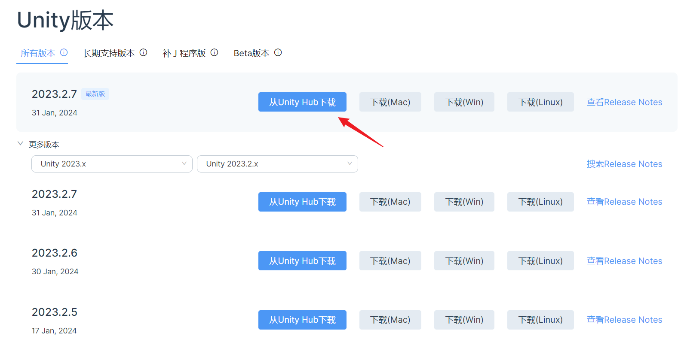

如果电脑上没有安装 hub，就需要先安装好 hub，再点击上图的按钮，hub 会弹窗安装对应的编辑器版本。

如果需要打包到安卓手机，则需要安装 Android Build Support 模块。需要其他平台就勾选对应的模块。

如果只需要打包到 Windows 平台，可以不用勾选模块，默认是可以打包 Windows 程序的。

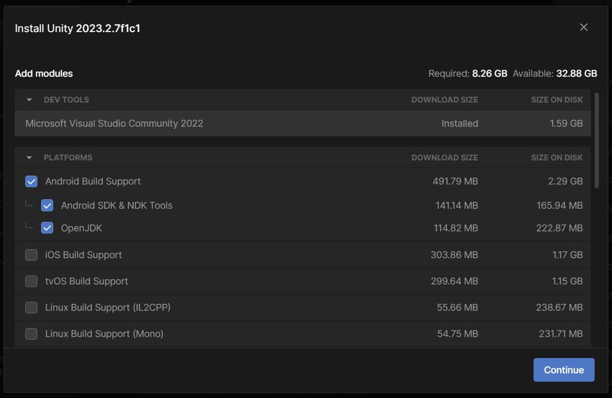

# 创建项目

安装完成之后，在 hub 界面点击右上角的<kbd>New project</kbd>创建项目。

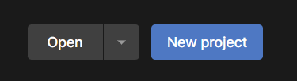

默认是 3D 项目模板，修改一下 Project name（项目名称）和 Location（本地文件夹存放位置），点击右下角的<kbd>Create project</kbd>按钮开始创建新项目。

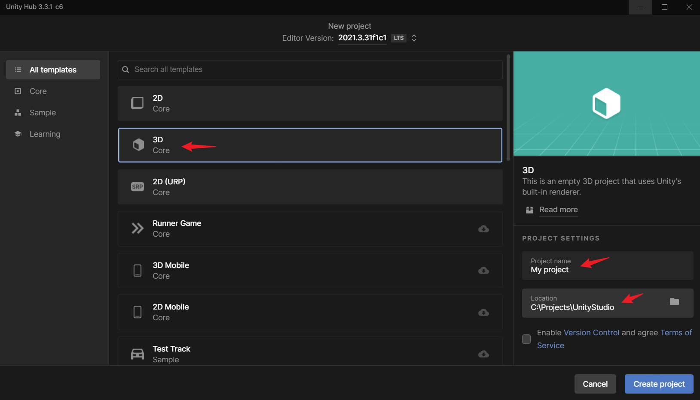

项目创建完成后，可以在右上角的下拉列表中，选择一个自己喜欢的窗口布局。

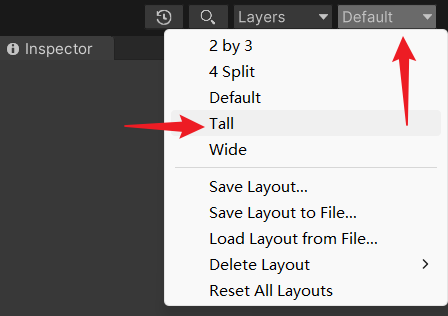

右键点击窗口的标签栏，还可以选择单列或双列的布局。

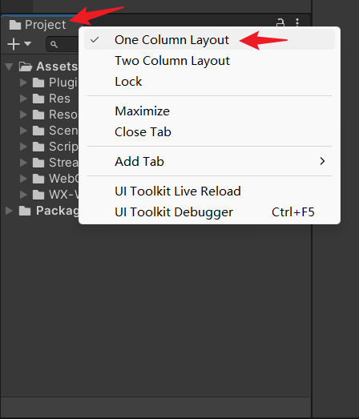

# 认识窗口

主要的窗口有

- Scene（编辑场景）
- Game（运行游戏）
- Inspector（组件属性）
- Hierarchy（物体层级）
- Project（项目资源）
- Console（调试输出）

这六个基本的窗口可以在 Window 菜单里面找到并打开。

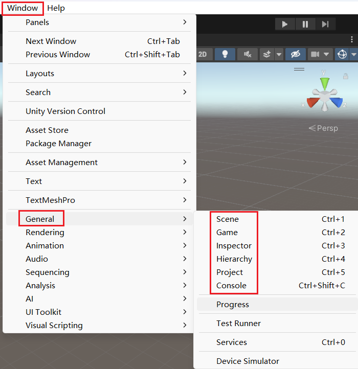

通常会在 Hierarchy 窗口空白处，右键单击，可以创建一个 Cube 立方体或者其他物体。

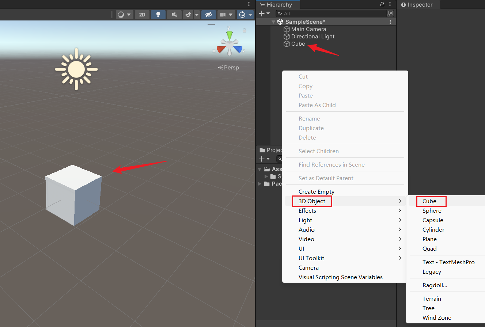

Project 窗口，则是右键单击 Assets 文件夹，展开 Create 菜单，可以看到很多选项，用于创建 unity 内置资源。

- Folder（创建文件夹）
- C# Script（创建 C# 脚本）
- Scene（创建场景）
- Material（创建材质）
- Animator Controller（创建动画控制器）
- Animation（创建动画片段）

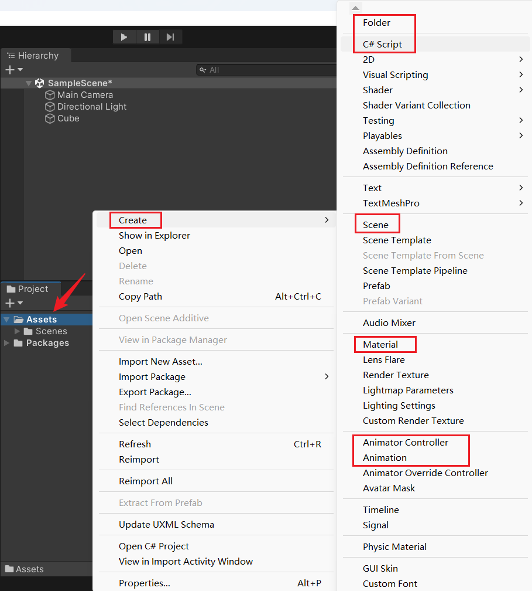

需要导入外部资源时，也可以直接将资源拖到 Assets 文件夹下。

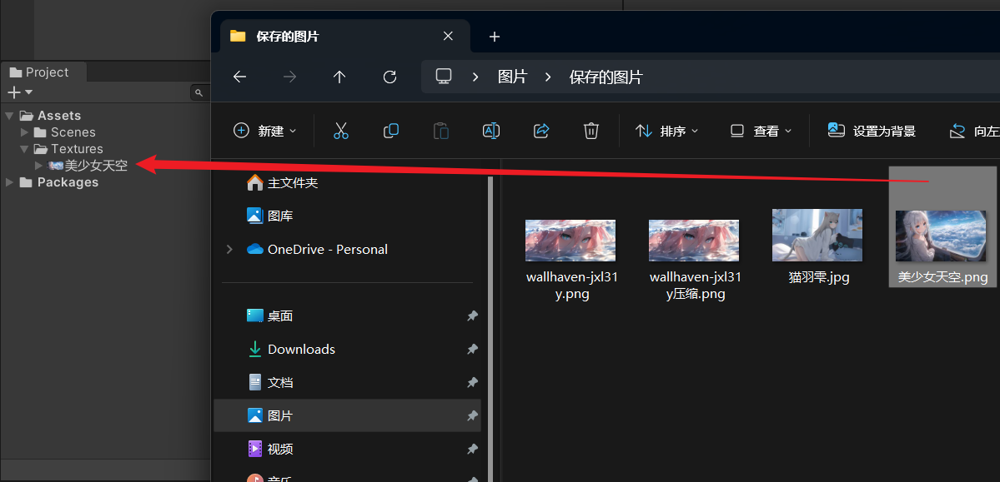

然后选中导入后的图片，可以在 Inspector 窗口看到图片资源的一些属性设置，通常会把图片的 Texture Type 改成 Sprite 类型，用于 2D Sprite 和 UI 图片，最后点击下方的 Apply 按钮确认修改。

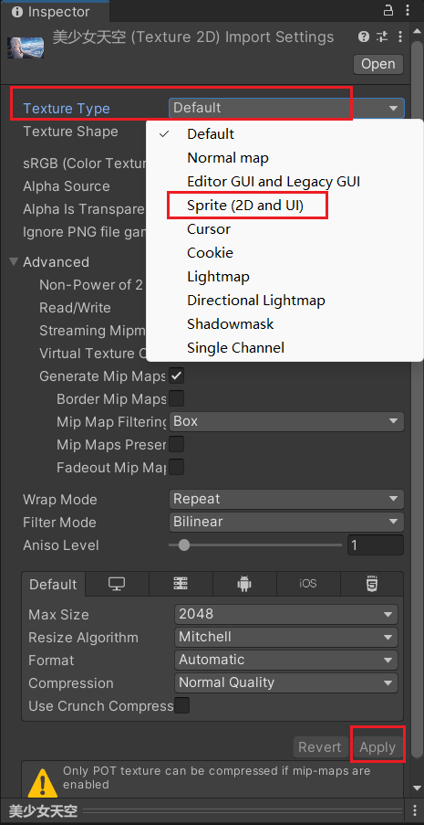

在 Hierarchy 窗口空白处，右键单击，可以创建一个 Image 图片，修改它的 Source Image 属性，可以点击右侧的小圆圈按钮，选择刚刚导入的图片，或者直接把图片拖拽到 Source Image 处。

点击 Set Native Size 按钮，可以让图片自动设置成图片源本身的宽度和高度，具体数值也可以在右上角的 Rect Transform 组件属性里调整。

此时就可以在 Scene 窗口看到导入的图片了。

Scene 窗口有个 2D 按钮，可以切换成 2D 平面视角。

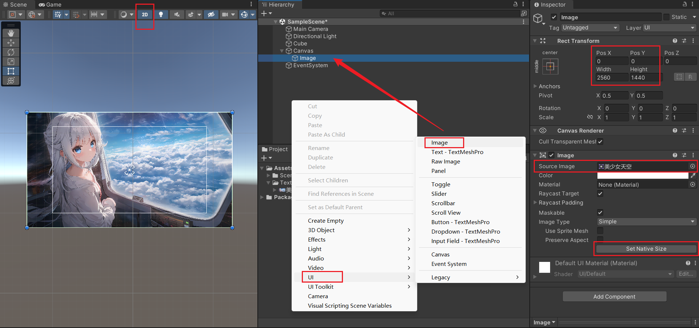

点击顶部的播放按钮，可以运行游戏，查看游戏运行效果。此时会自动跳转到 Game 窗口。

Game 窗口可以设置游戏运行的屏幕分辨率尺寸，点击下拉菜单最下方的 + 号，可以添加自定义的分辨率尺寸。

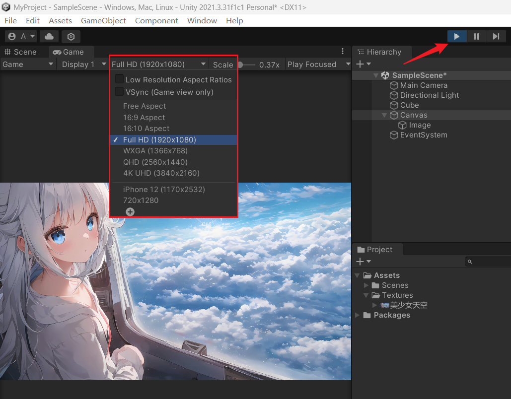

每个窗口的位置也是可以自行调整的，例如，点击 Console 窗口的标签，按住鼠标左键，拖动到 Project 标签旁边，就可以让这两个窗口共用一个区域，点击窗口标签的时候会切换窗口显示。

Console 窗口是运行游戏时，显示代码脚本输出的一些调试信息，目前还没有写代码输出信息，所以这个窗口就是空白的。

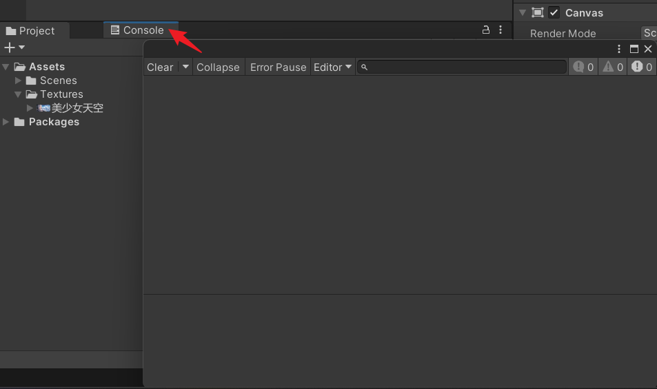

# 插件管理

在 Window 菜单，找到 Package Manager，打开插件包管理窗口。

Packages: Unity Registry 表示有经过 unity 注册认证过的插件，此处可以选择其他类型的筛选条件。

右上角的搜索框可以快速搜索到需要的插件，点击右下角的 Install 按钮安装插件。

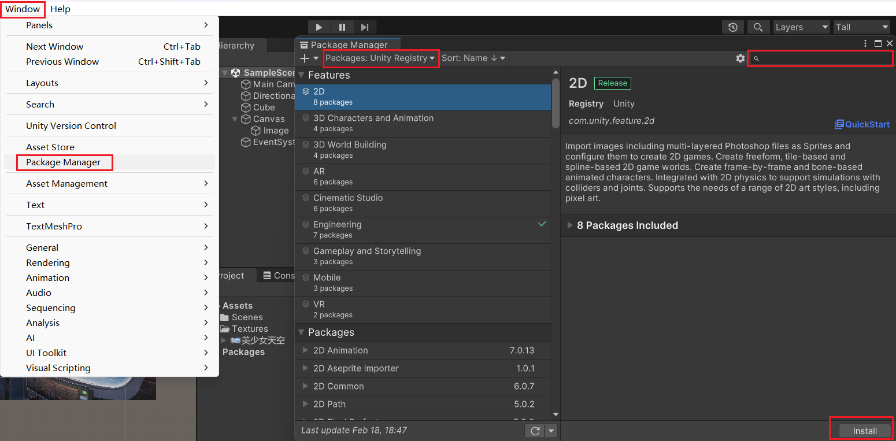

Packages: In Project 可以查看当前项目里已安装的所有插件，可以对选中的插件进行升级或者移除。

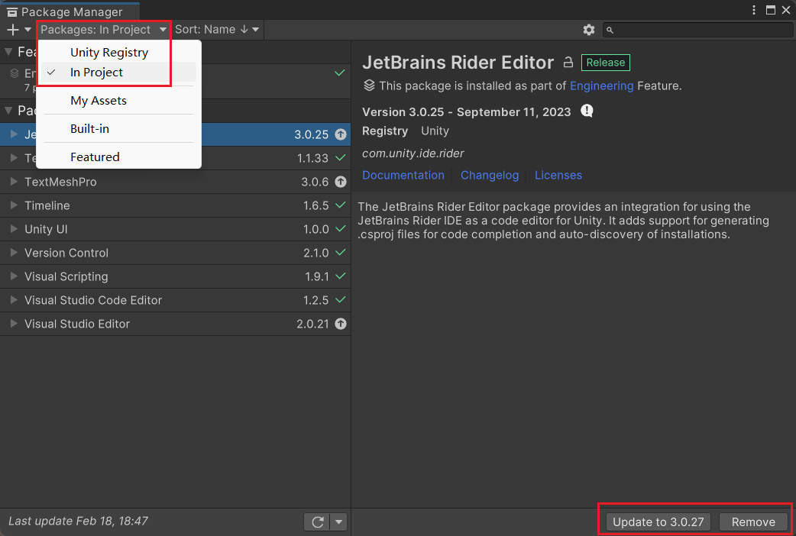

# 打包项目

点击菜单栏的 File -> Build Settings，点击 Add Open Scenes 把当前打开的场景添加到打包列表中，也可以自行从 Assets 文件夹中拖拽需要打包的场景，有勾选的场景会被打包，去掉勾选就不会被打包。

Platform 可以选择要打包的目标平台，默认是 Windows，如果需要打包到其他平台，就需要安装对应的模块。

最后点击 Build 按钮，选择一个存放的位置，进行打包。

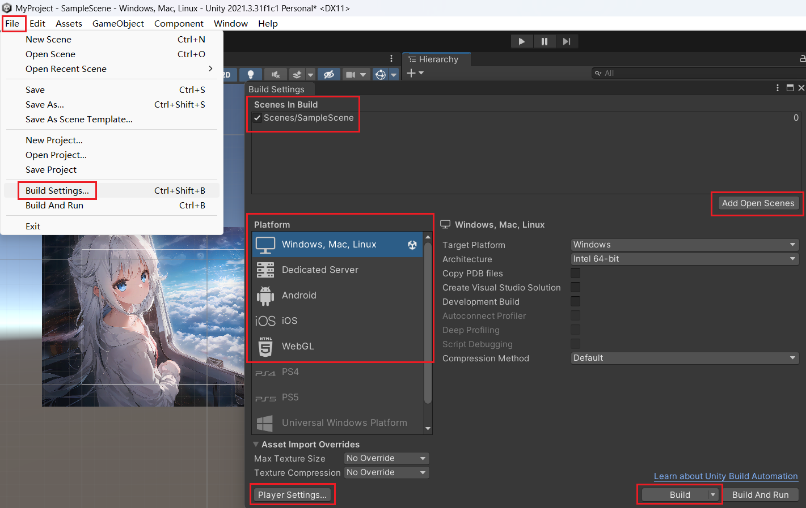

Player Settings 可以修改一些打包参数，例如公司名称、项目名称、版本号、图标等等。

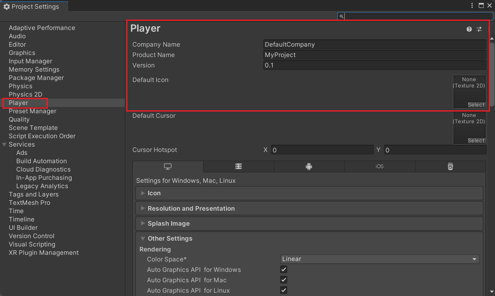

打包完成后，如果是 Windows 平台，可以双击 .exe 文件运行游戏。

打开游戏后，默认是全屏的，没有退出游戏按钮，可以直接按 Alt + F4 快捷键关闭游戏。

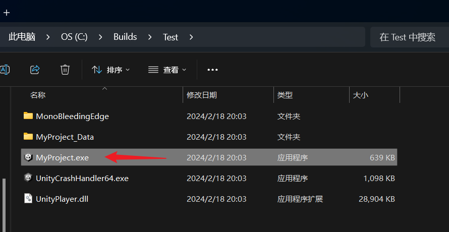
