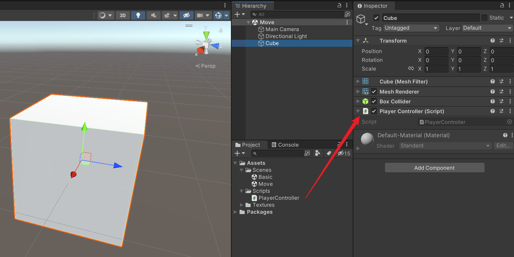
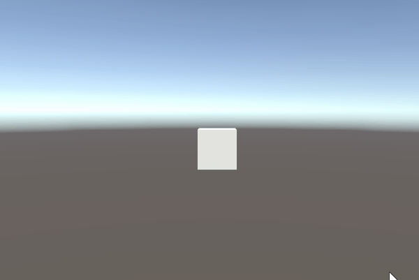
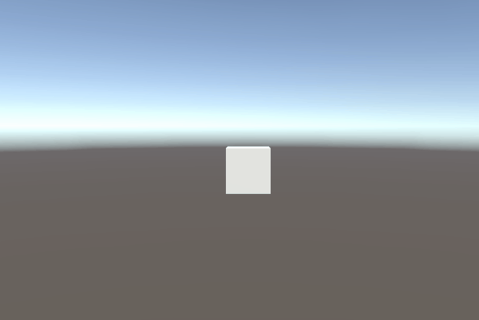
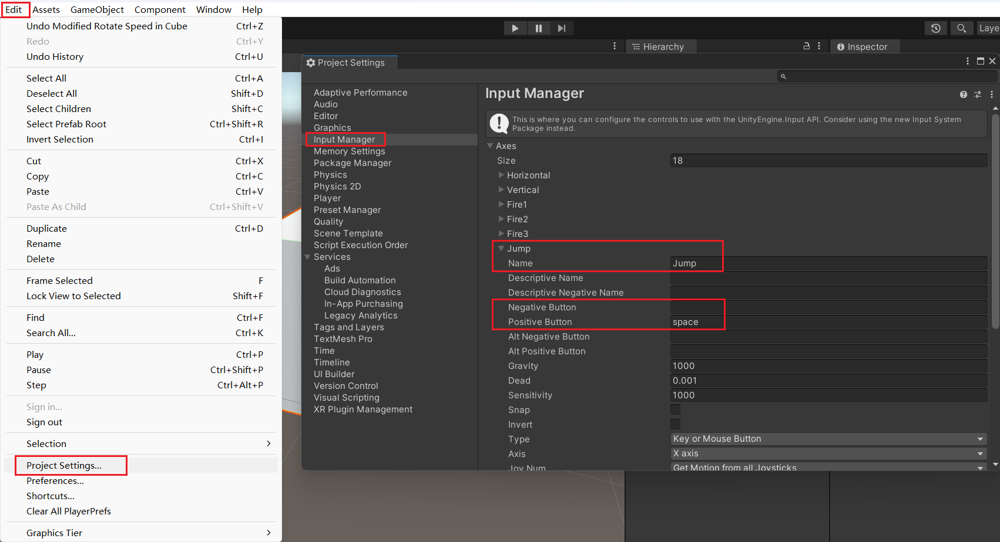

Unity3D 基础系列（第二期）

<!--more-->

# 创建脚本

首先，新建一个场景，创建一个 Cube。

在 Assets 文件夹中创建一个 Scripts 文件夹，用来存放代码文件。

然后创建一个 PlayerController.cs 代码文件，拖拽挂载到 Cube 身上。




# 物体移动

打开 PlayerController.cs 编辑代码。

添加 speed 和 direction 两个变量，在 Update 方法中，通过 Input.GetAxis 获取键盘 WSAD 或 方向键 的输入，修改移动方向，并计算改变 transform.position 的数值。

```c#
using System.Collections;
using System.Collections.Generic;
using UnityEngine;

public class PlayerController : MonoBehaviour
{
    public float speed = 5f;   // 移动速度
    public Vector3 direction;  // 移动方向

    void Start()
    {
        
    }

    void Update()
    {
        // 水平偏移量
        float h = Input.GetAxis("Horizontal");
        // 垂直偏移量
        float v = Input.GetAxis("Vertical");
        // 修改方向向量
        direction.x = h;
        direction.y = v;
        // 计算移动距离并修改物体位置
        transform.position += speed * Time.deltaTime * direction;
    }
}
```


移动效果：




> 注意到，这里计算移动距离时，乘了一个 Time.deltaTime 变量，可以尝试去掉这个变量，看看效果。

Time.deltaTime 表示一帧的间隔时间，根据设备配置和运行状况，这个变量的数值会不断变化。

假设运行帧率是 30 FPS，Time.deltaTime 的数值是 1/30。

假设运行帧率是 60 FPS，Time.deltaTime 的数值是 1/60。

Update 方法是每帧调用一次，假设 Cube 每帧移动的距离为 5，在每秒 30 帧的情况下，每秒移动的距离是 150。

而在每秒 60 帧的情况下，每秒移动的距离是 300。

也就是说，不同帧率的效果表现是不同的。

为了解决这个问题，乘上一个 Time.deltaTime，使得每秒移动的距离都变为常量 5，得到相同的表现效果。


# 物体旋转

除了通过 Input.GetAxis 获取水平和垂直方向上的偏移量，还可以通过 Input.GetKey 获取键盘的其他按键。

例如，使用枚举 KeyCode.Q 获取键盘 Q 键，当 Q 键被持续按下时，持续修改 Y 轴 旋转角度，并使用 Quaternion.Euler 方法进行转换，使物体的旋转属性保持在一个正常的范围内，然后赋值给 transform.rotation。

反向同理。

```c#
using System.Collections;
using System.Collections.Generic;
using UnityEngine;

public class PlayerController : MonoBehaviour
{
    // ...

    public float rotateSpeed = 100f;   // 旋转速度
    public Vector3 rotation;           // 旋转角度

    void Start()
    {
        
    }

    void Update()
    {
        // ...

        // 按住 Q 键
        if (Input.GetKey(KeyCode.Q))
        {
            // 持续修改 Y 轴 旋转角度（顺时针）
            rotation.y += rotateSpeed * Time.deltaTime;
            transform.rotation = Quaternion.Euler(rotation);
        }
        // 按住 E 键
        else if (Input.GetKey(KeyCode.E))
        {
            // 持续修改 Y 轴 旋转角度（逆时针）
            rotation.y -= rotateSpeed * Time.deltaTime;
            transform.rotation = Quaternion.Euler(rotation);
        }
    }
}
```


旋转效果：




# 物体缩放

了解了键盘按键，可以再看看鼠标按键。

可以通过 Input.GetMouseButtonDown 方法获取鼠标按键按下的状态，传入 0 则是鼠标左键，传入 1 则是鼠标右键。

这里修改了 transform.localScale，让 Cube 放大或变回原样。

```c#
using System.Collections;
using System.Collections.Generic;
using UnityEngine;

public class PlayerController : MonoBehaviour
{
    // ...

    public float bigger = 2f;    // 缩放系数（放大）
    public float normal = 1f;    // 缩放系数（正常）

    void Start()
    {
        
    }

    void Update()
    {
        // ...

        // 按下鼠标左键
        if (Input.GetMouseButtonDown(0))
        {
            transform.localScale = Vector3.one * bigger;
        }
        // 按下鼠标右键
        else if (Input.GetMouseButtonDown(1))
        {
            transform.localScale = Vector3.one * normal;
        }
    }
}
```


缩放效果：


# 按键总结

下面列举了一系列按键输入。

```c#
// 键盘
Input.GetKey(KeyCode.W)           // 按住 W 键持续返回 true, 松开后返回 false
Input.GetKeyDown(KeyCode.W)       // 按下 W 键返回 true，按住也只会返回 false
Input.GetKeyUp(KeyCode.W)         // 抬起 W 键返回 true

// 注：这里的 Jump 在 Input Manager 里默认是空格键
Input.GetButton("Jump")           // 按住自定义的键持续返回 true, 松开后返回 false
Input.GetButtonDown("Jump")       // 按下自定义的键返回 true，按住也只会返回 false
Input.GetButtonUp("Jump")         // 抬起自定义的键返回 true

Input.GetAxis("Horizontal")       // AD 或左右方向键的偏移量 (从 0 到 1 变化，或从 0 到 -1 变化)
Input.GetAxis("Vertical")         // WS 或上下方向键的偏移量 (从 0 到 1 变化，或从 0 到 -1 变化)
    
Input.GetAxisRaw("Horizontal")    // AD 或左右方向键的偏移量 (-1 0 1)
Input.GetAxisRaw("Vertical")      // WS 或上下方向键的偏移量 (-1 0 1)


// 鼠标 0: 左键  1: 右键  2: 中键
Input.GetMouseButton(0)       // 按住鼠标左键
Input.GetMouseButtonDown(1)   // 按下鼠标右键
Input.GetMouseButtonUp(2)     // 抬起鼠标中键

Input.GetAxis("Mouse X")      // 鼠标水平方向移动的偏移量
Input.GetAxis("Mouse Y")      // 鼠标垂直方向移动的偏移量
```


Input Manager 可以自定义按键名称和对应的键盘按键。


