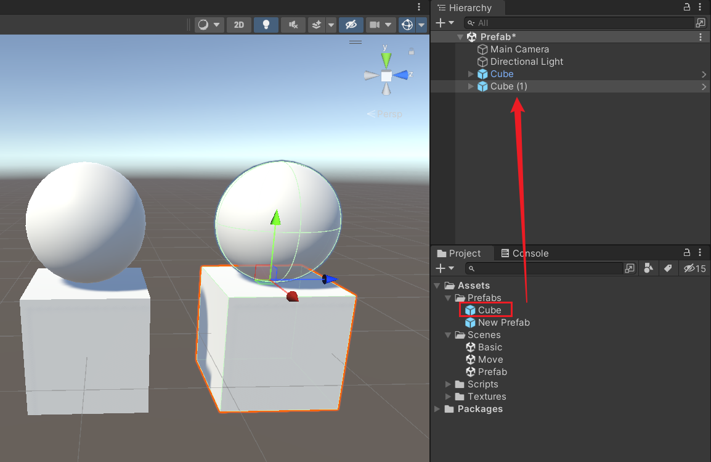

Unity3D 基础系列（第三期）

<!--more-->

# 创建预制体

创建预制体的方法很简单，直接把场景中的游戏物体，拖拽到 Assets 文件夹里，就会生成一个预制体资源了。


除了拖拽的方式，也可以在 Create 菜单中找到创建预制体的按钮，此时会创建一个空的预制体。


# 修改预制体

双击 Assets 文件夹里的预制体资源，可以进入编辑模式。

在编辑模式下，给预制体增加一个球模型，点击 Save 按钮保存。

保存之后，点击 Save 按钮旁边的 < 按钮，退出编辑模式，回到场景。


回到场景之后，发现场景中的游戏物体都会随之修改。

同时，也可以把预制体从 Assets 文件夹里再次拖拽到场景中，会生成新的一模一样的游戏物体。

后续对预制体的修改，都会同时改变场景中引用同一个预制体资源的所有游戏物体。




除了在 Assets 文件夹中双击预制体进行编辑的方式外，还可以直接在场景中，对游戏物体进行修改，然后应用到预制体上。

例如，在其中一个游戏物体中，再次添加一个小球，点击 Overrides 按钮，可以看到有哪些修改。

如果直接点击 Apply All，就会把所有修改都覆盖到预制体。

也可以单独点击其中某个修改，点击 Apply 按钮，再次点击 Apply to Prefab 'Cube' 按钮，就可以把单条修改覆盖到预制体。


应用覆盖之后，场景中的游戏物体和资源里的预制体都会发生改变。


# 实例化预制体

除了直接从 Assets 文件夹里拖拽预制体到场景中，进行游戏物体的生成外，还可以通过代码的方式实例化预制体。

创建一个脚本 CreateGameObjectByPrefab.cs，代码如下。

其中 cubePrefab 是要实例化的预制体资源，

pos 是生成的位置，

step 是每次修改生成位置的步长。

```c#
using System.Collections;
using System.Collections.Generic;
using UnityEngine;

public class CreateGameObjectByPrefab : MonoBehaviour
{
    public GameObject cubePrefab;
    public Vector3 pos;
    public float step = 1f;

    void Update()
    {
        // 按下键盘 G 键
        if (Input.GetKeyDown(KeyCode.G))
        {
            Generate();
        }
    }

    void Generate()
    {
        GameObject obj = Instantiate(cubePrefab);
        obj.transform.position = pos;
        pos.x += step;
    }
}
```


在场景中创建一个空物体，并把脚本拖拽到空物体上，再把 Cube 预制体拖拽到 Cube Prefab 属性上，设置好 pos 和 step 的参数。


运行游戏，按下键盘 G 键，可以看到场景中不断地生成新的游戏物体。


