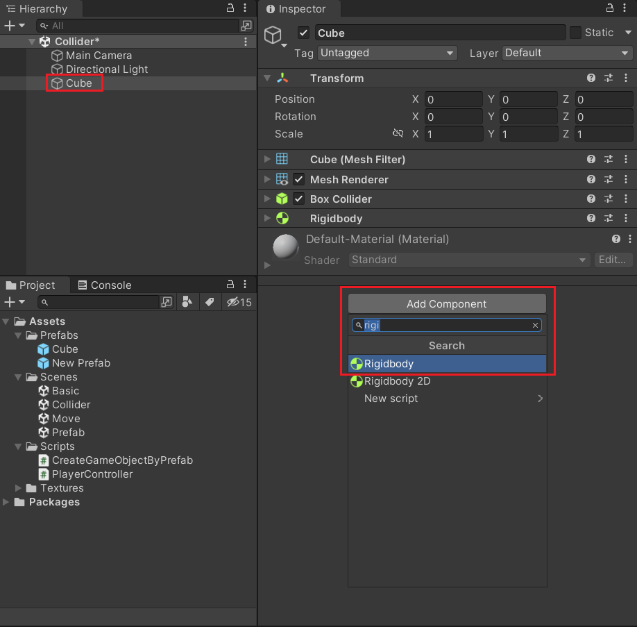
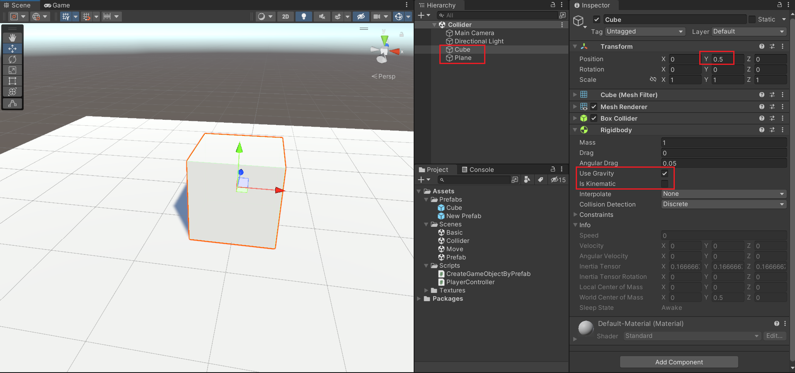
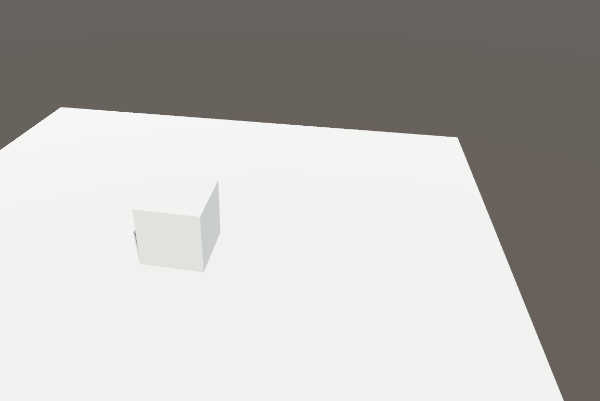
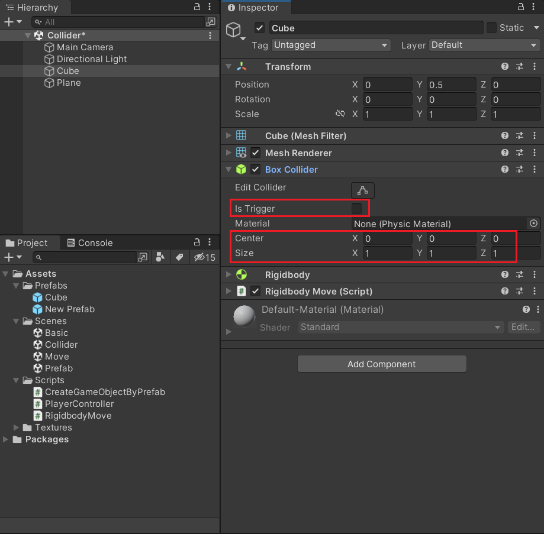
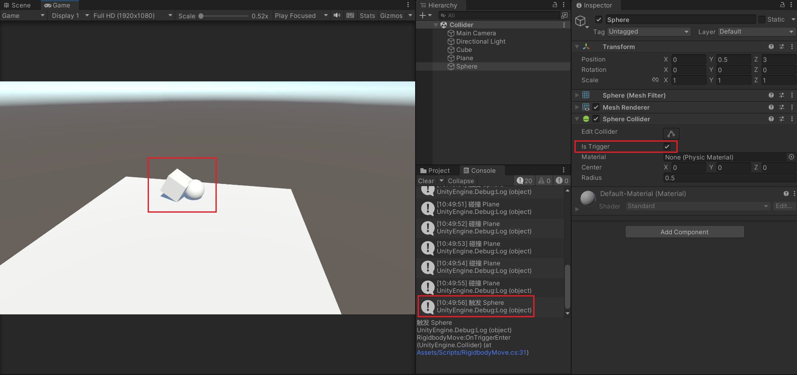

Unity3D 基础系列（第四期）

<!--more-->

# 刚体

在场景中创建一个 Cube，然后为它添加一个 Rigidbody 组件。

此时，Cube 就有了重力，如果运行游戏，Cube 会模拟自由落体，往下掉落。




可以简单布置一下场景，在 Cube 下面放置一个 Plane，这样 Cube 就会站立在平面上。

当然，也可以修改 Rigidbody 组件的参数，取消勾选 Use Gravity 或者勾选 Is Kinematic，也会取消重力效果。




刚体组件也可以让物体移动，只需要修改刚体的 velocity 属性。

```c#
using System.Collections;
using System.Collections.Generic;
using UnityEngine;

public class RigidbodyMove : MonoBehaviour
{
    public float speed = 5f;   // 移动速度
    public Vector3 direction;  // 移动方向
    public Rigidbody rb;

    void Start()
    {
        rb = GetComponent<Rigidbody>();
    }

    void Update()
    {
        // 水平偏移量
        float h = Input.GetAxis("Horizontal");
        // 垂直偏移量
        float v = Input.GetAxis("Vertical");
        // 修改方向向量
        direction.x = h;
        direction.z = v;
        // 设置刚体速度
        rb.velocity = speed * direction;
    }
}
```


运行效果：




# 碰撞体

在创建 Cube 时，默认会挂载一个碰撞体组件。

勾选 Is Trigger 会取消碰撞效果，只做触发器。

Center 和 Size 用来控制碰撞体的中心位置和大小。




如果要让两个物体碰撞，监听发生碰撞的时刻，需要其中一个物体带有刚体组件，另一个物体可以没有刚体。

当然，两个物体都要有碰撞体。

如果没有刚体的碰撞体，勾选了 Is Trigger，那么带有刚体的物体监听的碰撞回调函数是 OnTrigger 系列的函数。

如果没有刚体的碰撞体，没有勾选 Is Trigger，那么带有刚体的物体监听的碰撞回调函数是 OnCollision 系列的函数。

```c#
public class RigidbodyMove : MonoBehaviour
{
    // ...
    
    // 进入触发
    void OnTriggerEnter(Collider other)
    {
        Debug.Log("触发 " + other.name);
    }

    // 进入碰撞
    void OnCollisionEnter(Collision other)
    {
        Debug.Log("碰撞 " + other.collider.name);
    }
}
```


在场景中添加一个球体，并且把球的碰撞体设置为 Trigger。

可以看到 Console 窗口打印的信息。

因为 Plane 也带有碰撞体，并且不是 Trigger，所以会打印 碰撞 Plane。

而球体是 Trigger，所以会打印 触发 Sphere。




类似的碰撞回调函数

```c#
// 进入触发器
void OnTriggerEnter(Collider other)
{
}

// 停留触发器
void OnTriggerStay(Collider other)
{
}

// 退出触发器
void OnTriggerExit(Collider other)
{
}

// 进入碰撞体
void OnCollisionEnter(Collision other)
{
}

// 停留碰撞体
void OnCollisionStay(Collision other)
{
}

// 退出碰撞体
void OnCollisionExit(Collision other)
{
}
```

