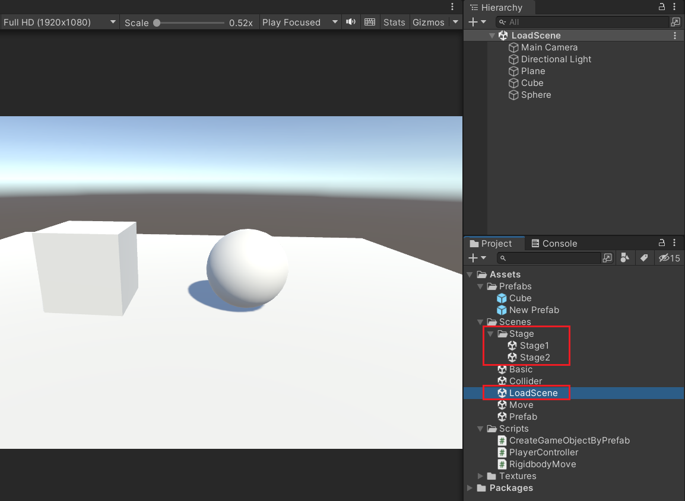
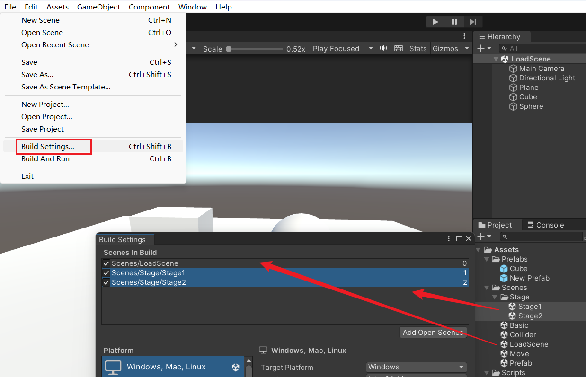
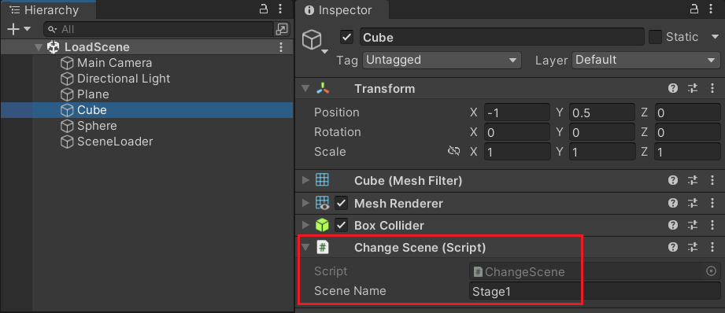
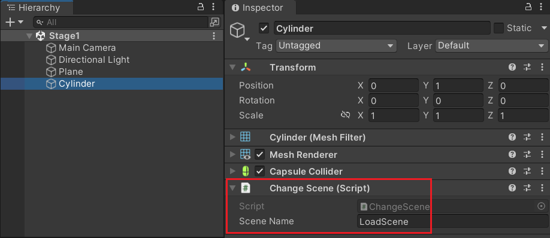
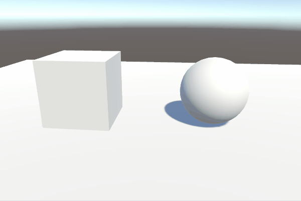
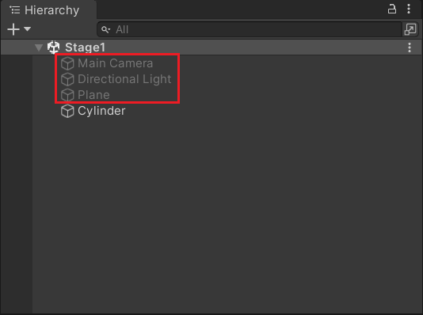
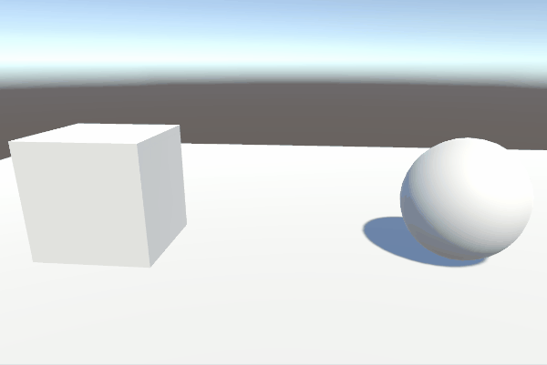
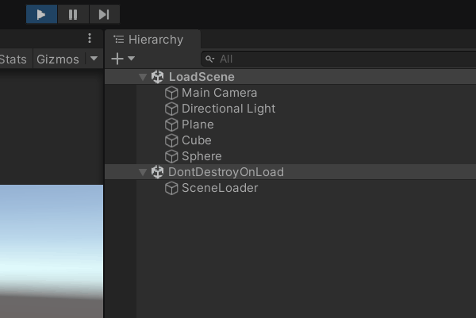

Unity3D 基础系列（第五期）

<!--more-->

# 场景配置

首先，在资源文件夹里创建一个 LoadScene 场景，摆放一些物体，用来做初始场景。

然后创建一个 Stage 文件夹，并创建两个场景 Stage1、Stage2。

两个 Stage 场景也可以简单布置一下，方便区分。




接着，打开 Build Settings，把需要加载的场景添加到配置中。



# 切换场景

创建一个 SceneLoader 脚本，并在 LoadScene 场景中创建一个空物体，挂载这个脚本。

这里为了方便调用加载场景的方法，简单使用了单例模式，在 Awake 初始化时，把当前脚本实例保存到 instance 变量里，并且设置为 DontDestroyOnLoad，保证这个对象不会因为场景切换而被销毁，其他对象通过 Instance 属性获取到单例。

当前脚本提供一个 LoadScene 方法，传入一个场景名称就可以直接切换场景。

```c#
using System.Collections;
using System.Collections.Generic;
using UnityEngine;
using UnityEngine.SceneManagement;

public class SceneLoader : MonoBehaviour
{
    // 单例模式
    static SceneLoader instance;
    public static SceneLoader Instance
    {
        get { return instance; }
    }

    void Awake()
    {
        if (instance != null)
        {
            Destroy(gameObject);
        }
        else
        {
            instance = this;
            DontDestroyOnLoad(gameObject);
        }
    }

    public void LoadScene(string sceneName)
    {
        SceneManager.LoadScene(sceneName);
    }
}
```


接着再创建一个脚本 ChangeScene，挂载到场景中的 3D 物体上，并填写目标场景的名称。

OnMouseDown 方法会在物体被鼠标点击时调用。

```c#
using System.Collections;
using System.Collections.Generic;
using UnityEngine;

public class ChangeScene : MonoBehaviour
{
    public string sceneName;

    void OnMouseDown()
    {
        SceneLoader.Instance.LoadScene(sceneName);
    }
}
```








场景切换效果：




# 场景叠加

目前场景加载是卸载掉原来的场景，加载新的场景，DontDestroyOnLoad 场景一直存在。

并且场景加载是同步的，如果新的场景包含的物体资源太多，加载时间稍慢的话，就会感觉到卡顿。

场景是可以叠加的，也就是同时加载了多个场景，也有异步加载的方式。

下面添加两个方法，用来加载或卸载场景。因为是异步加载，需要使用协程，场景加载完成后可以执行其他操作。

```c#
public class SceneLoader : MonoBehaviour
{
    // ...
    
    // 当前加载的场景
    Scene currentScene;
    
    // 加载场景（异步加载，叠加模式）
    public void LoadSceneAdditive(string sceneName)
    {
        StartCoroutine(LoadSceneAsync(sceneName));
    }

    IEnumerator LoadSceneAsync(string sceneName)
    {
        AsyncOperation operation = SceneManager.LoadSceneAsync(sceneName, LoadSceneMode.Additive);
        yield return operation;
        // 加载完成后，保存当前加载的场景
        currentScene = SceneManager.GetSceneByName(sceneName);
    }

    // 卸载当前已加载的场景
    public void UnloadCurrentScene()
    {
        // 判断是否加载过当前场景
        if (!currentScene.IsValid()) return;
        StartCoroutine(UnloadCurrentSceneAsync());
    }

    IEnumerator UnloadCurrentSceneAsync()
    {
        AsyncOperation operation = SceneManager.UnloadSceneAsync(currentScene);
        yield return operation;
    }
}
```


然后修改一下 ChangeScene 脚本调用的方法。

```c#
public class ChangeScene : MonoBehaviour
{
    public string sceneName;

    void OnMouseDown()
    {
        // 先卸载当前加载的场景
        SceneLoader.Instance.UnloadCurrentScene();
        
        // 加载新的场景（叠加模式）
        SceneLoader.Instance.LoadSceneAdditive(sceneName);
    }
}
```


Stage 场景也需要修改一下，隐藏掉相机和灯光，因为主场景已经有了，多个相机和灯光会影响视觉效果。




场景叠加效果：




