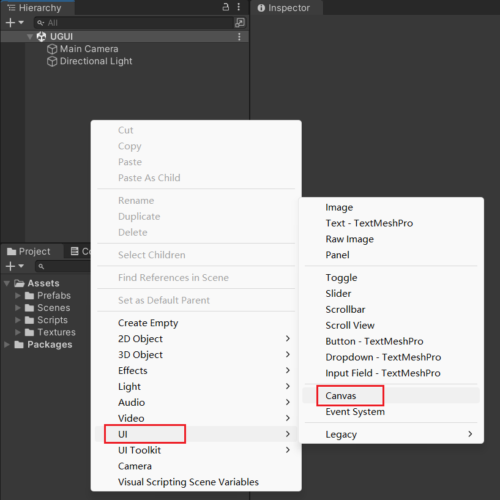
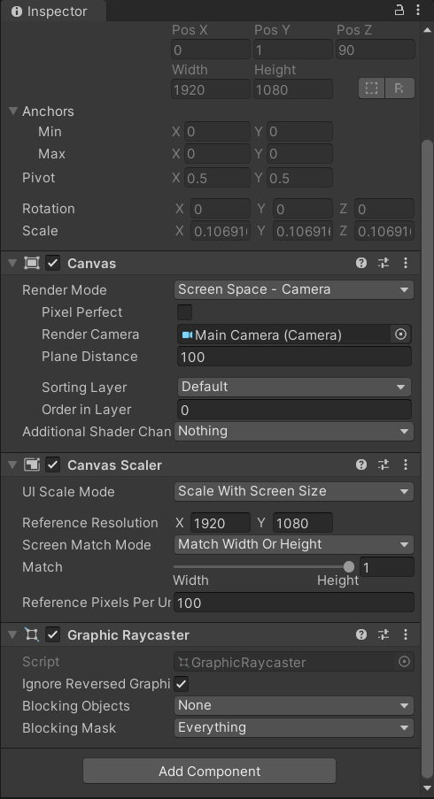
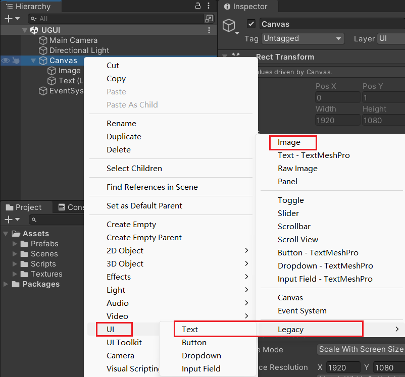
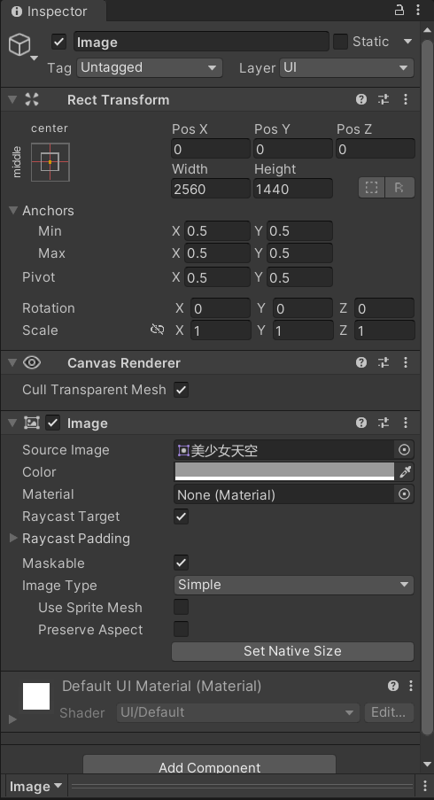
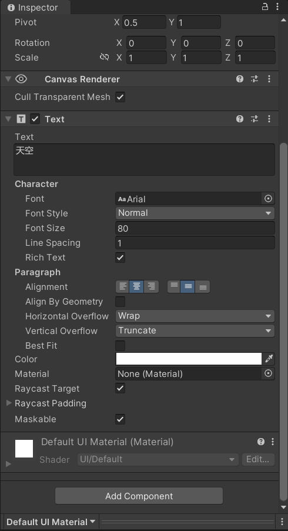
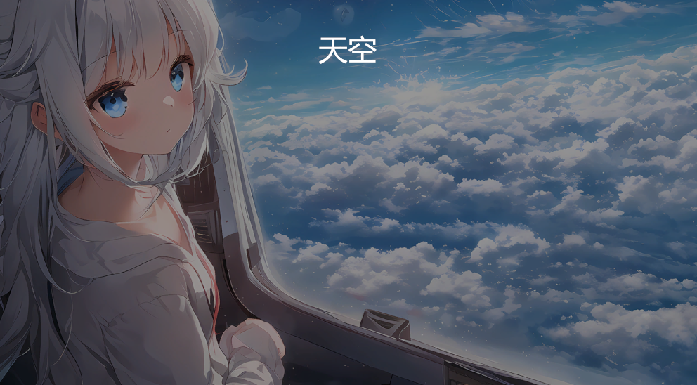
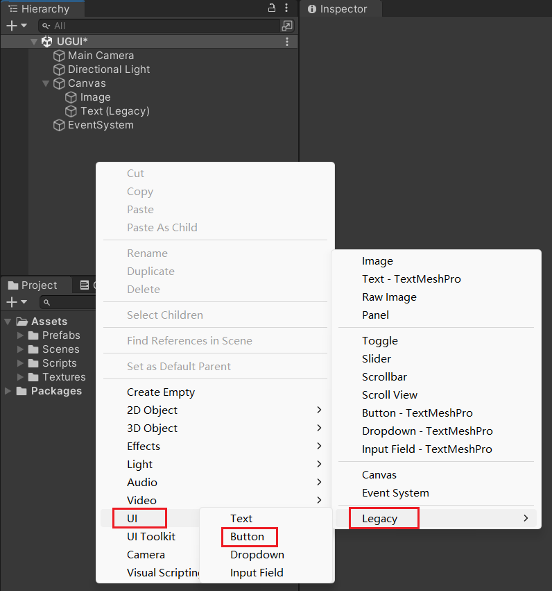
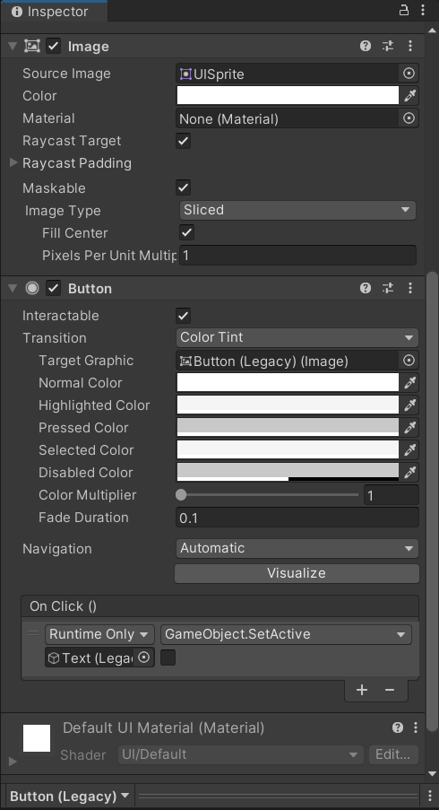
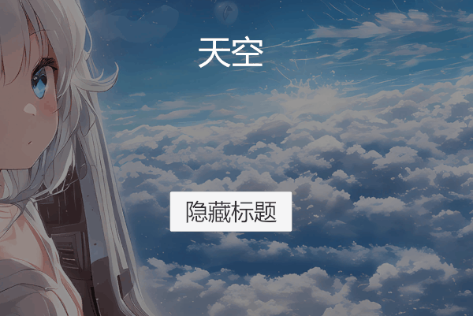

Unity3D 基础系列（第六期）

<!--more-->

# 创建画布

在 Hierarchy 面板右键，选择 UI -> Canvas，创建一个画布。




可以看到画布默认带有一些组件：

- Canvas
- Canvas Scaler
- Graphic Raycaster





Canvas 组件可以选择 Render Mode，有三种渲染模式。

1. Overlay 模式会把画布渲染到最顶层，不会被其他元素遮挡。
2. Camera 模式需要指定一个相机，画布会被缩小到相机的尺寸范围内，可以通过设置 Plane Distance、Sorting Layer、Order in Layer 来控制画布的渲染层级。通常是推荐使用 Camera 模式。
3. World Space 模式是把画布当做 3D 世界物体来使用，可以自行调整画布的位置、旋转和缩放。


Canvas Scaler 组件可以设置画布的分辨率。通常会设置成 Scale With Screen Size，指定一个合适的分辨率，当屏幕尺寸发生变化时，可以选择根据宽度还是高度进行适配。


Graphic Raycaster 组件是一个容易被忽略的组件，如果没有这个组件，画布是不会响应点击事件的。


# 图片和文本

在 Hierarchy 面板右键，选择 UI -> Image，创建一个图片。

旧版文本是在 Legacy 菜单中，选择 Text。

新版文本则是 Text-TextMeshPro。




Image 组件可以在 Source Image 属性选择想要显示的图片，

Color 调整颜色和不透明度，

Raycast Target 控制是否要接收点击事件，

Maskable 控制是否被遮罩裁剪。




Text 组件主要填写 Text 属性的内容，

修改 Font 字体，Font Size 字体大小，Alignment 对齐方式。

同样也有 Raycast Target 和 Maskable 属性。




效果图：




# 按钮

在 Hierarchy 面板右键，选择 UI -> Legacy -> Button，创建一个按钮。




Button 组件主要添加 OnClick 点击事件。

可以简单的，点击 OnClick 列表右下角的 + 号，添加一个事件，把标题文本拖拽到 Runtime Only 下面的选框中。

点击 Runtime Only 右侧的方法列表，例如选择 GameObject -> SetActive，方法下面就会出现一个方框，勾选则代表 true，不勾选则代表 false。




除了直接在面板上添加点击事件，还可以通过代码添加。

例如，创建一个脚本 ButtonClick.cs，挂到按钮上，并拖拽一个文本给 text 字段。

在 Start 方法中，先获取按钮自身的 Button 组件，再通过 onClick.AddListener 方法添加另一个方法 HideText 作为点击事件，这个方法里把 text 字段引用的文本隐藏。

```c#
using System.Collections;
using System.Collections.Generic;
using UnityEngine;
using UnityEngine.UI;

public class ButtonClick : MonoBehaviour
{
    public Text text;
    Button button;

    void Start()
    {
        button = GetComponent<Button>();
        button.onClick.AddListener(HideText);
    }

    void HideText()
    {
        text.gameObject.SetActive(false);
    }
}
```


效果图：



