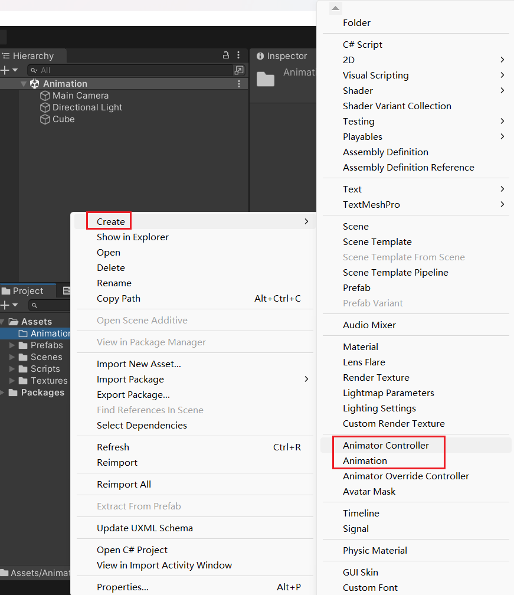
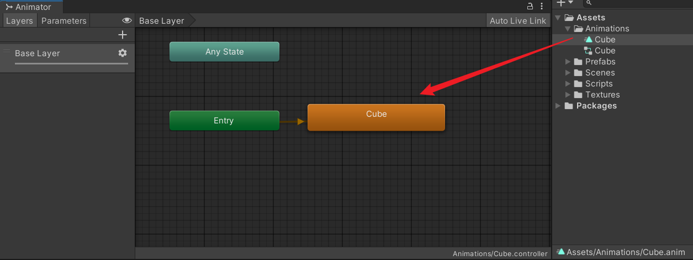
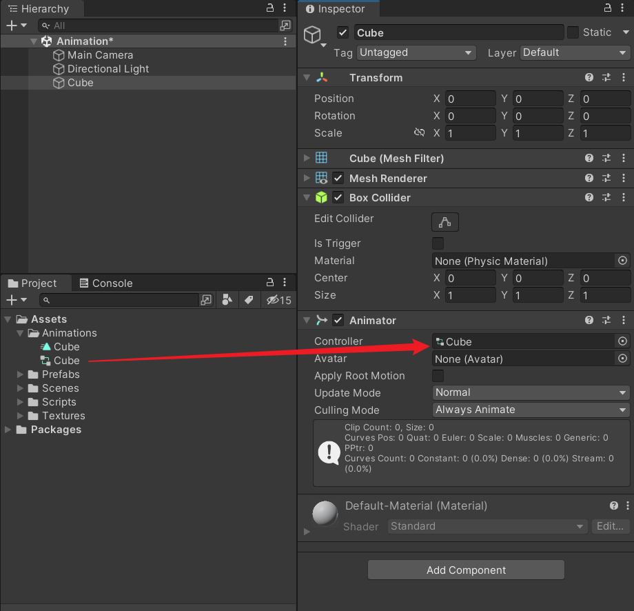
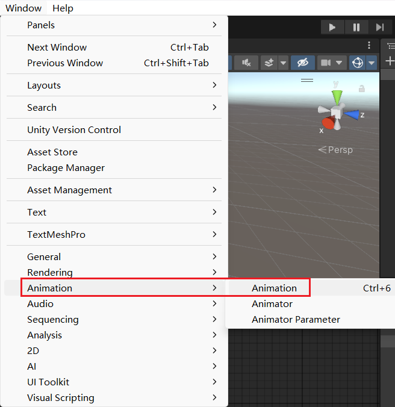
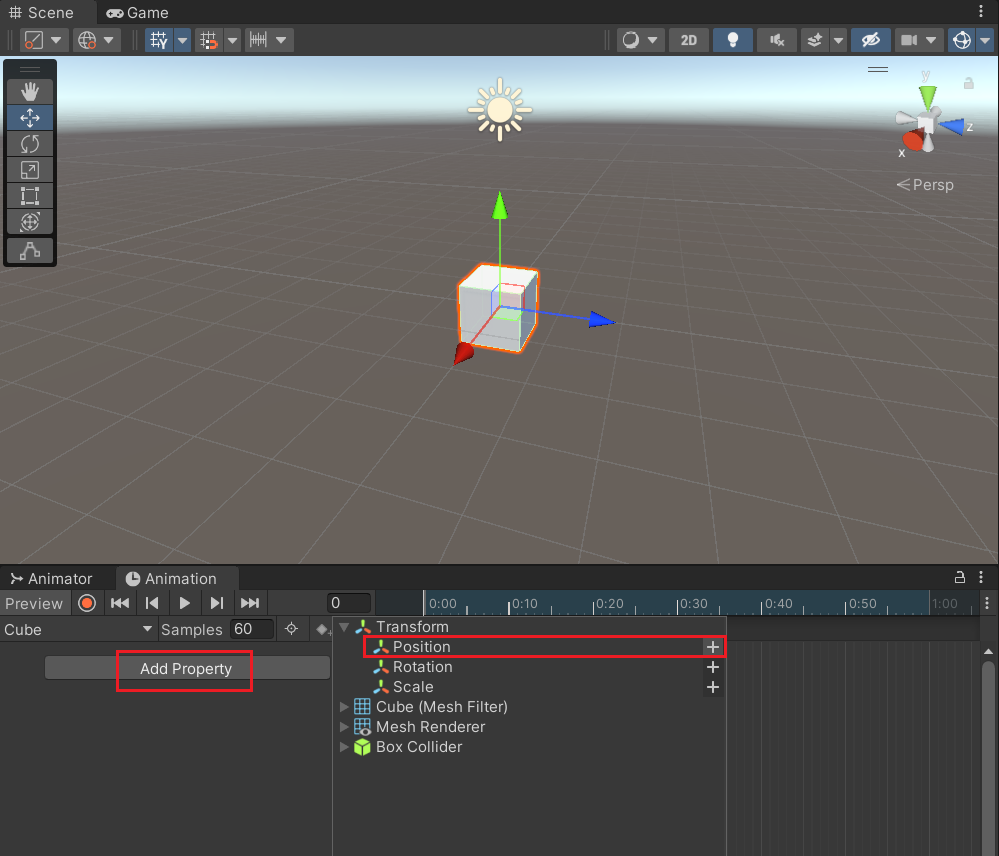
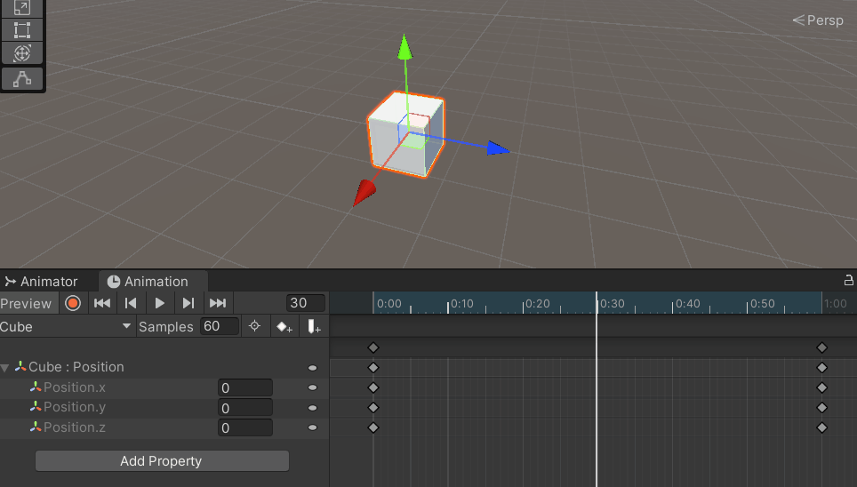

Unity3D 基础系列（第七期 完结）

<!--more-->

# 动画控制器

首先，创建一个 Animator Controller 和一个 Animation 资源文件。

双击 Animator Controller 文件，可以打开 Animator 窗口。

然后把 Animation 文件拖拽到 Animator 窗口，生成一个动画片段。

给场景中的 Cube 添加一个 Animator 组件，并把资源文件拖拽赋值。

通过顶部菜单栏打开 Animation 编辑窗口。

给 Cube 添加一个动画属性。

点击录制按钮，开始录制动画。

