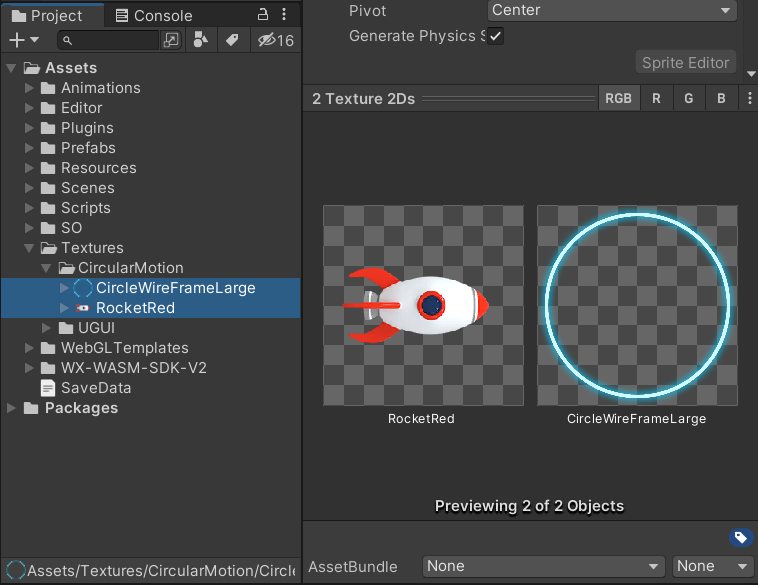
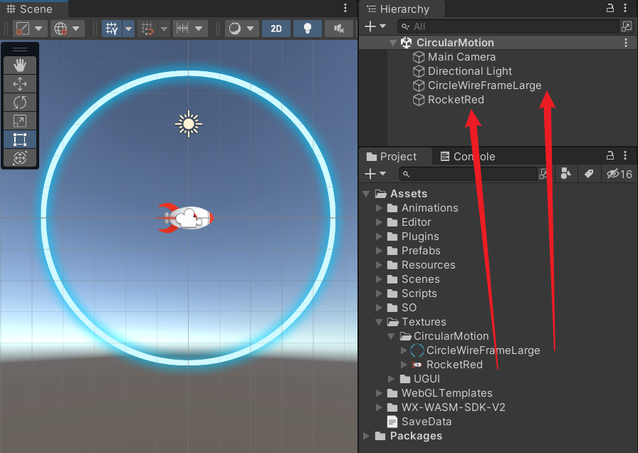
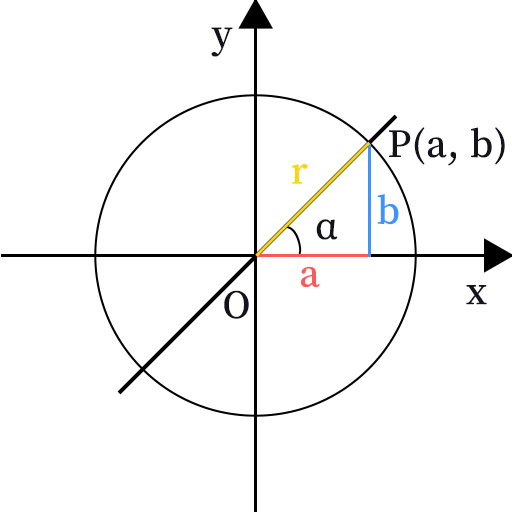
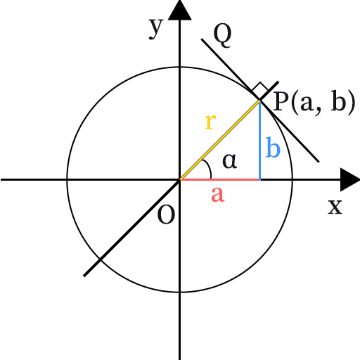
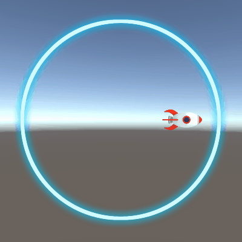
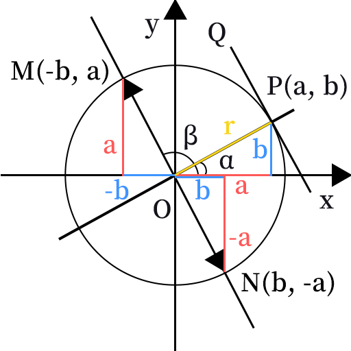
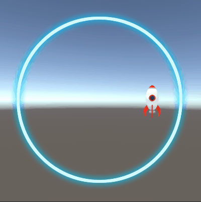

Unity3D 实现一个 2D 物体沿着圆周进行运动。

<!--more-->

# 物体圆周运动

前段时间在开发一个小游戏时，需要实现火箭沿着一个圆形轨道进行圆周运动。

以前面试的时候也被问到过这类问题（如何让一个 2D 物体做圆周运动），所以还是记录一下实现思路。

## 准备素材

可以在网上找两张图片素材，只要是一个物体和一个圆圈就行了，这里就先不提供素材啦。



然后直接把每张图片素材分别拖拽到场景中。



## 数学知识

在看到这个场景时，可以联想到一个单位圆，三角函数之类的数学知识。

例如下图，圆的半径 r = 1，点 P 落在圆周上，直线 OP 与 x 轴的夹角为 $α$。

因为 a，b，r 三条边构成了一个三角形，可以使用正弦、余弦和正切的概念，跟夹角联系起来，即
$$
sin α = 对边/斜边 = b/r = b
$$

$$
cos α = 邻边/斜边 = a/r = a
$$

$$
tan α = 对边/邻边 = b/a
$$




那么，当夹角发生改变时，我们可以通过正弦和余弦计算出点 P 的坐标。

过点 P 作直线 PQ 垂直于直线 OP，直线 PQ 是点 P 处的切线。



## 实现功能

### 计算坐标位置

创建脚本 CircularMotion.cs，挂载到火箭上。

脚本中有三个变量：

- radius 控制圆的半径，改变火箭移动的轨迹。
- angle 实时变化的角度，在 Update 中不断变化。
- speed 控制角度变化的速度。

在 Update 中，先把角度转成弧度，这是因为 `Mathf.Sin` 和 `Mathf.Cos` 接收的是一个弧度值。

只需要让角度乘上 `Mathf.Deg2Rad` 这个常量值即可。

接着，通过弧度值，计算出正弦和余弦，乘上半径（也就是斜边），就可以得到对应半径的圆周上的坐标点，修改火箭的位置。

最后实时更新角度，通过 speed 变量控制速度快慢，乘上 `Time.deltaTime` 保证角度变化不受帧率影响。

```csharp
using System.Collections;
using System.Collections.Generic;
using UnityEngine;

public class CircularMotion : MonoBehaviour
{
    public float radius = 3f;  // 圆的半径
    public float angle = 0f;   // 实时变化的角度
    public float speed = 50f;  // 角度变化速度

    void Update()
    {
        // 角度转弧度
        float radians = Mathf.Deg2Rad * angle;
        
        // 单位圆的坐标点
        float a = Mathf.Cos(radians);
        float b = Mathf.Sin(radians);
        
        // 根据半径缩放坐标点
        float x = a * radius;
        float y = b * radius;

        // 设置物体位置
        transform.position = new Vector2(x, y);

        // 更新角度
        angle += speed * Time.deltaTime;
        
        // 确保角度在合理范围内（0 到 360 度）
        if (angle >= 360f)
        {
            angle -= 360f;
        }
        else if (angle <= 0f)
        {
            angle += 360f;
        }
    }
}
```

运行效果：



### 计算切线方向

现在火箭虽然能进行圆周运动了，但是方向看上去不对，火箭的顶端应该朝着轨道的切线方向旋转。

由上述的数学知识可知，直线 PQ 是点 P 处的切线，把切线平移到原点处，作直线 MN。

点 M 和 N 都是圆周上的点，它们构成的三角形都是全等的，容易得出它们的坐标分别是 (-b, a) 和 (b, -a)。



目前火箭是按逆时针方向移动的，火箭顶端应该朝着点 M(-b, a) 的方向。

这里使用 `Mathf.Atan2` 函数，注意它的参数列表是 `Atan2(float y, float x)`，第一个参数是 y，第二个参数是 x。

它也给出了注释 `Returns the angle in radians whose Tan is y/x.`

所以调用时，写成 `Mathf.Atan2(a, -b)`。

因为此函数的返回值是弧度，需要转成角度，只需要乘上 `Mathf.Rad2Deg` 即可。

转换后的角度是从 X 轴的正方向到射线 OM 的夹角 $β$，取值范围是 -180° 到 180°。

最后使用 `Quaternion.Euler` 构造一个欧拉角，赋值给 `transform.rotation`，修改火箭的 Z 轴旋转。

```csharp
using System.Collections;
using System.Collections.Generic;
using UnityEngine;

public class CircularMotion : MonoBehaviour
{
    public float radius = 3f;  // 圆的半径
    public float angle = 0f;   // 实时变化的角度
    public float speed = 50f;  // 角度变化速度

    void Update()
    {
        // 角度转弧度
        float radians = Mathf.Deg2Rad * angle;

        // 单位圆的坐标点
        float a = Mathf.Cos(radians);
        float b = Mathf.Sin(radians);
        
        // 根据半径缩放坐标点
        float x = a * radius;
        float y = b * radius;

        // 设置物体位置
        transform.position = new Vector2(x, y);

        // 计算旋转角度
        float rotationAngle = Mathf.Atan2(a, -b) * Mathf.Rad2Deg;

        // 设置物体的旋转
        transform.rotation = Quaternion.Euler(0f, 0f, rotationAngle);

        // 更新角度
        angle += speed * Time.deltaTime;
        
        // 确保角度在合理范围内（0 到 360 度）
        if (angle >= 360f)
        {
            angle -= 360f;
        }
        else if (angle <= 0f)
        {
            angle += 360f;
        }
    }
}
```

运行效果：



## 小结

数学方法：

- 角度转弧度 radians = Mathf.Deg2Rad * angle
- 弧度转角度 angle = Mathf.Rad2Deg * radians
- 正弦 Mathf.Sin(radians)
- 余弦 Mathf.Cos(radians)
- 反正切 Mathf.Atan2(y, x)

角度和弧度是度量角的两种单位，角度旋转一周是 360°，弧度则是 $2π$，即 $360°=2π$。

1 弧度大约等于 57.3°。
