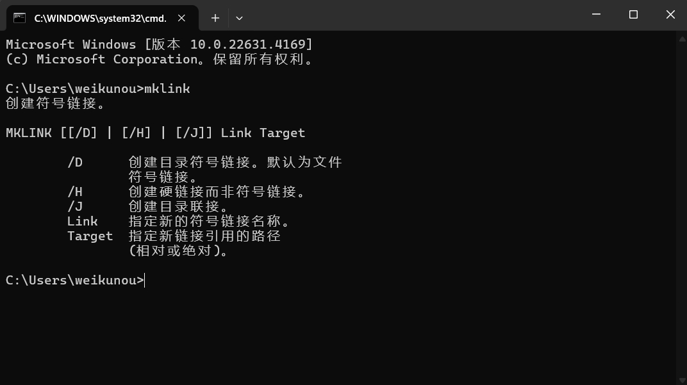
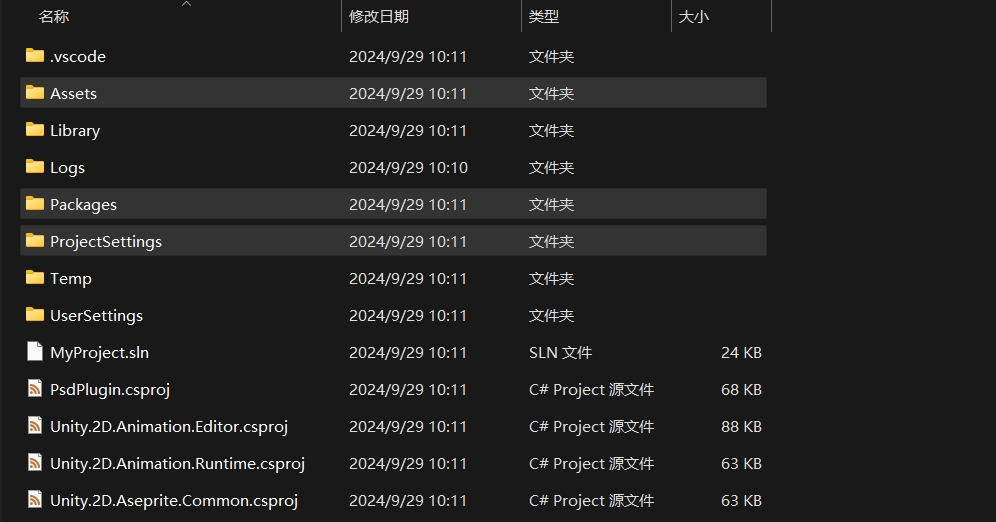
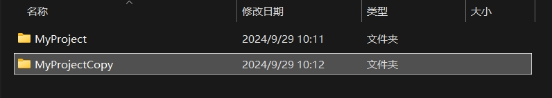
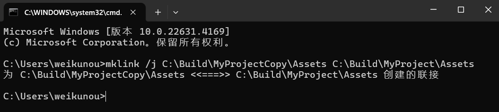
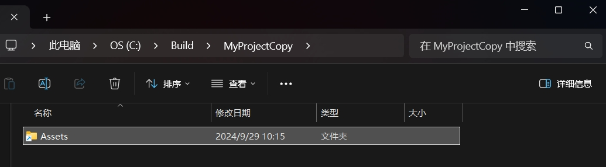
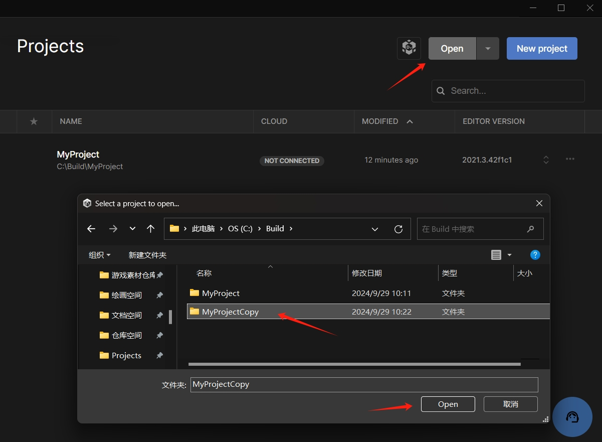
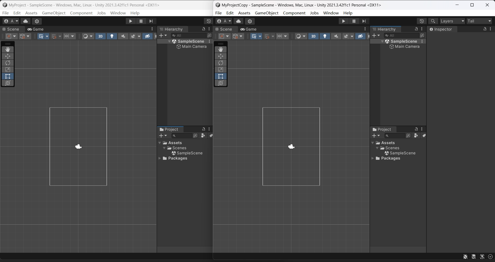

Unity3D 实现客户端多开

<!--more-->

# 客户端多开

最近在做好友聊天系统，为了方便测试，需要再开一个客户端。

简单的方法，就是直接拷贝一个新的项目，但是需要很多时间和占用空间。

查阅了网络资料，发现有一种软链接，可以仅通过创建文件夹，就能实现多开。

## mklink

按下 win + R 键，打开 cmd 命令提示符，输入 `mklink`，可以看到关于该命令的一些参数介绍。



我们需要使用 `mklink` 命令，对三个文件夹进行软链接。

- Assets
- Packages
- ProjectSettings

如图，高亮的三个文件夹。



## 创建文件夹

现在有一个工程，路径是

```
C:\Build\MyProject
```

创建一个文件夹，路径是（也可以放到别的磁盘目录）

```
C:\Build\MyProjectCopy
```



打开命令提示符，输入 `mklink /j 目标文件夹 源文件夹`

```
mklink /j C:\Build\MyProjectCopy\Assets C:\Build\MyProject\Assets
```

按下回车键后，提示创建了联接。



看看 MyProjectCopy 的文件夹目录，已经有一个 Assets 文件夹了，并且左下角有一个类似快捷方式的图标，但跟快捷方式还是有区别的。



继续输入命令，直到把三个文件夹都联接上。

```
mklink /j C:\Build\MyProjectCopy\Packages C:\Build\MyProject\Packages
```

```
mklink /j C:\Build\MyProjectCopy\ProjectSettings C:\Build\MyProject\ProjectSettings
```

## 打开新工程

现在就可以使用 hub 打开新的工程目录了。



如图，已经打开了两个客户端，并且使用的是同一套资源代码。


