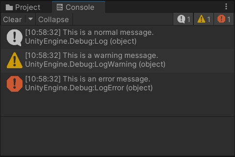
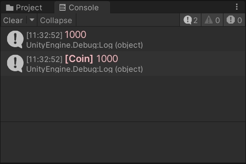

Unity3D 自定义彩色打印的实现。

<!--more-->

# 彩色打印

## 常用打印

在 Unity 控制台中打印信息，通常使用以下三个接口：

```csharp
Debug.Log("This is a normal message.");
Debug.LogWarning("This is a warning message.");
Debug.LogError("This is an error message.");
```

效果：



在日常开发中，用得比较多的是 `Debug.Log`，用于打印一些普通的日志，测试代码流程。而另外两个打印，则是用于一些异常情况的报错提示。

通常项目中的打印会非常多，有时候难以观察到自己所需要的打印，当然，也有人会使用另外两个打印，突出显示，不过弊端就是容易忽略真正的报错。

为了解决上述问题，我们可以稍加改造，添加一些自定义的颜色，加大字号，让打印更加明显。

## 自定义打印

首先，创建一个静态类 `ColorLog`，定义颜色、字体大小、打印开关（用于打正式包时统一关闭打印）。

接着，创建一个对外的函数 `Pink`，接收不定长的参数列表，内部调用封装好的 `Log` 函数。

`Log` 函数实际上是调用 `Debug.Log`，只是添加了一些富文本标签，如 `<color></color>` 和 `<size></size>`，把参数列表用空格进行拼接，然后填入字符串中。

```csharp
using UnityEngine;

public static class ColorLog
{
    static readonly string pinkColorHex = "#fbbac1";   // 粉色
    static readonly int fontSize = 15;                 // 字体大小
    public static bool isDebug = true;                 // 打印开关
    
    public static void Pink(params object[] args)
    {
        Log(pinkColorHex, args);
    }
    
    static void Log(string color, params object[] args)
    {
        if (!isDebug) return;
        string content = args.Length > 0 ? string.Join(" ", args) : string.Empty;
        Debug.Log($"<size={fontSize}><color={color}>{content}</color></size>");
    }
}
```

调用：

```csharp
ColorLog.Pink("This is a pink message.");
```

效果：


我们还可以把接收到的第一个字符串参数，用作标题加粗显示。

在 `ColorLog` 类中添加一个重载函数 `Pink(string title, params object[] args)`，内部调用的 `Log` 函数也添加重载。

与之前的 `Log` 对比，不同之处在于，字符串中添加了标签 `<b></b>`，把 `title` 参数加粗显示。

```csharp
using UnityEngine;

public static class ColorLog
{
    // ...
    
    public static void Pink(string title, params object[] args)
    {
        Log(pinkColorHex, title, args);
    }
    
    static void Log(string color, string title, params object[] args)
    {
        if (!isDebug) return;
        string content = args.Length > 0 ? string.Join(" ", args) : string.Empty;
        Debug.Log($"<size={fontSize}><color={color}><b>{title}</b> {content}</color></size>");
    }
}
```

调用：

```csharp
ColorLog.Pink(1000);
ColorLog.Pink("[Coin]", 1000);
```

效果：



类似的，我们还可以添加各种颜色的打印：


## 完整代码

```csharp
using UnityEngine;

public static class ColorLog
{
    static readonly string redColorHex = "#bf5959";    // 红色
    static readonly string yellowColorHex = "#ffbb00"; // 黄色
    static readonly string blueColorHex = "#5489ce";   // 蓝色
    static readonly string greenColorHex = "#3cb472";  // 绿色
    static readonly string pinkColorHex = "#fbbac1";   // 粉色
    static readonly int fontSize = 15;                 // 字体大小
    public static bool isDebug = true;                 // 打印开关

    public static void Red(params object[] args)
    {
        LogError(redColorHex, args);
    }

    public static void Red(string title, params object[] args)
    {
        LogError(redColorHex, title, args);
    }

    public static void Yellow(params object[] args)
    {
        LogWarning(yellowColorHex, args);
    }

    public static void Yellow(string title, params object[] args)
    {
        LogWarning(yellowColorHex, title, args);
    }

    public static void Blue(params object[] args)
    {
        Log(blueColorHex, args);
    }

    public static void Blue(string title, params object[] args)
    {
        Log(blueColorHex, title, args);
    }

    public static void Green(params object[] args)
    {
        Log(greenColorHex, args);
    }

    public static void Green(string title, params object[] args)
    {
        Log(greenColorHex, title, args);
    }

    public static void Pink(params object[] args)
    {
        Log(pinkColorHex, args);
    }

    public static void Pink(string title, params object[] args)
    {
        Log(pinkColorHex, title, args);
    }

    static void Log(string color, params object[] args)
    {
        if (!isDebug) return;
        string content = args.Length > 0 ? string.Join(" ", args) : string.Empty;
        Debug.Log($"<size={fontSize}><color={color}>{content}</color></size>");
    }

    static void Log(string color, string title, params object[] args)
    {
        if (!isDebug) return;
        string content = args.Length > 0 ? string.Join(" ", args) : string.Empty;
        Debug.Log($"<size={fontSize}><color={color}><b>{title}</b> {content}</color></size>");
    }

    static void LogWarning(string color, params object[] args)
    {
        string content = args.Length > 0 ? string.Join(" ", args) : string.Empty;
        Debug.LogWarning($"<size={fontSize}><color={color}>{content}</color></size>");
    }

    static void LogWarning(string color, string title, params object[] args)
    {
        string content = args.Length > 0 ? string.Join(" ", args) : string.Empty;
        Debug.LogWarning($"<size={fontSize}><color={color}><b>{title}</b> {content}</color></size>");
    }

    static void LogError(string color, params object[] args)
    {
        string content = args.Length > 0 ? string.Join(" ", args) : string.Empty;
        Debug.LogError($"<size={fontSize}><color={color}>{content}</color></size>");
    }

    static void LogError(string color, string title, params object[] args)
    {
        string content = args.Length > 0 ? string.Join(" ", args) : string.Empty;
        Debug.LogError($"<size={fontSize}><color={color}><b>{title}</b> {content}</color></size>");
    }
}
```
