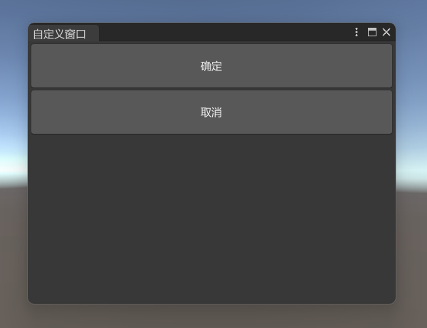

Unity3D 自定义窗口的实现。

<!--more-->

# 自定义窗口

Unity3D 可以通过编写代码，扩展编辑器的菜单栏和窗口。

简单的功能可以直接一个菜单按钮实现，复杂的功能就需要绘制一个窗口展示更多的信息。

编辑器扩展的脚本，需要放在 Editor 文件夹中。


## 菜单栏

首先，需要引用命名空间 `UnityEditor`，然后在类里编写静态方法，在方法的头顶上面添加 `MenuItem`，填写菜单栏的路径。

```csharp
using UnityEditor;

public class CustomizeWindow
{
    [MenuItem("自定义窗口/打开窗口")]
    public static void OpenWindow()
    {

    }
}
```

编译一下，就能看到多出了一个菜单栏选项。


## 窗口

需要继承 `EditorWindow`，通过 `GetWindow` 方法创建一个窗口对象，调用 `Show` 方法显示。

可以通过修改 `titleContent` 设置窗口标题。

这里的 `GUIContent` 需要引用命名空间 `UnityEngine`。

```csharp
using UnityEngine;
using UnityEditor;

public class CustomizeWindow : EditorWindow
{
    [MenuItem("自定义窗口/打开窗口")]
    public static void OpenWindow()
    {
        // 创建窗口对象
        CustomizeWindow window = GetWindow<CustomizeWindow>();

        // 设置窗口标题
        window.titleContent = new GUIContent("自定义窗口");

        // 显示窗口
        window.Show();
    }
}
```

现在再去点击菜单栏的<kbd>打开窗口</kbd>按钮，就能显示自定义窗口了。


### 按钮

现在窗口空荡荡的，可以先加两个按钮。

在窗口中绘制 UI 元素，需要写在生命周期函数 `OnGUI` 里面，使用 `GUILayout.Button` 创建按钮，使用 `GUILayout.Height` 设置按钮高度。

创建按钮的代码之所以放在 if 语句的条件判断里，是因为点击按钮后会返回一个布尔值，可以判断按钮是否被点击。

```csharp
using UnityEngine;
using UnityEditor;

public class CustomizeWindow : EditorWindow
{
    // ...

    void OnGUI()
    {
        if (GUILayout.Button("确定", GUILayout.Height(50)))
        {

        }

        if (GUILayout.Button("取消", GUILayout.Height(50)))
        {
            
        }
    }
}
```

现在窗口就有了两个按钮了。



### 文本

使用 `GUILayout.Label` 绘制文本。

```csharp
using UnityEngine;
using UnityEditor;

public class CustomizeWindow : EditorWindow
{
    // ...

    void OnGUI()
    {
        GUILayout.Label("这是一个自定义的窗口，可以自由编写功能");
        
        // ...
    }
}
```

现在窗口有文本了。


### 文本输入框

使用 `EditorGUILayout.TextField` 绘制文本输入框，它有返回值，是输入框的内容。

可以在按钮里面打印一下文本输入框的内容。

```csharp
using UnityEngine;
using UnityEditor;

public class CustomizeWindow : EditorWindow
{
    // ...

    string input = "请输入...";

    void OnGUI()
    {
        // ...
        
        input = EditorGUILayout.TextField(input);

        if (GUILayout.Button("确定", GUILayout.Height(50)))
        {
            Debug.Log("input = " + input);
        }

        // ...
    }
}
```

现在窗口有文本输入框了。


### 样式

按钮文本的样式也可以自定义。

先定义 `GUIStyle` 变量，在 `InitGUIStyle` 方法中，分别对三种控件的样式进行初始化设置，然后传递给控件的第二个参数。

```csharp
using UnityEngine;
using UnityEditor;

public class CustomizeWindow : EditorWindow
{
    GUIStyle buttonStyle;
    GUIStyle labelStyle;
    GUIStyle textFieldStyle;

    // ...

    void OnGUI()
    {
        InitGUIStyle();

        GUILayout.Label("这是一个自定义的窗口，可以自由编写功能", labelStyle);

        input = EditorGUILayout.TextField(input, textFieldStyle);

        if (GUILayout.Button("确定", buttonStyle, GUILayout.Height(50)))
        {
            Debug.Log("input = " + input);
        }

        if (GUILayout.Button("取消", buttonStyle, GUILayout.Height(50)))
        {
            
        }
    }

    void InitGUIStyle()
    {
        if (buttonStyle == null)
        {
            buttonStyle = new GUIStyle(GUI.skin.button);
            buttonStyle.fontSize = 14;
            buttonStyle.margin.left = 20;
            buttonStyle.margin.right = 20;
            buttonStyle.margin.top = 20;
            buttonStyle.margin.bottom = 20;
        }

        if (labelStyle == null)
        {
            labelStyle = new GUIStyle(EditorStyles.boldLabel);
            labelStyle.fontSize = 14;
            labelStyle.margin.left = 20;
            labelStyle.margin.right = 20;
            labelStyle.margin.top = 20;
            labelStyle.margin.bottom = 20;
        }

        if (textFieldStyle == null)
        {
            textFieldStyle = new GUIStyle(EditorStyles.toolbarTextField);
            textFieldStyle.fontSize = 14;
            textFieldStyle.fixedHeight = 30;
            textFieldStyle.margin.left = 20;
            textFieldStyle.margin.right = 20;
            textFieldStyle.margin.top = 20;
            textFieldStyle.margin.bottom = 20;
        }
    }
}
```

现在窗口焕然一新。


### 布局

窗口内的控件可以调整摆放的布局。

例如，把两个垂直摆放的按钮，改成水平布局。

- 在按钮代码的开头加上 `EditorGUILayout.BeginHorizontal();`
- 在按钮代码的结尾加上 `EditorGUILayout.EndHorizontal();`

被这两行代码包围的控件，就会处于同一个水平布局之中。

```csharp
using UnityEngine;
using UnityEditor;

public class CustomizeWindow : EditorWindow
{
    // ...

    void OnGUI()
    {
        // ...

        EditorGUILayout.BeginHorizontal();

        if (GUILayout.Button("确定", buttonStyle, GUILayout.Height(50)))
        {
            Debug.Log("input = " + input);
        }

        if (GUILayout.Button("取消", buttonStyle, GUILayout.Height(50)))
        {
            
        }

        EditorGUILayout.EndHorizontal();
    }
}
```

现在两个按钮就在同一个水平布局之中了。


### 间隔

使用 `GUILayout.Space` 绘制间隔。

例如，在文本输入框和按钮之间，加入 10 的间隔。

```csharp
using UnityEngine;
using UnityEditor;

public class CustomizeWindow : EditorWindow
{
    // ...

    void OnGUI()
    {
        // ...

        input = EditorGUILayout.TextField(input, textFieldStyle);

        GUILayout.Space(10);

        EditorGUILayout.BeginHorizontal();

        // ...
    }
}
```

现在文本输入框和按钮之间就不会那么贴近了。


### 滚动视图

滚动视图也是两行代码包围控件。

- `EditorGUILayout.BeginScrollView(scrollPos);`
- `EditorGUILayout.EndScrollView();`

不过滚动视图需要定义一个 `Vector2 scrollPos`，在滚动时记录当前的位置。

```csharp
using UnityEngine;
using UnityEditor;

public class CustomizeWindow : EditorWindow
{
    // ...

    GUIStyle scrollViewStyle;

    Vector2 scrollPos = Vector2.zero;

    void OnGUI()
    {
        // ...

        GUILayout.Label("搜索结果", labelStyle);

        scrollPos = EditorGUILayout.BeginScrollView(scrollPos, scrollViewStyle);

        GUILayout.Label("结果 1", labelStyle);

        GUILayout.Label("结果 2", labelStyle);

        EditorGUILayout.EndScrollView();
    }

    void InitGUIStyle()
    {
        // ...

        if (scrollViewStyle == null)
        {
            scrollViewStyle = new GUIStyle(GUI.skin.scrollView);
            scrollViewStyle.fontSize = 14;
            scrollViewStyle.margin.left = 20;
            scrollViewStyle.margin.right = 20;
            scrollViewStyle.margin.top = 20;
            scrollViewStyle.margin.bottom = 20;
        }
    }
}
```

现在就有了一个展示结果列表的滚动视图。


## 弹窗

现在点按钮是没有反馈的，通常情况下可以给一个弹窗提示。

- 弹窗附带一个确定和一个关闭按钮，使用 `EditorUtility.DisplayDialog`，返回 true 或者 false
- 弹窗附带一个确定、一个取消、一个可选和一个关闭按钮，使用 `EditorUtility.DisplayDialogComplex`，返回 0、1、2

例如，在确定和取消按钮中添加弹窗提示。

```csharp
using UnityEngine;
using UnityEditor;

public class CustomizeWindow : EditorWindow
{
    // ...

    void OnGUI()
    {
        // ...

        if (GUILayout.Button("确定", buttonStyle, GUILayout.Height(50)))
        {
            int id = EditorUtility.DisplayDialogComplex("温馨提示", "搜索完成", "okk", "oh no", "good");
            Debug.Log(id);
        }

        if (GUILayout.Button("取消", buttonStyle, GUILayout.Height(50)))
        {
            bool flag = EditorUtility.DisplayDialog("温馨提示", "已取消", "okk");
            Debug.Log(flag);
        }
    }
}
```

现在点击确定按钮，弹出附带三个按钮和关闭按钮的弹窗。


点击取消按钮，弹出附带一个按钮和关闭按钮的弹窗。


