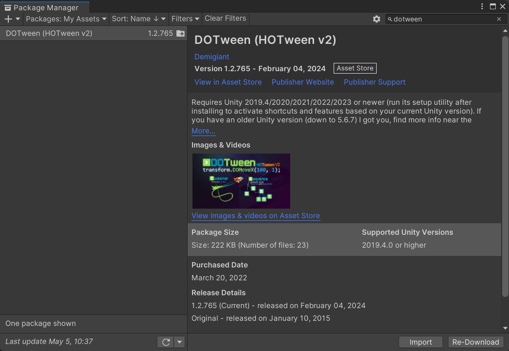
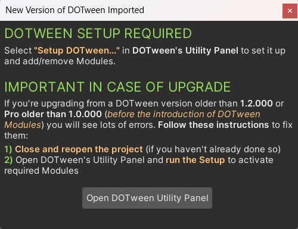
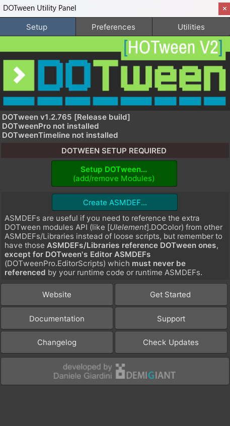
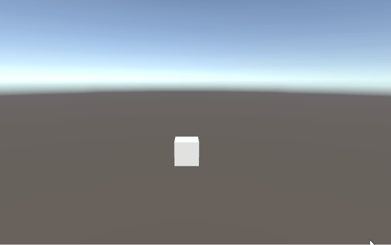
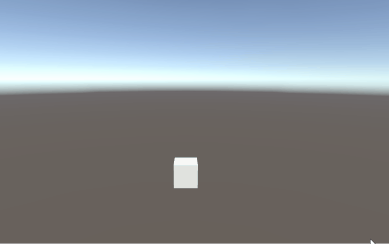
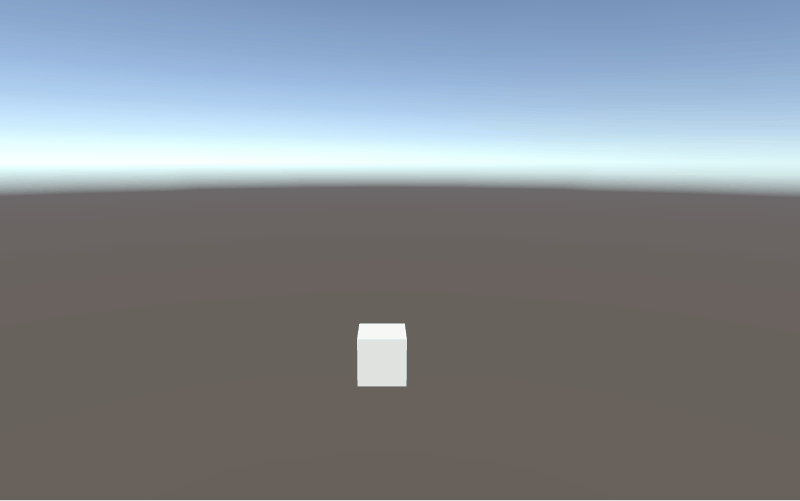
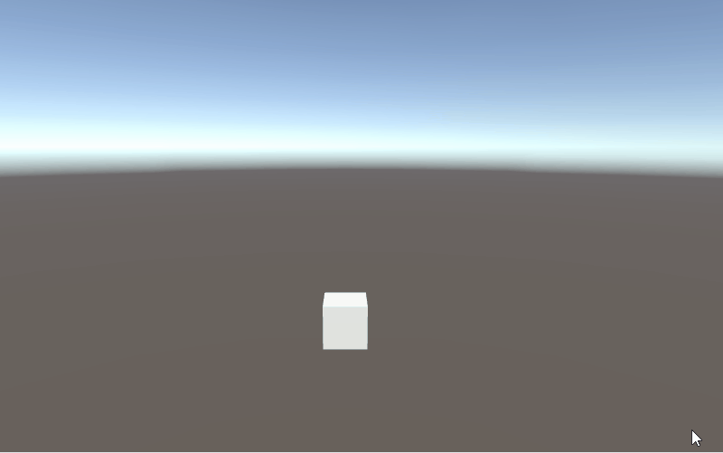
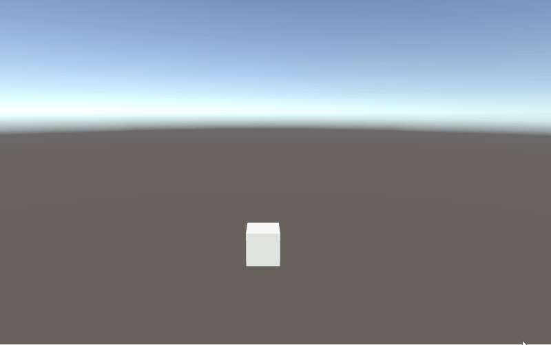
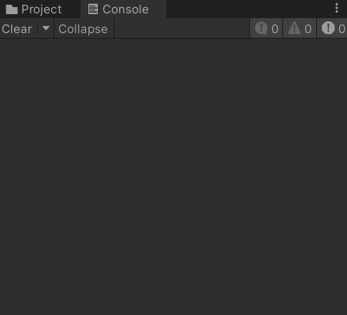

简单介绍一下 DOTween 插件的使用。

<!--more-->

# 导入插件

先到 Asset Store 获取 DOTween 插件，然后在 Package Manager 的 My Assets 中搜索，下载并导入插件。



导入后，会自动弹出一个窗口，提示需要先对插件进行配置。



点击上图中的按钮，打开下图的窗口，按顺序点击 Setup DOTween 和 Create ASMDEF 按钮。



配置完成后就可以开始使用 DOTween 插件了。

# 简单动画

创建一个脚本 DOTweenDemo.cs，在场景中创建一个空物体并挂载脚本。

在场景中创建一个 Cube，拖拽引用。

要使用 DOTween，需要引入命名空间 `DG.Tweening`，然后通过组件扩展的以 DO 开头的函数方法进行调用。

例如，`transform.DOMoveX` 是让物体在 X 轴方向上进行移动，第一个参数是目标位置，第二个参数是持续时间。

```c#
using UnityEngine;
using DG.Tweening;

public class DOTweenDemo : MonoBehaviour
{
    public GameObject cube;

    public float posX = 5f;
    public float duration = 1f;

    void Update()
    {
        if (Input.GetKeyDown(KeyCode.Alpha1))
        {
            cube.transform.DOMoveX(-posX, duration);
        }
        else if (Input.GetKeyDown(KeyCode.Alpha2))
        {
            cube.transform.DOMoveX(posX, duration);
        }
    }
}
```

运行游戏，按下键盘 1 键时 Cube 向左移动，按下键盘 2 键时 Cube 向右移动。



# 动画序列

在实际项目中，动画会更加复杂一些，可能会有多段位移，或者位移后缩小的需求。

通常会使用动画序列来实现复杂动画。

使用 `DOTween.Sequence` 创建一个动画序列对象，通过 `sequence.Insert` 在指定时刻插入一个简单动画。

例如，在最开始 0 秒的位置，让 Cube 移动到右边。

因为持续时间是 1 秒，所以在 1 秒的位置，上一个动画结束了，继续插入第二个动画，让 Cube 向上移动。

后续的动画以此类推。

```c#
using UnityEngine;
using DG.Tweening;

public class DOTweenDemo : MonoBehaviour
{
    public GameObject cube;

    public float posX = 5f;
    public float posY = 5f;
    public float duration = 1f;

    void Update()
    {
        if (Input.GetKeyDown(KeyCode.Alpha1))
        {
            Sequence sequence = DOTween.Sequence();
            sequence.Insert(0f, cube.transform.DOMoveX(posX, duration));
            sequence.Insert(1f, cube.transform.DOMoveY(posY, duration));
            sequence.Insert(2f, cube.transform.DOMoveX(-posX, duration));
            sequence.Insert(3f, cube.transform.DOMoveY(0f, duration));
        }
    }
}
```

运行游戏，按下键盘 1 键时 Cube 进行了四段位移。



# 动画回调

有时候，我们想要在动画播放完成之后执行一些逻辑，就可以使用动画的回调方法。

例如，让 Cube 向前移动，到达指定位置之后，再缩小。

```c#
using UnityEngine;
using DG.Tweening;

public class DOTweenDemo : MonoBehaviour
{
    public GameObject cube;

    public float posX = 5f;
    public float posY = 5f;
    public float duration = 1f;

    void Update()
    {
        if (Input.GetKeyDown(KeyCode.Alpha1))
        {
            cube.transform.DOMoveZ(5f, duration).OnComplete(()=>
            {
                cube.transform.DOScale(0f, duration);
            });
        }
    }
}
```

运行效果：



# 结束动画

有时候，玩家进行了某些操作，需要提前让动画结束，有两种方法。

一种是直接 Kill 掉动画，即中断动画。

一种是提前完成动画。

在 Kill 掉动画的时候，需要先为动画设置 id，然后使用 `DOTween.Kill` 中断指定 id 的动画。

> 注意：这里只为 DOMoveZ 设置了 id，当它结束时播放的另一个缩放动画是不会被 Kill 掉的。

```c#
using UnityEngine;
using DG.Tweening;

public class DOTweenDemo : MonoBehaviour
{
    public GameObject cube;

    public float posX = 5f;
    public float posY = 5f;
    public float duration = 1f;

    void Update()
    {
        if (Input.GetKeyDown(KeyCode.Alpha1))
        {
            cube.transform.DOMoveZ(5f, duration).OnComplete(()=>
            {
                cube.transform.DOScale(0f, duration);
            }).SetId("cube");
        }
        else if (Input.GetKeyDown(KeyCode.Alpha2))
        {
            DOTween.Kill("cube");
        }
    }
}
```

运行效果，先按键盘 1 键执行动画，再立刻按键盘 2 键中断动画。



提前完成动画，只需要调用 DOComplete 函数即可。

这里因为是 transform 调用的，对于两段动画来说，都是可以提前完成的。

```c#
using UnityEngine;
using DG.Tweening;

public class DOTweenDemo : MonoBehaviour
{
    public GameObject cube;

    public float posX = 5f;
    public float posY = 5f;
    public float duration = 1f;

    void Update()
    {
        if (Input.GetKeyDown(KeyCode.Alpha1))
        {
            cube.transform.DOMoveZ(5f, duration).OnComplete(()=>
            {
                cube.transform.DOScale(0f, duration);
            });
        }
        else if (Input.GetKeyDown(KeyCode.Alpha2))
        {
            cube.transform.DOComplete();
        }
    }
}
```

运行效果，先按键盘 1 键执行动画，再立刻按键盘 2 键提前完成动画，会有一个动画跳跃的视觉效果。



# 延迟调用

DOTween 除了做一些动画效果外，还可以当做定时器，延迟一段时间后调用。

```c#
using UnityEngine;
using DG.Tweening;

public class DOTweenDemo : MonoBehaviour
{
    void Update()
    {
        if (Input.GetKeyDown(KeyCode.Alpha1))
        {
            Debug.Log("开始定时");
            DOVirtual.DelayedCall(1f, ()=>
            {
                Debug.Log("1 秒后调用");
            });
        }
    }
}
```

运行效果：


