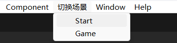

扩展编辑器菜单栏，快速切换常用场景。

<!--more-->

# 菜单栏快速切换场景

一般要打开一个场景，需要在 Assets 文件夹下找到场景文件，双击打开。

但是当资源文件夹太多，搜索起来也比较麻烦。

此时可以在顶部菜单栏上显示几个按钮，点击切换到常用的场景。

这类扩展了编辑器按钮的代码，需要在 Assets 下创建一个 Editor 文件夹，把脚本放到 Editor 文件夹中。

例如，在 Editor 文件夹中创建 EditorSwitchScene.cs，引用 `UnityEditor` 命名空间，在静态类中写静态方法。

使用 `MenuItem` 这个标签给编辑器添加新的菜单按钮，点击按钮则会调用对应的静态方法。

```c#
using UnityEditor;
using UnityEditor.SceneManagement;

public static class EditorSwitchScene
{
    /// <summary>
    /// 打开场景
    /// </summary>
    /// <param name="filename">场景路径</param>
    public static void OpenScene(string filename)
    {
        // 询问是否保存对当前场景的修改
        if (EditorSceneManager.SaveCurrentModifiedScenesIfUserWantsTo())
        {
            EditorSceneManager.OpenScene(filename);
        }
    }

    [MenuItem("切换场景/Start")]
    public static void SwitchStart()
    {
        OpenScene("Assets/Scenes/Start.unity");
    }

    [MenuItem("切换场景/Game")]
    public static void SwitchGame()
    {
        OpenScene("Assets/Scenes/Game.unity");
    }
}
```

可以看到菜单栏多出的按钮：


