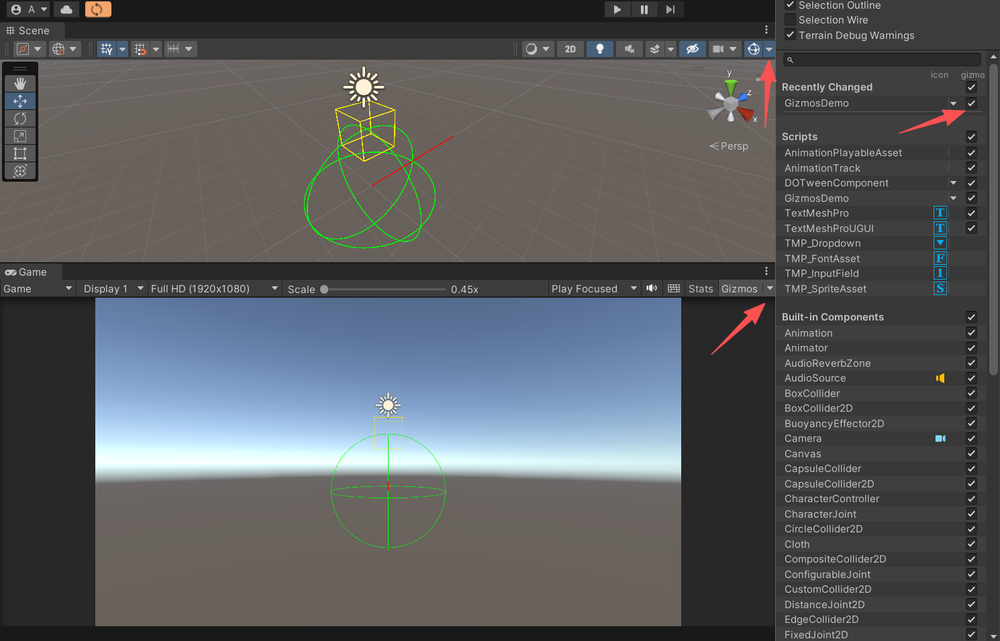

利用 Gizmos 直观地看到一些调试信息。

<!--more-->

# Unity3D Gizmos 调试可视化

在 Unity 开发中，很多时候我们需要在 **Scene / Game 视图** 里直观地看到一些调试信息，比如角色的攻击范围、AI 的巡逻路径、摄像机的视野等。

这时候，Unity 提供的 **Gizmos** 系统就是非常好用的工具。

## 基本用法

只要在脚本里实现 **`OnDrawGizmos`** 或 **`OnDrawGizmosSelected`** 方法，就能绘制调试辅助图形。

```csharp
using UnityEngine;

public class GizmosDemo : MonoBehaviour
{
    [SerializeField] private float radius = 2f;

    private void OnDrawGizmos()
    {
        // 设置颜色
        Gizmos.color = Color.green;

        // 画一个球体
        Gizmos.DrawWireSphere(transform.position, radius);

        // 画一个立方体
        Gizmos.color = Color.yellow;
        Gizmos.DrawWireCube(transform.position + Vector3.up * 2, Vector3.one);

        // 画一条射线
        Gizmos.color = Color.red;
        Gizmos.DrawRay(transform.position, transform.forward * 5f);
    }

    private void OnDrawGizmosSelected()
    {
        Gizmos.color = Color.cyan;
        Gizmos.DrawWireSphere(transform.position, radius * 1.5f);
    }
}
```

- **`OnDrawGizmos`** -> 始终显示（场景中会很乱）
- **`OnDrawGizmosSelected`** -> 只有选中物体时显示（推荐）

> 注：如果在视图中没有显示绘制的图形，请检查右上角的图形开关，勾选对应的脚本。



## 常用 Gizmos API

| 方法                                           | 描述                               |
| ---------------------------------------------- | ---------------------------------- |
| `Gizmos.DrawWireSphere(pos, radius)`           | 线框球体                           |
| `Gizmos.DrawSphere(pos, radius)`               | 实心球体                           |
| `Gizmos.DrawWireCube(pos, size)`               | 线框立方体                         |
| `Gizmos.DrawCube(pos, size)`                   | 实心立方体                         |
| `Gizmos.DrawLine(start, end)`                  | 绘制线段                           |
| `Gizmos.DrawRay(origin, dir)`                  | 绘制射线                           |
| `Gizmos.DrawIcon(pos, "icon.png", true)`       | 绘制图标（方便定位）               |
| `Gizmos.matrix = transform.localToWorldMatrix` | 设置坐标系（绘制局部网格时很有用） |
| `Gizmos.DrawMesh(mesh, pos, rot, scale)`       | 绘制自定义 Mesh                    |

## 实际应用场景

### 显示攻击范围

```csharp
private void OnDrawGizmosSelected()
{
    Gizmos.color = Color.red;
    Gizmos.DrawWireSphere(transform.position, attackRange);
}
```

### 显示 AI 巡逻路径

```csharp
private void OnDrawGizmos()
{
    Gizmos.color = Color.blue;
    for (int i = 0; i < waypoints.Length - 1; i++)
    {
        Gizmos.DrawLine(waypoints[i].position, waypoints[i + 1].position);
    }
}
```

### 显示摄像机视野

```csharp
private void OnDrawGizmos()
{
    Camera cam = GetComponent<Camera>();
    Gizmos.color = Color.green;
    Gizmos.matrix = cam.transform.localToWorldMatrix;
    Gizmos.DrawFrustum(Vector3.zero, cam.fieldOfView, cam.farClipPlane, cam.nearClipPlane, cam.aspect);
}
```

## 通用 Gizmos 工具类

为了避免每次都写重复代码，可以整理一个 **GizmosHelper** 工具类，例如：

- 绘制调试网格
- 绘制扇形范围
- 绘制路径箭头

```csharp
using UnityEngine;

public static class GizmosHelper
{
    /// <summary>
    /// 绘制调试网格
    /// </summary>
    public static void DrawGrid(Vector3 origin, int width, int height, float cellSize, Color color)
    {
        Gizmos.color = color;
        for (int x = 0; x <= width; x++)
        {
            Gizmos.DrawLine(origin + new Vector3(x * cellSize, 0, 0),
                            origin + new Vector3(x * cellSize, 0, height * cellSize));
        }
        for (int z = 0; z <= height; z++)
        {
            Gizmos.DrawLine(origin + new Vector3(0, 0, z * cellSize),
                            origin + new Vector3(width * cellSize, 0, z * cellSize));
        }
    }

    /// <summary>
    /// 绘制扇形范围
    /// </summary>
    public static void DrawSector(Vector3 center, Vector3 forward, float angle, float radius, int segments = 20)
    {
        Gizmos.color = Color.yellow;
        float halfAngle = angle * 0.5f;
        Quaternion leftRot = Quaternion.AngleAxis(-halfAngle, Vector3.up);
        Quaternion rightRot = Quaternion.AngleAxis(halfAngle, Vector3.up);

        Vector3 leftDir = leftRot * forward * radius;
        Vector3 rightDir = rightRot * forward * radius;

        Gizmos.DrawLine(center, center + leftDir);
        Gizmos.DrawLine(center, center + rightDir);

        Vector3 lastPoint = center + leftDir;
        for (int i = 1; i <= segments; i++)
        {
            float t = (float)i / segments;
            Quaternion rot = Quaternion.AngleAxis(Mathf.Lerp(-halfAngle, halfAngle, t), Vector3.up);
            Vector3 nextPoint = center + rot * forward * radius;
            Gizmos.DrawLine(lastPoint, nextPoint);
            lastPoint = nextPoint;
        }
    }

    /// <summary>
    /// 绘制路径箭头
    /// </summary>
    public static void DrawPath(Vector3[] points, Color color)
    {
        if (points == null || points.Length < 2) return;

        Gizmos.color = color;
        for (int i = 0; i < points.Length - 1; i++)
        {
            Gizmos.DrawLine(points[i], points[i + 1]);
            DrawArrowHead(points[i], points[i + 1], color);
        }
    }

    private static void DrawArrowHead(Vector3 start, Vector3 end, Color color)
    {
        Vector3 dir = (end - start).normalized;
        Vector3 right = Quaternion.LookRotation(dir) * Quaternion.Euler(0, 150, 0) * Vector3.forward;
        Vector3 left = Quaternion.LookRotation(dir) * Quaternion.Euler(0, -150, 0) * Vector3.forward;

        Gizmos.DrawLine(end, end + right * 0.5f);
        Gizmos.DrawLine(end, end + left * 0.5f);
    }
}
```

使用示例：

```csharp
private void OnDrawGizmos()
{
    // 调试网格
    GizmosHelper.DrawGrid(Vector3.zero, 5, 5, 1f, Color.gray);

    // 扇形范围
    GizmosHelper.DrawSector(transform.position, transform.forward, 90f, 5f);

    // 路径箭头
    Vector3[] path = { transform.position, transform.position + Vector3.forward * 3, transform.position + Vector3.right * 3 };
    GizmosHelper.DrawPath(path, Color.cyan);
}
```

效果：


## 注意事项

- Gizmos 只在 **Scene / Game 视图** 可见，不会出现在游戏发布版本。
- 在 **Gizmos 面板** 勾选对应脚本才能看到。
- 建议用 `OnDrawGizmosSelected`，避免场景太乱。

## 总结

- `OnDrawGizmos` / `OnDrawGizmosSelected` 是调试可视化的核心入口。
- Gizmos 常用来显示 **网格、范围、路径、摄像机视野等调试辅助信息**。
- 封装 **GizmosHelper 工具类** 能极大提高开发效率。
