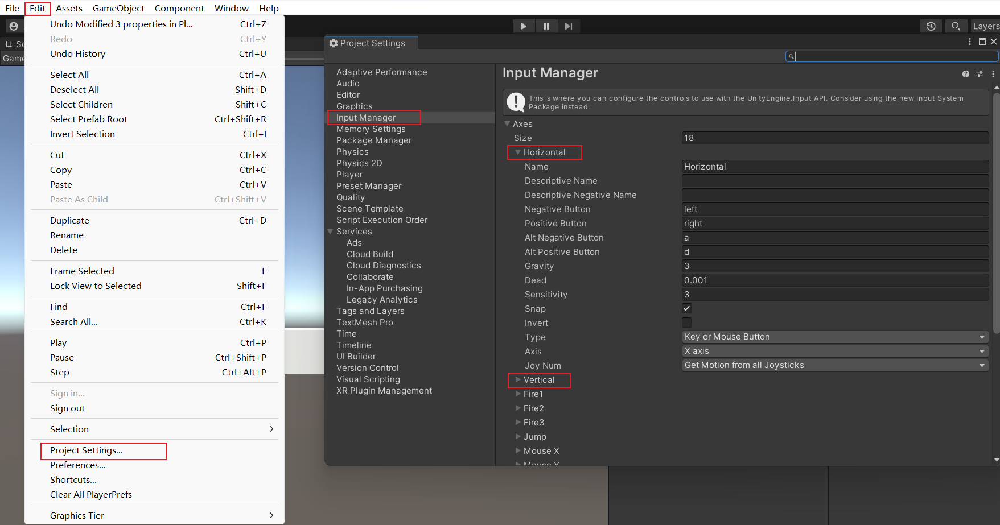

这篇文章研究一下通过键盘和鼠标对游戏物体进行移动或是其他操作。

先来看看简单的按键输入。

<!--more-->

# 一、键盘按键

创建一个脚本，挂载到一个 Cube 上，在 Update 函数监听键盘按键。

使用的接口就是 Input.GetKeyDown，这个接口只会在按下按键的时候，返回一次 true。也就是说，长按键盘按键时，后续只会返回 false。

如果想要按住键盘的按键，持续不断地返回 true，就可以使用 Input.GetKey 接口。

（注：Input.GetKey 在按下的瞬间，可能会调用好几次，因为 Update 是每帧执行一次，每帧 0.016 秒左右）

```c#
void Update()
{
    // 按下键盘的 W 键，向上移动一个单位
    if (Input.GetKeyDown(KeyCode.W))
    {
        transform.position += Vector3.up;
    }
    // 按下键盘的 S 键，向下移动一个单位
    else if (Input.GetKeyDown(KeyCode.S))
    {
        transform.position += Vector3.down;
    }
    // 按下键盘的 A 键，向左移动一个单位
    else if (Input.GetKeyDown(KeyCode.A))
    {
        transform.position += Vector3.left;
    }
    // 按下键盘的 D 键，向右移动一个单位
    else if (Input.GetKeyDown(KeyCode.D))
    {
        transform.position += Vector3.right;
    }
}
```

当然，在移动游戏物体时，不会逐个按键去监听，而是使用 Input.GetAxis 去监听水平或垂直方向上的偏移量。

这里声明了一个速度和一个方向向量，通过获取水平和垂直方向的偏移量，修改方向向量，计算出每帧的移动距离，修改物体位置，达到通过键盘方向键移动游戏物体的目的。

上面通过监听每个键盘按键的例子，只对 WSAD 有效。而下面这个例子，对 WSAD 和 方向键 都有效。

```c#
public float speed = 5f;
public Vector3 direction;

void Update()
{
    // 水平偏移量
    float h = Input.GetAxis("Horizontal");
    // 垂直偏移量
    float v = Input.GetAxis("Vertical");
    // 修改方向向量
    direction.x = h;
    direction.y = v;
    // 计算移动距离并修改物体位置
    transform.position += speed * Time.deltaTime * direction;
}
```

为什么是 Horizontal 和 Vertical 呢？有没有其他的参数呢？

答案是有的。

打开 Edit -> Project Settings -> Input Manager，可以看到 Horizontal 和 Vertical 两个元素，里面都包含了一系列的参数设置。

可以添加、修改、删除一些元素，填好 Name（按键名）、Positive Button（正向）、Negative Button（反向）就可以通过 Input.GetAxis 获取按键输入啦。



此外，还有 Input.GetAxisRaw，它和 Input.GetAxis 的区别是，它的返回值是 -1 0 1 三个整数，而 Input.GetAxis 会逐渐从 0 到 1 或 -1 进行变化，有一个缓慢增速的过程。

除了 Input.GetKeyDown，还有 Input.GetButtonDown，它们都可以获取 Input Manager 设置的轴键，而 GetKeyDown 可以额外通过 KeyCode 枚举变量获取按键，GetButtonDown 则只能获取轴键（GetAxis 同理）。

# 二、鼠标按键

鼠标的三个按键也都是通过 Input 类的接口来监听。

```c#
void Update()
{
    if (Input.GetMouseButtonDown(0))
    {
        Debug.Log("按下鼠标左键");
    }
    else if (Input.GetMouseButtonDown(1))
    {
        Debug.Log("按下鼠标右键");
    }
    else if (Input.GetMouseButtonDown(2))
    {
        Debug.Log("按下鼠标中键");
    }
}
```

鼠标在屏幕上移动时，也同样可以获取到移动的坐标偏移量。

```c#
void Update()
{
    float x = Input.GetAxis("Mouse X");
    float y = Input.GetAxis("Mouse Y");
    Debug.Log($"mouse x = {x} y = {y}");
}
```

# 三、总结

下面列出了一些常用的按键接口。

```c#
// 键盘
Input.GetKey(KeyCode.W)           // 按住 W 键持续返回 true, 松开后返回 false
Input.GetKeyDown(KeyCode.W)       // 按下 W 键返回 true，按住也只会返回 false
Input.GetKeyUp(KeyCode.W)         // 抬起 W 键返回 true

// 注：这里的 Jump 需要在 Input Manager 里设置一个名称为 Jump 的轴键
Input.GetButton("Jump")           // 按住自定义的键持续返回 true, 松开后返回 false
Input.GetButtonDown("Jump")       // 按下自定义的键返回 true，按住也只会返回 false
Input.GetButtonUp("Jump")         // 抬起自定义的键返回 true

Input.GetAxis("Horizontal")       // AD 或左右方向键的偏移量 (从 0 到 1 变化，或从 0 到 -1 变化)
Input.GetAxis("Vertical")         // WS 或上下方向键的偏移量 (从 0 到 1 变化，或从 0 到 -1 变化)
    
Input.GetAxisRaw("Horizontal")    // AD 或左右方向键的偏移量 (-1 0 1)
Input.GetAxisRaw("Vertical")      // WS 或上下方向键的偏移量 (-1 0 1)


// 鼠标 0: 左键  1: 右键  2: 中键
Input.GetMouseButton(0)       // 按住鼠标左键
Input.GetMouseButtonDown(1)   // 按下鼠标右键
Input.GetMouseButtonUp(2)     // 抬起鼠标中键

Input.GetAxis("Mouse X")      // 鼠标水平方向移动的偏移量
Input.GetAxis("Mouse Y")      // 鼠标垂直方向移动的偏移量
```

