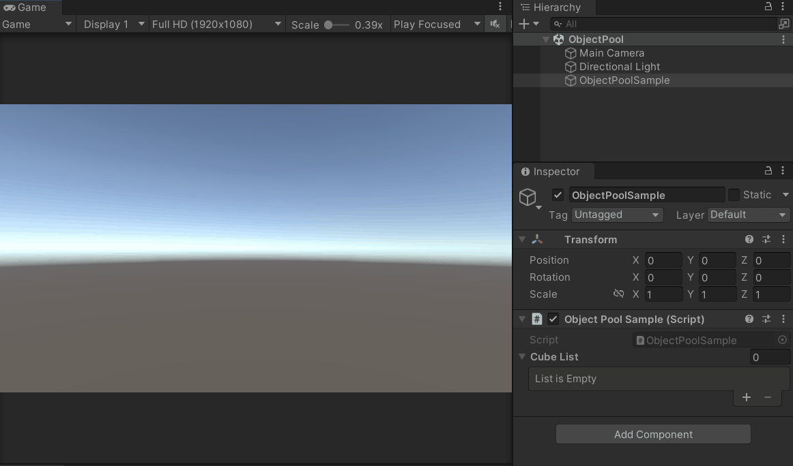
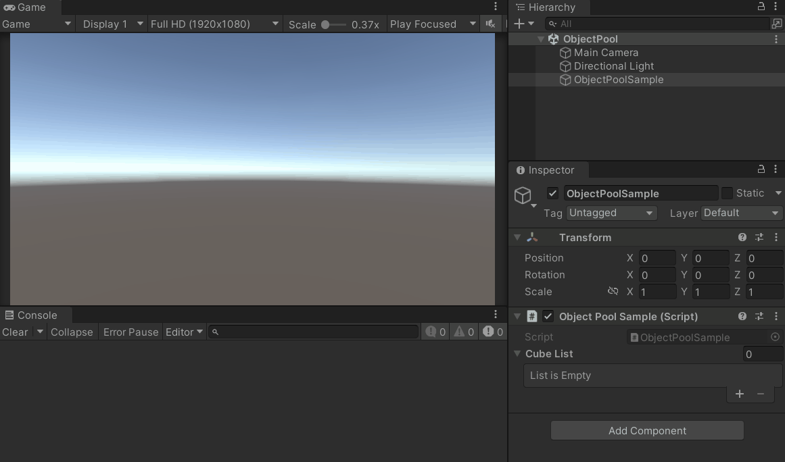

Unity3D 官方对象池的使用。

<!--more-->

# 对象池

对象池是一个可以复用对象的容器。

当需要创建对象时，调用对象池的接口获得对象。

当需要销毁对象时，调用对象池的接口归还对象。

而对象池会判断池子里是否有可用的对象，如果有，直接取出一个对象返回，如果没有，就创建一个新的对象。

从对象池里取出的对象，使用完毕之后要放回对象池。

通过复用对象，减少了创建和销毁对象的次数，避免因频繁创建和销毁对象带来的性能问题。

# 创建对象

下面来看看 Unity3D 官方提供的对象池类。

首先需要引用 `UnityEngine.Pool` 这个命名空间，然后使用 ObjectPool 这个类型定义一个成员字段，在 Start 中实例化，并提供一个用于创建对象的 OnCreate 函数，需要带有返回值，即创建好的新对象。

这里就简单地使用 `GameObject.CreatePrimitive` 创建一个 Cube。

在 Update 中，通过 `cubePool.Get()` 函数获得对象。

```c#
using System.Collections;
using System.Collections.Generic;
using UnityEngine;

// 对象池命名空间
using UnityEngine.Pool;

public class ObjectPoolSample : MonoBehaviour
{
    // 一个对象池
    public ObjectPool<GameObject> cubePool;

    Vector3 pos;

    void Start()
    {
        // 实例化对象池，必须提供一个创建对象的回调函数（带返回值）
        cubePool = new ObjectPool<GameObject>(OnCreate);
    }

    void Update()
    {
        // 按下键盘 1 键
        if (Input.GetKeyDown(KeyCode.Alpha1))
        {
            // 从对象池中获得对象
            GameObject obj = cubePool.Get();
            obj.transform.position = pos;
            pos += Vector3.right;
        }
    }
    
    /// <summary>
    /// 创建对象
    /// </summary>
    /// <returns>新的对象</returns>
    GameObject OnCreate()
    {
        // 创建一个 Cube
        GameObject obj = GameObject.CreatePrimitive(PrimitiveType.Cube);
        return obj;
    }
}
```

# 归还对象

目前只提供了创建对象的函数，还需要提供归还对象的函数。

添加一个 List，用于维护已创建的对象。

在实例化对象池时，第三个参数是归还对象时的回调函数 OnRelease，带有一个参数 GameObject obj，可以获取到被归还的对象，通过 `SetActive(false)` 把它隐藏。第二个参数暂时填 null。

然后在 Update 中添加一个按键 2 的逻辑，遍历 cubeList，把所有的对象都通过 `cubePool.Release` 归还，归还之前会调用 OnRelease 回调函数。

```c#
using System.Collections;
using System.Collections.Generic;
using UnityEngine;
using UnityEngine.Pool;

public class ObjectPoolSample : MonoBehaviour
{
    // ...
    public List<GameObject> cubeList;

    void Start()
    {
        // 实例化对象池时，添加一个新的回调函数 OnRelease
        cubePool = new ObjectPool<GameObject>(OnCreate, null, OnRelease);
        cubeList = new List<GameObject>();
    }

    void Update()
    {
        if (Input.GetKeyDown(KeyCode.Alpha1))
        {
            GameObject obj = cubePool.Get();
            // ...
            cubeList.Add(obj);
        }
        else if (Input.GetKeyDown(KeyCode.Alpha2))
        {
            for (int i = 0; i < cubeList.Count; i++)
            {
                cubePool.Release(cubeList[i]);
            }
            cubeList.Clear();
        }
    }

    // ...

    void OnRelease(GameObject obj)
    {
        obj.SetActive(false);
    }
}
```

# 再次获得对象

因为在 OnRelease 函数中，隐藏了对象，此时对象池中存有的对象都是隐藏的，所以取出的对象都是隐藏的。

刚开始因为对象池内是空的，所以每次调用 `cubePool.Get()` 时，都会调用 OnCreate 函数。

但是当对象池不为空时，就不会再去调用 OnCreate 函数，而是调用另一个回调函数（也就是实例化对象池时，暂时填 null 的那个参数）。

所以还需要提供一个获得对象时的回调函数 OnGet，在这个函数中通过 `SetActive(true)` 把它显示出来。

```c#
using System.Collections;
using System.Collections.Generic;
using UnityEngine;
using UnityEngine.Pool;

public class ObjectPoolSample : MonoBehaviour
{
    // ...

    void Start()
    {
        // 实例化对象池时，添加一个新的回调函数 OnGet
        cubePool = new ObjectPool<GameObject>(OnCreate, OnGet, OnRelease);
        // ...
    }

    // ...

    void OnGet(GameObject obj)
    {
        obj.SetActive(true);
    }

    // ...
}
```


效果图：

可以看到，空池时，创建了三个 Cube，归还给对象池之后，再次获得三个 Cube，都是复用之前创建好的。



# 销毁对象

当对象池最大容量已满，归还的对象是不会被存入对象池的，而是调用一个被销毁的回调函数。

主动调用 Clear 函数，也会为池内的所有对象都调用一次被销毁的回调函数。

此时可以提供一个 OnObjectDestroy 函数作为对象销毁时的回调函数（OnDestroy 是脚本的生命周期函数，需要换个名字避免冲突）。

```c#
using System.Collections;
using System.Collections.Generic;
using UnityEngine;
using UnityEngine.Pool;

public class ObjectPoolSample : MonoBehaviour
{
    // ...

    void Start()
    {
        // 实例化对象池时，添加一个新的回调函数 OnObjectDestroy
        cubePool = new ObjectPool<GameObject>(OnCreate, OnGet, OnRelease, OnObjectDestroy);
        // ...
    }
    
    void Update()
    {
        // ...
        else if (Input.GetKeyDown(KeyCode.Alpha3))
        {
            cubePool.Clear();
        }
    }

    // ...

    void OnObjectDestroy(GameObject obj)
    {
        Debug.Log($"销毁对象 {obj.name} pos = {obj.transform.position}");
        Destroy(obj);
    }
}
```


效果图：

按键 1 创建三个 Cube，按键 2 归还所有 Cube，按键 3 销毁池内所有对象。




# 完整代码

```c#
using System.Collections;
using System.Collections.Generic;
using UnityEngine;

// 对象池命名空间
using UnityEngine.Pool;

public class ObjectPoolSample : MonoBehaviour
{
    // 一个对象池
    public ObjectPool<GameObject> cubePool;

    // 维护对象的列表
    public List<GameObject> cubeList;
    Vector3 pos;

    void Start()
    {
        // 实例化对象池，必须提供一个创建对象的回调函数，其他回调函数都是可空的
        cubePool = new ObjectPool<GameObject>(OnCreate, OnGet, OnRelease, OnObjectDestroy);
        cubeList = new List<GameObject>();
    }

    void Update()
    {
        // 按键 1 获得对象
        if (Input.GetKeyDown(KeyCode.Alpha1))
        {
            GameObject obj = cubePool.Get();
            obj.transform.position = pos;
            pos += Vector3.right;
            // 添加到列表
            cubeList.Add(obj);
        }
        // 按键 2 归还所有对象
        else if (Input.GetKeyDown(KeyCode.Alpha2))
        {
            for (int i = 0; i < cubeList.Count; i++)
            {
                cubePool.Release(cubeList[i]);
            }
            cubeList.Clear();
        }
        // 按键 3 销毁池内的所有对象
        else if (Input.GetKeyDown(KeyCode.Alpha3))
        {
            cubePool.Clear();
        }
    }

    /// <summary>
    /// 创建对象
    /// </summary>
    /// <returns>新的对象</returns>
    GameObject OnCreate()
    {
        GameObject obj = GameObject.CreatePrimitive(PrimitiveType.Cube);
        return obj;
    }

    /// <summary>
    /// 获得对象
    /// </summary>
    /// <param name="obj">获得的对象</param>
    void OnGet(GameObject obj)
    {
        obj.SetActive(true);
    }

    /// <summary>
    /// 归还对象
    /// </summary>
    /// <param name="obj">归还的对象</param>
    void OnRelease(GameObject obj)
    {
        obj.SetActive(false);
    }

    /// <summary>
    /// 销毁对象
    /// </summary>
    /// <param name="obj">销毁的对象</param>
    void OnObjectDestroy(GameObject obj)
    {
        Debug.Log($"销毁对象 {obj.name} pos = {obj.transform.position}");
        Destroy(obj);
    }
}
```

