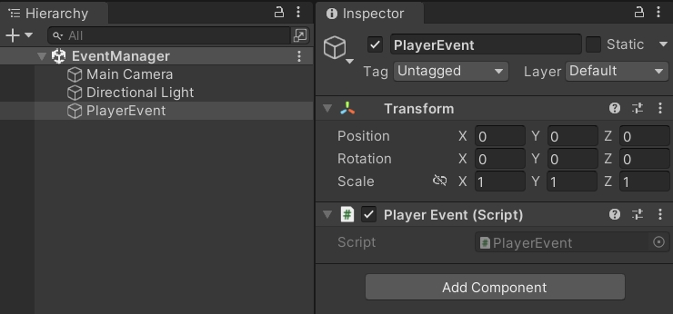
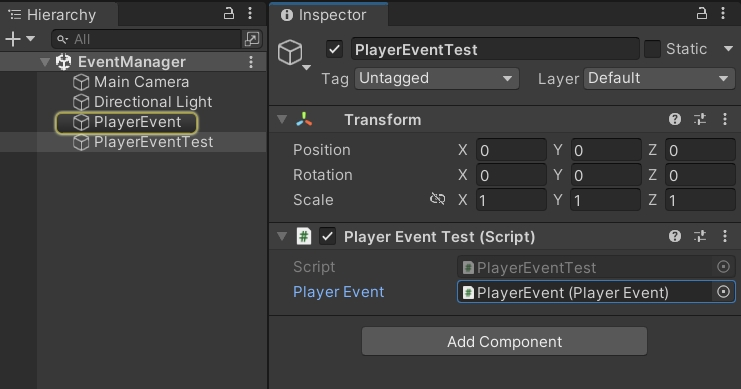
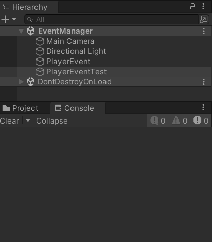

Unity3D 泛型事件系统

<!--more-->

# 观察者模式

观察者模式是一种行为设计模式，通过订阅机制，可以让对象触发事件时，通知多个其他对象。

在游戏逻辑中，UI 界面通常会监听一些事件，当数据层发生变化时，通过触发事件，通知 UI 界面进行刷新。

## 定义事件类型

先进行简单的一步，创建 `GameEventType.cs` 脚本，定义一个枚举类型，可以在枚举中添加多个事件名。

```csharp
public enum GameEventType
{
    PlayerAttack,  // 玩家攻击
    PlayerDeath,   // 玩家阵亡
}
```


## 事件管理器

接着，创建 `EventManager.cs` 脚本，定义多个泛型委托，这里声明了单参数和两个参数的委托，参数类型是泛型 T。

```csharp
using System;
using System.Collections.Generic;

// 单参数事件处理委托
public delegate void EventDelegate<T>(T param);

// 两个参数的事件处理委托
public delegate void EventDelegate<T1, T2>(T1 param1, T2 param2);

public class EventManager
{
    
}
```

在 EventManager 类中，定义两个字典，分别存储单参数和两个参数的委托列表。

```csharp
public class EventManager
{
    // 单参数事件的字典，键是事件类型，值是对应的事件处理器
    static Dictionary<int, Delegate> eventTableSingle = new Dictionary<int, Delegate>();

    // 两个参数事件的字典
    static Dictionary<int, Delegate> eventTableDouble = new Dictionary<int, Delegate>();
}
```

然后分别添加三个接口：订阅、取消订阅、触发。

- 订阅，接收事件名和函数，判断字典中是否存在事件名，不存在则添加新的事件，然后把函数连接到委托中。
- 取消订阅，接收事件名和函数，判断字典中是否存在事件名，存在则从委托中移除函数。
- 触发，接收事件名和参数，判断字典中是否存在事件名，存在则取出委托并调用。

如果后续还需要三个参数，可以依此类推，添加字典和接口。

```csharp
public class EventManager
{
    // ...
    
    // 订阅单参数事件
    public static void AddListener<T>(GameEventType gameEventType, EventDelegate<T> handler)
    {
        int eventType = (int)gameEventType;
        if (!eventTableSingle.ContainsKey(eventType))
        {
            eventTableSingle.Add(eventType, null);
        }
        eventTableSingle[eventType] = (EventDelegate<T>)eventTableSingle[eventType] + handler;
    }

    // 取消订阅单参数事件
    public static void RemoveListener<T>(GameEventType gameEventType, EventDelegate<T> handler)
    {
        int eventType = (int)gameEventType;
        if (eventTableSingle.ContainsKey(eventType))
        {
            eventTableSingle[eventType] = (EventDelegate<T>)eventTableSingle[eventType] - handler;
        }
    }

    // 触发单参数事件
    public static void Trigger<T>(GameEventType gameEventType, T param)
    {
        int eventType = (int)gameEventType;
        if (eventTableSingle.ContainsKey(eventType))
        {
            var callback = eventTableSingle[eventType] as EventDelegate<T>;
            callback?.Invoke(param);
        }
    }

    // 订阅双参数事件
    public static void AddListener<T1, T2>(GameEventType gameEventType, EventDelegate<T1, T2> handler)
    {
        int eventType = (int)gameEventType;
        if (!eventTableDouble.ContainsKey(eventType))
        {
            eventTableDouble.Add(eventType, null);
        }
        eventTableDouble[eventType] = (EventDelegate<T1, T2>)eventTableDouble[eventType] + handler;
    }

    // 取消订阅双参数事件
    public static void RemoveListener<T1, T2>(GameEventType gameEventType, EventDelegate<T1, T2> handler)
    {
        int eventType = (int)gameEventType;
        if (eventTableDouble.ContainsKey(eventType))
        {
            eventTableDouble[eventType] = (EventDelegate<T1, T2>)eventTableDouble[eventType] - handler;
        }
    }

    // 触发双参数事件
    public static void Trigger<T1, T2>(GameEventType gameEventType, T1 param1, T2 param2)
    {
        int eventType = (int)gameEventType;
        if (eventTableDouble.ContainsKey(eventType))
        {
            var callback = eventTableDouble[eventType] as EventDelegate<T1, T2>;
            callback?.Invoke(param1, param2);
        }
    }
}
```


## 添加和移除监听

创建 `PlayerEvent.cs` 脚本，在场景中也创建一个游戏物体，挂载该脚本。



在 OnEnable 方法中，调用 `EventManager.AddListener` 添加事件监听。

在 OnDisable 方法中，调用 `EventManager.RemoveListener` 移除事件监听。

此时可以确定泛型参数的实际类型，并在回调函数中接收参数，进行逻辑处理。

```csharp
using System.Collections;
using System.Collections.Generic;
using UnityEngine;

public class PlayerEvent : MonoBehaviour
{
    void OnEnable()
    {
        EventManager.AddListener<int>(GameEventType.PlayerAttack, OnPlayerAttack);
        EventManager.AddListener<string, int>(GameEventType.PlayerDeath, OnPlayerDeath);
    }

    void OnDisable()
    {
        EventManager.RemoveListener<int>(GameEventType.PlayerAttack, OnPlayerAttack);
        EventManager.RemoveListener<string, int>(GameEventType.PlayerDeath, OnPlayerDeath);
    }

    void OnPlayerAttack(int damage)
    {
        Debug.Log($"玩家发起攻击，造成伤害 {damage}");
    }

    void OnPlayerDeath(string reason, int damage)
    {
        Debug.Log($"玩家阵亡，原因 {reason}，受到伤害 {damage}");
    }
}
```


## 触发事件

创建 `PlayerEventTest.cs` 脚本，在 Update 方法中，根据键盘按键，触发不同的事件。

这里定义 `PlayerEvent` 变量，按下 E 键对其游戏物体进行显示隐藏，是为了测试事件的添加和移除。

```csharp
using System.Collections;
using System.Collections.Generic;
using UnityEngine;

public class PlayerEventTest : MonoBehaviour
{
    public PlayerEvent playerEvent;

    void Update()
    {
        if (Input.GetKeyDown(KeyCode.Q))
        {
            EventManager.Trigger(GameEventType.PlayerAttack, 100);
        }
        else if (Input.GetKeyDown(KeyCode.W))
        {
            EventManager.Trigger(GameEventType.PlayerDeath, "Boss攻击", 999);
        }
        else if (Input.GetKeyDown(KeyCode.E))
        {
            bool isActive = playerEvent.gameObject.activeInHierarchy;
            playerEvent.gameObject.SetActive(!isActive);
        }
    }
}
```

在场景中添加游戏物体，并挂载该脚本，拖拽引用。



运行游戏：

- 按下 Q 键触发了 `PlayerAttack` 事件
- 按下 W 键触发了 `PlayerDeath` 事件
- 按下 E 键隐藏了 `PlayerEvent` 游戏物体，同时事件被移除，不会再响应 Q 和 W 键，除非再次按下 E 键，显示游戏物体并添加事件。

如图所示：



