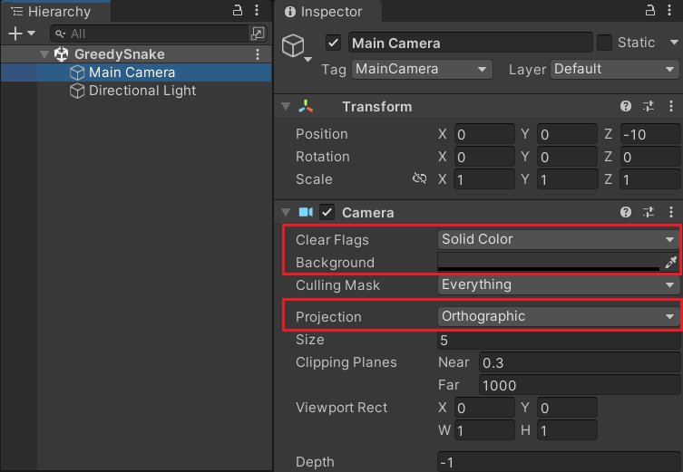
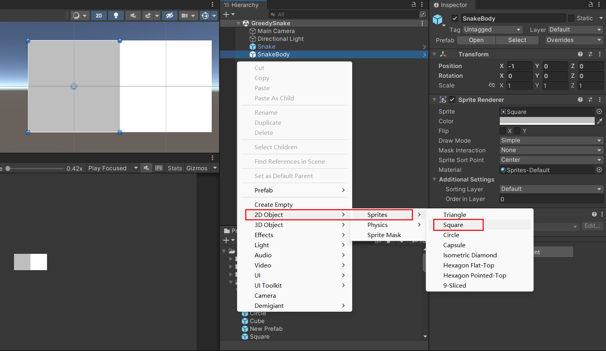
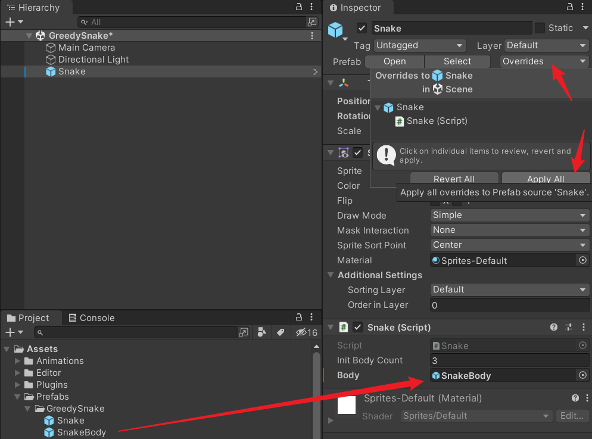
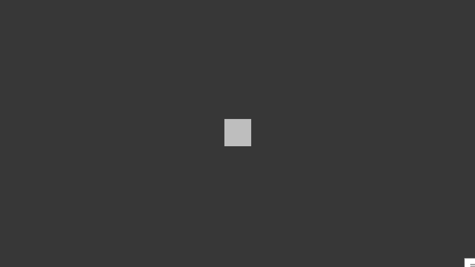
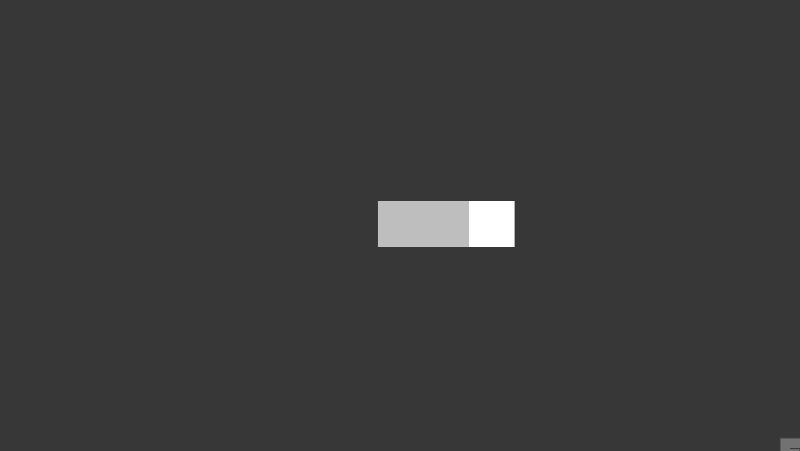
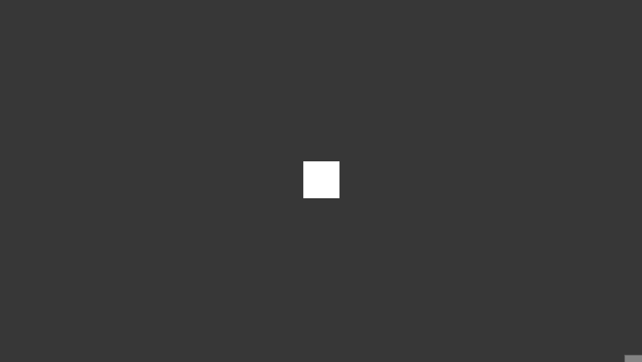

Unity3D 小案例 像素贪吃蛇 第一期 蛇的移动

<!--more-->

# 像素贪吃蛇

今天来简单制作一个小案例，经典的像素贪吃蛇。

## 准备

首先调整一下相机的设置，这里使用灰色的纯色背景，正交视图。



接着，创建一个正方形，保存为预制体，一个蛇头，一个蛇身。蛇身稍微调成灰色。



## 初始生成

创建脚本 `Snake.cs`，挂到 Snake 预制体上。

这里先定义初始身体数量，身体预制体，身体列表。

在 Start 方法里，初始生成一定数量的身体。

```csharp
using System.Collections;
using System.Collections.Generic;
using UnityEngine;

public class Snake : MonoBehaviour
{
    public int initBodyCount = 3;  // 初始身体数量

    public GameObject body;  // 身体预制体

    List<GameObject> bodyList = new List<GameObject>();  // 身体列表

    void Start()
    {
        // 初始生成身体
        for (int i = 0; i < initBodyCount; i++)
        {
            GenerateBody();
        }
    }

    /// <summary>
    /// 生成身体
    /// </summary>
    void GenerateBody()
    {
        GameObject obj = Instantiate(body);

        // 已有身体
        if (bodyList.Count > 0)
        {
            // 获取最后一个身体，在它的位置生成
            GameObject lastBody = bodyList[bodyList.Count - 1];
            obj.transform.position = lastBody.transform.position;
        }
        // 没有身体
        else
        {
            // 以蛇头的位置生成身体
            obj.transform.position = transform.position;
        }

        bodyList.Add(obj);
    }
}
```

拖拽预制体引用，然后覆盖到预制体。

场景里面的 SnakeBody 可以删掉。



运行游戏，会在蛇头的位置生成三个身体，此时身体都是重叠的。

## 蛇的移动

定义移动方向和移动速度，在 Start 方法中，调用 `InvokeRepeating` 定时器，根据速度计算出定时器的调用时间间隔，每次调用 `Move` 方法往当前方向移动。

```csharp
using System.Collections;
using System.Collections.Generic;
using UnityEngine;

public class Snake : MonoBehaviour
{
    // ...

    public Vector2 direction = Vector2.right;  // 移动方向
    public float speed = 1;  // 移动速度

    void Start()
    {
        // ...

        float time = 1 / speed;
        InvokeRepeating(nameof(Move), time, time);
    }

    /// <summary>
    /// 移动
    /// </summary>
    void Move()
    {
        transform.Translate(direction);
    }
}
```

此时只有蛇头会移动，身体是不动的。

要让身体跟着蛇头移动，需要在蛇头移动前，标记位置，再把旧的位置赋值给第一个身体。

第一个身体移动前，也要先标记位置，然后赋值给第二个身体。

所以要使用两个 `Vector2` 变量，循环标记。

```csharp
using System.Collections;
using System.Collections.Generic;
using UnityEngine;

public class Snake : MonoBehaviour
{
    // ...

    Vector2 posMarkFirst;  // 第一个标记位置
    Vector2 posMarkLast;   // 第二个标记位置

    // ...

    /// <summary>
    /// 移动
    /// </summary>
    void Move()
    {
        // 移动前，先标记旧的位置
        posMarkFirst = transform.position;
        transform.Translate(direction);

        for (int i = 0; i < bodyList.Count; i++)
        {
            // 利用奇偶数，交替标记旧的位置
            if (i % 2 == 0)
            {
                posMarkLast = bodyList[i].transform.position;
                bodyList[i].transform.position = posMarkFirst;
            }
            else
            {
                posMarkFirst = bodyList[i].transform.position;
                bodyList[i].transform.position = posMarkLast;
            }
        }
    }
}
```

运行游戏，可以看到，蛇开始移动了。



## 控制方向

在 `Update` 方法中，获取键盘输入，改变蛇头的移动方向。

```csharp
using System.Collections;
using System.Collections.Generic;
using UnityEngine;

public class Snake : MonoBehaviour
{
    // ...

    void Update()
    {
        float h = Input.GetAxisRaw("Horizontal");
        float v = Input.GetAxisRaw("Vertical");

        // 检测到按键输入
        if(h != 0 || v != 0)
        {
            // 改变蛇头的方向
            direction.x = h;
            direction.y = v;
        }
    }
}
```

运行游戏，可以通过键盘方向键，改变蛇的移动方向。



但是问题来了，如上图所示，蛇头可以往反方向移动，还可以斜着移动，这些都是需要排除的情况。

简单分析一下，蛇头的移动方向，用二维向量来变量，有四种情况。

- 向上 `(0, 1)`
- 向下 `(0, -1)`
- 向左 `(-1, 0)`
- 向右 `(1, 0)`

当蛇头向右移动时，如果按键输入向左，那么 X 坐标相加等于 0。

同理，向上移动时，如果按键输入向下，那么 Y 坐标相加等于 0。

所以在改变方向时，判断当前方向和按键输入方向的相加情况，进行排除。

```csharp
using System.Collections;
using System.Collections.Generic;
using UnityEngine;

public class Snake : MonoBehaviour
{
    // ...

    void Update()
    {
        float h = Input.GetAxisRaw("Horizontal");
        float v = Input.GetAxisRaw("Vertical");

        // 检测到按键输入
        if(h != 0 || v != 0)
        {
            if (direction.x + h == 0 || direction.y + v == 0) return;

            // 改变蛇头的方向
            direction.x = h;
            direction.y = v;
        }
    }
}
```

斜着移动时，也有四种情况。

- 左上 `(-1, 1)`
- 右上 `(1, 1)`
- 左下 `(-1, -1)`
- 右下 `(1, -1)`

它们的规律是，要么 X 坐标和 Y 坐标相等，要么 X 坐标和 Y 坐标相加等于 0。

所以在改变方向时，判断以上情况，进行排除。

```csharp
using System.Collections;
using System.Collections.Generic;
using UnityEngine;

public class Snake : MonoBehaviour
{
    // ...

    void Update()
    {
        float h = Input.GetAxisRaw("Horizontal");
        float v = Input.GetAxisRaw("Vertical");

        // 检测到按键输入
        if(h != 0 || v != 0)
        {
            if (direction.x + h == 0 || direction.y + v == 0) return;
            if (h == v || h + v == 0) return;

            // 改变蛇头的方向
            direction.x = h;
            direction.y = v;
        }
    }
}
```

但是还没有完全解决问题，当蛇头向右移动时，如果快速按向上键，再按向左键，蛇头依然会往反方向移动，因为以上规则在二次按键时，可以顺利切换方向。

所以，每当定时器触发移动时，还需要再进行方向修正。

我们可以先记录第一次按键的方向，此时该方向是合理的。当触发移动时，如果当前方向和上次移动的方向正好相反，那么判定当前方向是进行了二次按键，把当前方向修正为第一次按键的合理方向。

```csharp
using System.Collections;
using System.Collections.Generic;
using UnityEngine;

public class Snake : MonoBehaviour
{
    // ...
    
    public Vector2 lastDirection = Vector2.right;   // 上次的移动方向
    public Vector2 firstDirection = Vector2.right;  // 第一次按键的移动方向
    public bool firstPress = true;  // 是否记录第一次按键

    void Update()
    {
        float h = Input.GetAxisRaw("Horizontal");
        float v = Input.GetAxisRaw("Vertical");

        // 检测到按键输入
        if(h != 0 || v != 0)
        {
            if (direction.x + h == 0 || direction.y + v == 0) return;
            if (h == v || h + v == 0) return;

            // 改变蛇头的方向
            direction.x = h;
            direction.y = v;
            
            // 仅记录第一次按键
            if (firstPress)
            {
                firstPress = false;
                firstDirection.x = h;
                firstDirection.y = v;
            }
        }
    }
    
    /// <summary>
    /// 移动
    /// </summary>
    void Move()
    {
        // 当前移动方向和上次方向相反，修正为第一次按键的方向
        if (direction.x + lastDirection.x == 0 || direction.y + lastDirection.y == 0)
        {
            direction.x = firstDirection.x;
            direction.y = firstDirection.y;
        }

        // 移动前，先标记旧的位置
        posMarkFirst = transform.position;
        transform.Translate(direction);

        // 记录上次的移动方向
        lastDirection = direction;
        // 可重新记录第一次按键的移动方向
        firstPress = true;
        
        // ...
    }
}
```

最终的移动效果。


