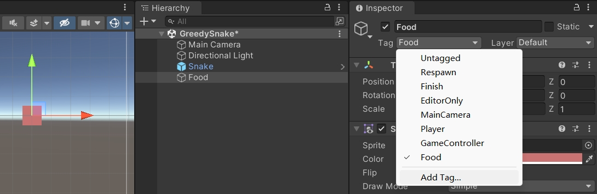
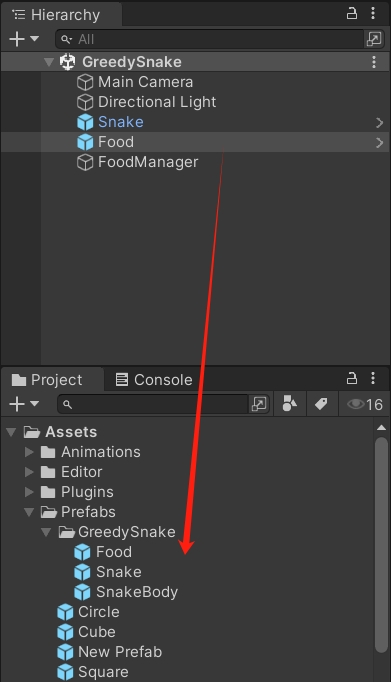
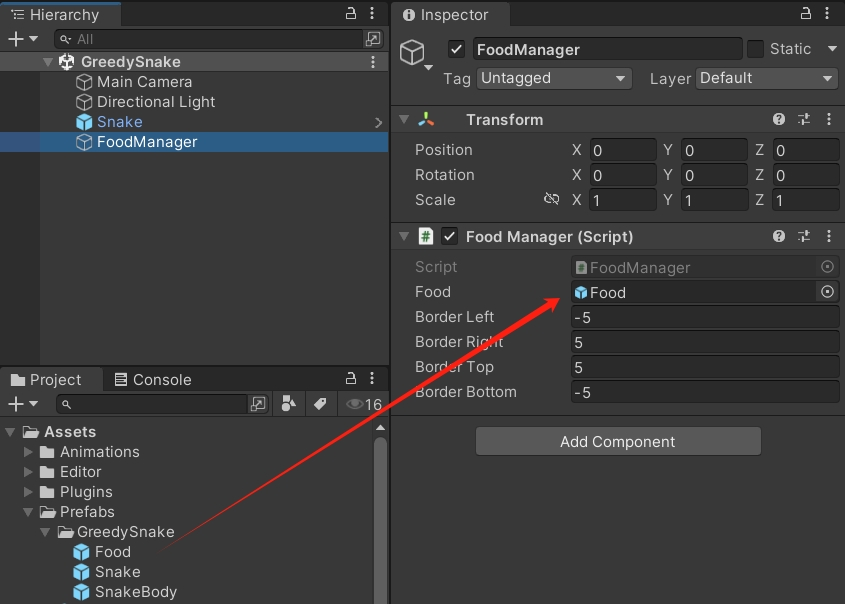
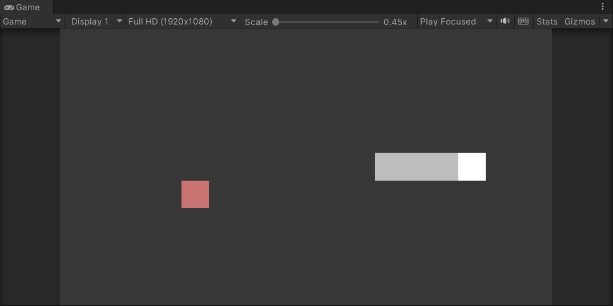
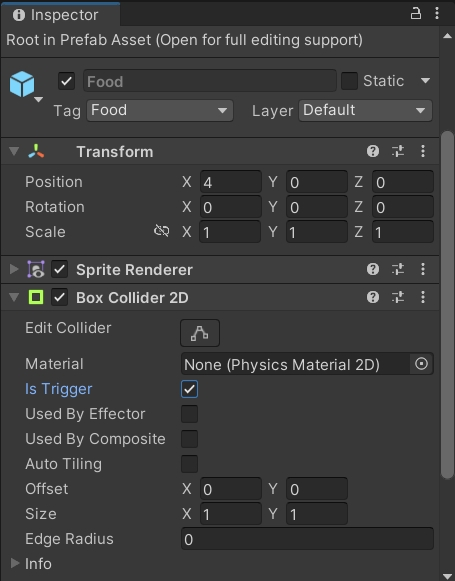
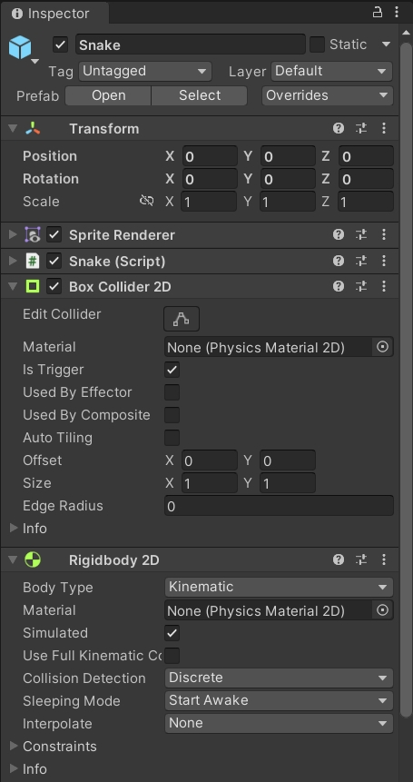
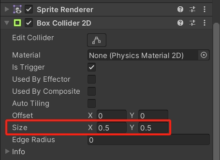
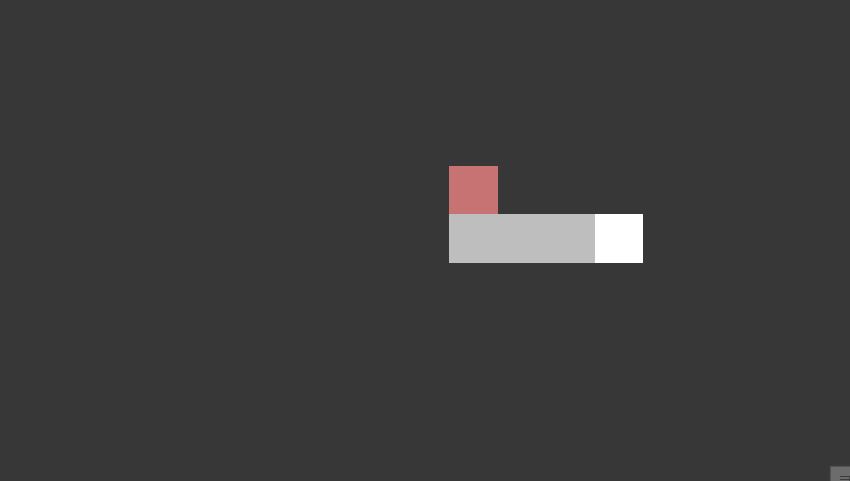
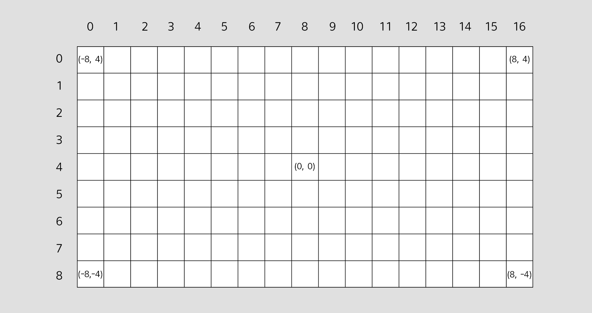
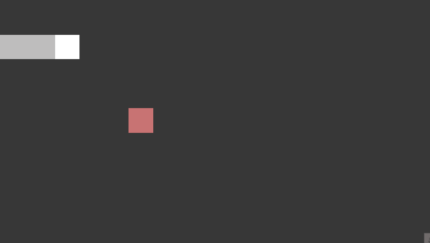

Unity3D 小案例 像素贪吃蛇 第二期 蛇的觅食

<!--more-->

# 像素贪吃蛇

## 食物生成

在场景中创建一个 2D 正方形，调整颜色，添加 Tag 并修改为 Food。



然后拖拽到 Assets 文件夹中变成预制体。



创建食物管理器 `FoodManager.cs`，添加单例，可以设置食物生成的坐标范围，提供生成一个食物的方法。

因为 `Random.Range` 的取值范围是 `[min, max)`，为了取到 max 的值，需要给右边界加一。

```csharp
using System.Collections;
using System.Collections.Generic;
using UnityEngine;

public class FoodManager : MonoBehaviour
{
    public static FoodManager instance;

    public GameObject food;

    public int borderLeft = -8;
    public int borderRight = 8;
    public int borderTop = 4;
    public int borderBottom = -4;

    void Awake()
    {
        if (instance == null)
        {
            instance = this;
        }
        else
        {
            Destroy(gameObject);
        }
    }

    void Start()
    {
        // 初始生成一个食物
        GenerateFood();
    }

    /// <summary>
    /// 生成食物
    /// </summary>
    public void GenerateFood()
    {
        GameObject obj = Instantiate(food, transform);
        int x = Random.Range(borderLeft, borderRight + 1);
        int y = Random.Range(borderBottom, borderTop + 1);
        obj.transform.position = new Vector3(x, y, 0);
    }
}
```

在场景中创建节点，挂上脚本，拖拽引用。



运行游戏，可以看到场景中生成了一个食物。



## 吃掉食物

给食物的预制体添加碰撞体，勾选 `Is Trigger`。



同样，蛇头也要添加碰撞体，还要再添加一个刚体，`Body Type` 设置为 `Kinematic`，不需要受到重力影响。



在 `Snake.cs` 中添加碰撞函数，判断碰撞物体的标签是 Food，就销毁食物，生成新的蛇身，并生成下一个食物。

```csharp
using System.Collections;
using System.Collections.Generic;
using UnityEngine;

public class Snake : MonoBehaviour
{
    // ...

    void OnTriggerEnter2D(Collider2D other)
    {
        if (other.CompareTag("Food"))
        {
            Destroy(other.gameObject);
            GenerateBody();
            FoodManager.instance.GenerateFood();
        }
    }
}
```

此时运行游戏，蛇头可以吃掉食物了。

但是有时候蛇头还未到达食物的位置，食物就被吃掉了，甚至蛇头只是经过食物的附近，食物也消失了。这是因为碰撞体的范围问题，默认的 Size 是 `(1, 1)`，可以稍微调小一些，例如 `(0.5, 0.5)`。



调整后的效果：



## 食物位置

目前场景范围适中，生成的食物都在空地，但是当蛇越来越长的时候，会发现食物生成的位置有可能在蛇的身上。

我们应该让食物始终都在空地生成。

那么，对于一个坐标是否为空地，就需要做一些标记。

### 网格

目前食物生成的坐标取值范围，在 X 轴是 `[-8, 8]`，在 Y 轴是 `[-4, 4]`。

如果把这些坐标点看成是一个网格，可以按照行列来看。

左上角是 `(-8, 4)`，是第 0 行，第 0 列，索引为 0。

右上角是 `(8, 4)`，是第 0 行，第 16 列，索引为 16。

左下角是 `(-8, -4)`，是第 8 行，第 0 列，索引为 136。

右下角是 `(8, -4)`，是第 8 行，第 16 列，索引为 152。

> 注意：这里的索引是从第 0 行开始，从左到右递增。行数增加时，索引继续计数。



### 网格列表

在 `FoodManager.cs` 中，添加一个 `Vector3` 列表，X 和 Y 记录坐标，Z 记录是否空地（0 表示空地，1 表示有物体占用）。

这里总行数是上边界减去下边界，还要加上一个端点，总共 9 行。

总列数是右边界减去左边界，还要加上一个端点，总共 17 列。

根据行列数，依次添加 `Vector3` 到列表中，Z 默认是 0。

```csharp
using System.Collections;
using System.Collections.Generic;
using UnityEngine;

public class FoodManager : MonoBehaviour
{
    // ...

    public List<Vector3> gridList;

    public int rowMax = 0;
    public int colMax = 0;

    void Start()
    {
        rowMax = borderTop - borderBottom + 1;
        colMax = borderRight - borderLeft + 1;

        for (int i = 0; i < rowMax; i++)
        {
            for (int j = 0; j < colMax; j++)
            {
                gridList.Add(new Vector3(borderLeft + j, borderTop - i, 0));
            }
        }
    }
}
```

然后提供一个标记网格列表的方法，把传入的坐标转成 int，判断边界，换算行列，计算索引，根据索引从网格列表中取出一个网格点，更新标记。

```csharp
using System.Collections;
using System.Collections.Generic;
using UnityEngine;

public class FoodManager : MonoBehaviour
{
    // ...

    /// <summary>
    /// 标记网格列表
    /// </summary>
    /// <param name="pos">坐标位置</param>
    /// <param name="flag">标记</param>
    public void MarkGridList(Vector3 pos, bool flag)
    {
        int x = (int)pos.x;
        int y = (int)pos.y;

        // 坐标超出边界
        if (x < borderLeft || x > borderRight) return;
        if (y < borderBottom || y > borderTop) return;

        // 换算行列
        int row = borderTop - y;
        int col = x - borderLeft;

        // 计算索引
        int index = col + row * colMax;

        // 索引超出边界
        if (index < 0 || index > gridList.Count - 1) return;

        // 取出网格点，标记是否空地
        Vector3 grid = gridList[index];
        grid.z = flag ? 1 : 0;

        // 更新网格点
        gridList[index] = grid;
    }
}
```

### 标记网格

在游戏开始时，蛇头会占用一个网格，生成的身体也需要标记网格。

```csharp
using System.Collections;
using System.Collections.Generic;
using UnityEngine;

public class Snake : MonoBehaviour
{
    void Start()
    {
        // 初始生成身体
        for (int i = 0; i < initBodyCount; i++)
        {
            GenerateBody();
        }

        FoodManager.instance.MarkGridList(transform.position, true);

        // ...
    }
    
    void GenerateBody()
    {
        GameObject obj = Instantiate(body);

        // ...

        FoodManager.instance.MarkGridList(obj.transform.position, true);
    }
}
```

在蛇的移动过程中，也要动态地标记网格。

蛇头和身体移动后都要标记网格已经被占用，只有在最后一个身体移动前，标记当前网格位置为空地。

```csharp
using System.Collections;
using System.Collections.Generic;
using UnityEngine;

public class Snake : MonoBehaviour
{
    void Move()
    {
        // ...

        // 移动前，先标记旧的位置
        posMarkFirst = transform.position;
        transform.Translate(direction);

        // 标记蛇头移动后的网格位置
        FoodManager.instance.MarkGridList(transform.position, true);

        // ...

        for (int i = 0; i < bodyList.Count; i++)
        {
            // 最后一个身体移动前，标记当前网格位置为空地
            if (i == bodyList.Count - 1)
            {
                FoodManager.instance.MarkGridList(bodyList[i].transform.position, false);
            }

            // ...

            // 每个身体移动后，标记当前网格位置
            FoodManager.instance.MarkGridList(bodyList[i].transform.position, true);
        }
    }
}
```

食物也会占用网格，每次生成食物时，也要标记网格。

```csharp
using System.Collections;
using System.Collections.Generic;
using UnityEngine;

public class FoodManager : MonoBehaviour
{
    public void GenerateFood()
    {
        GameObject obj = Instantiate(food, transform);
        int x = Random.Range(borderLeft, borderRight + 1);
        int y = Random.Range(borderBottom, borderTop + 1);
        obj.transform.position = new Vector3(x, y, 0);
        
        // 标记食物占用的网格位置
        MarkGridList(obj.transform.position, true);
    }
}
```

### 筛选空地

在食物生成时，不能单纯用随机数来确定坐标位置，而是要从网格列表中，筛选未被占用的网格点，然后从这些网格点中随机取出一个位置。

定义一个 `filterList`，用来存储筛选后的网格点。

每次生成食物时，需要先清理 `filterList`，然后从网格列表中，筛选 Z 为 0（表示未被占用）的网格点，添加到筛选列表中。

然后再生成随机数，从筛选列表中取出网格点，赋值位置给生成的食物。

```csharp
using System.Collections;
using System.Collections.Generic;
using UnityEngine;

public class FoodManager : MonoBehaviour
{
    // ...

    public List<Vector3> filterList;

    // ...

    public void GenerateFood()
    {
        // 清理筛选列表
        filterList.Clear();

        for (int i = 0; i < gridList.Count; i++)
        {
            // 筛选未被占用的网格点
            if (gridList[i].z == 0)
            {
                filterList.Add(gridList[i]);
            }
        }

        // 没有空地了
        if (filterList.Count == 0) return;

        // 随机取出一个空地
        int index = Random.Range(0, filterList.Count);
        Vector3 pos = filterList[index];

        GameObject obj = Instantiate(food, transform);
        // int x = Random.Range(borderLeft, borderRight + 1);
        // int y = Random.Range(borderBottom, borderTop + 1);
        // obj.transform.position = new Vector3(x, y, 0);
        obj.transform.position = pos;

        // 标记食物占用的网格位置
        MarkGridList(obj.transform.position, true);
    }
}
```

至此，当蛇身越来越长时，也不会出现食物生成在蛇身上的情况了。

运行效果：


