Unity3D 小案例 像素贪吃蛇 第三期 蛇的碰撞（完结）

<!--more-->

# 像素贪吃蛇

## 碰撞蛇身

当蛇头碰撞到蛇身时，游戏应该判定为失败。

找到蛇身预制体，添加 Body 标签和碰撞体，碰撞体的大小为 0.5，跟蛇头和蛇身的碰撞体范围一样，避免因碰撞范围过大而产生错误的碰撞效果。

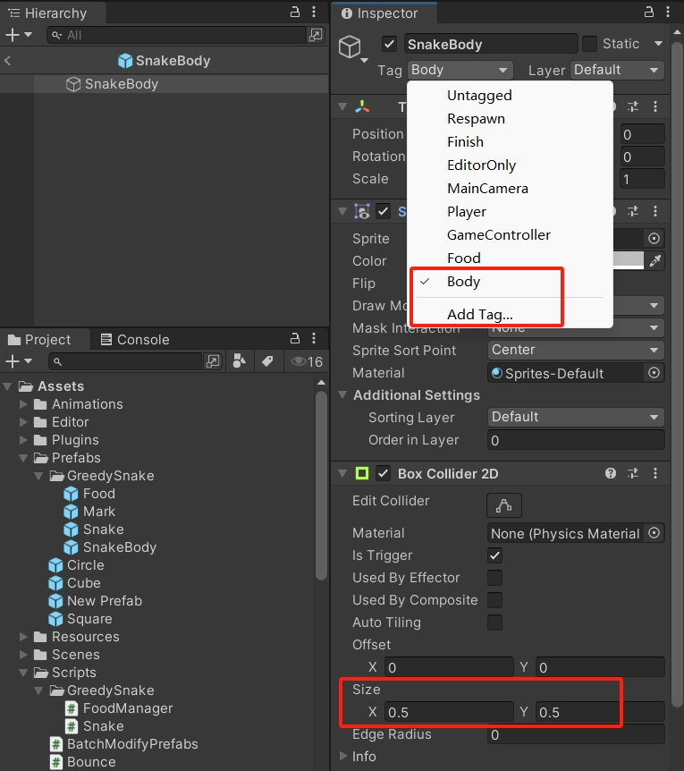

修改一下 OnTriggerEnter2D 方法，判断碰撞到 Body 标签的物体，判定游戏失败，蛇停止移动。

```csharp
using System.Collections;
using System.Collections.Generic;
using UnityEngine;

public class Snake : MonoBehaviour
{
    void OnTriggerEnter2D(Collider2D other)
    {
        if (other.CompareTag("Food"))
        {
            // ...
        }
        else if (other.CompareTag("Body"))
        {
            // 取消定时器
            CancelInvoke(nameof(Move));
        }
    }
}
```

如果此时运行游戏，会发现蛇一开始就不动了。因为之前初始生成身体时，都在同一个位置生成，一开始就会碰撞蛇身。

修改一下之前的逻辑，让初始生成的蛇身偏移位置。

```csharp
using System.Collections;
using System.Collections.Generic;
using UnityEngine;

public class Snake : MonoBehaviour
{
    Vector2 initPos;  // 初始位置

    void Start()
    {
        initPos = transform.position;

        // 初始生成身体
        for (int i = 0; i < initBodyCount; i++)
        {
            GenerateBody(true);
        }

        // ...
    }
    
    void GenerateBody(bool isInit = false)
    {
        GameObject obj = Instantiate(body);

        // 初始生成
        if (isInit)
        {
            obj.transform.position = initPos + Vector2.left;
            initPos = obj.transform.position;
        }
        else
        {
            // 已有身体
            if (bodyList.Count > 0)
            {
                // 获取最后一个身体，在它的位置生成
                GameObject lastBody = bodyList[bodyList.Count - 1];
                obj.transform.position = lastBody.transform.position;
            }
            // 没有身体
            else
            {
                // 以蛇头的位置生成身体
                obj.transform.position = transform.position;
            }
        }

        // ...
    }
}
```

现在运行游戏，蛇身的初始位置就不会跟蛇头重叠了。

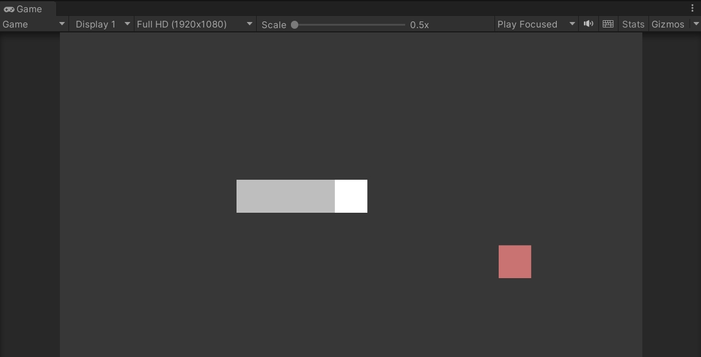

另外，蛇头的层级也要调整一下，当蛇头与蛇身重叠时，让蛇头能够显示在蛇身之上。

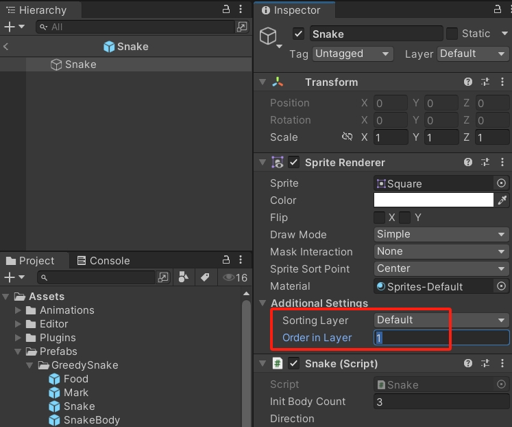

运行效果：

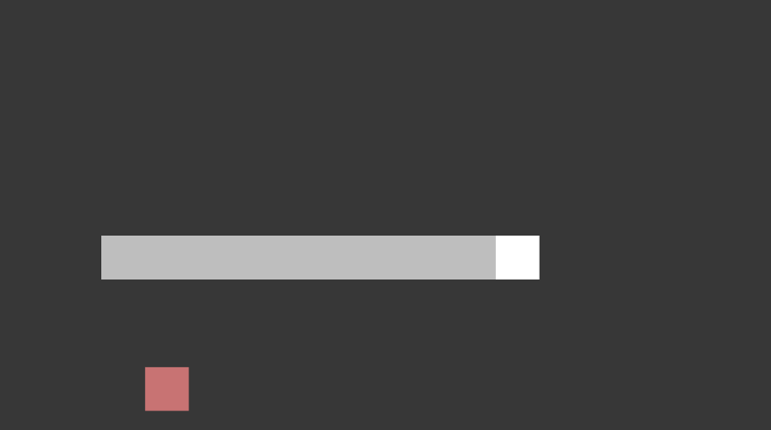

## 添加墙壁

创建四个正方形，调整缩放和位置，调整颜色，分别布置在上下左右四个方向。

因为蛇的移动范围，在 X 轴是 `[-8, 8]`，在 Y 轴是 `[-4, 4]`，所以左右的墙壁分别放置在 X 轴的 -9 和 9 的位置，上下的墙壁分别放置在 Y 轴的 5 和 -5 的位置。

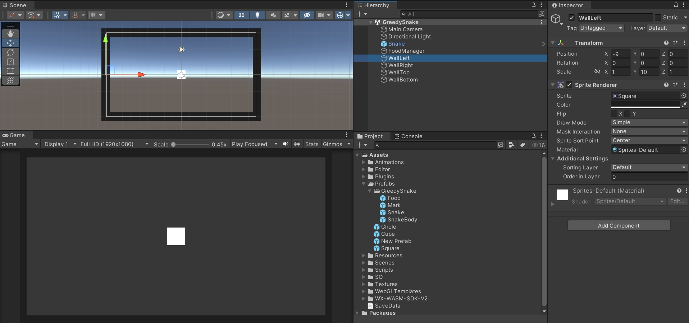

然后给墙壁也添加标签 Wall，并且要添加碰撞体，碰撞体的大小保持默认的 1 即可。

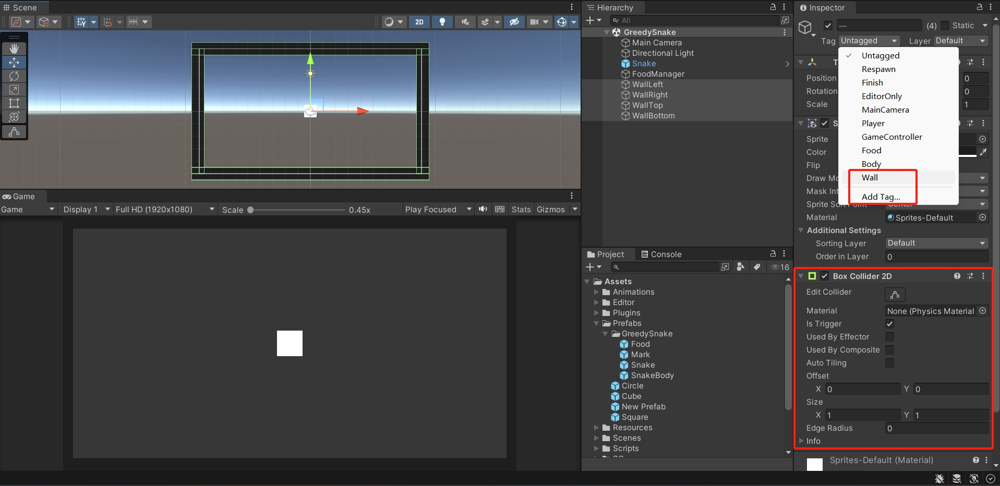

在代码中也添加碰撞墙壁的逻辑。

```csharp
using System.Collections;
using System.Collections.Generic;
using UnityEngine;

public class Snake : MonoBehaviour
{
    void OnTriggerEnter2D(Collider2D other)
    {
        if (other.CompareTag("Food"))
        {
            // ...
        }
        else if (other.CompareTag("Body") || other.CompareTag("Wall"))
        {
            // 取消定时器
            CancelInvoke(nameof(Move));
        }
    }
}
```

运行效果：

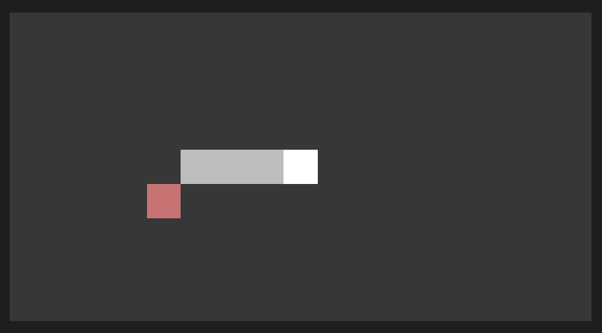

## 游戏失败

### 显示失败界面

简单搭建一个游戏失败界面。

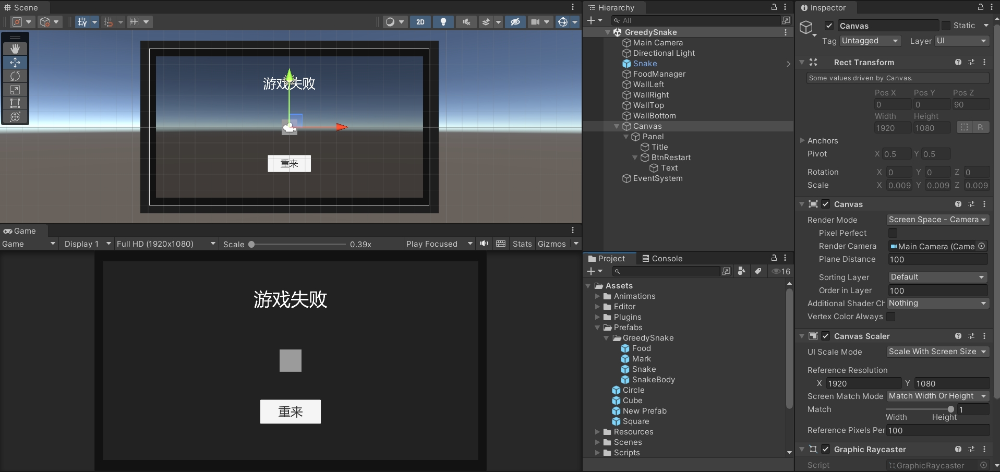

创建一个 `UIGameOver.cs` 脚本，引用命名空间 `UnityEngine.UI`，定义 UI 组件变量，拖拽引用。

```csharp
using UnityEngine;
using UnityEngine.UI;

public class UIGameOver : MonoBehaviour
{
    public Button btnRestart;
    public CanvasGroup canvasGroup;

    void Start()
    {

    }
}
```

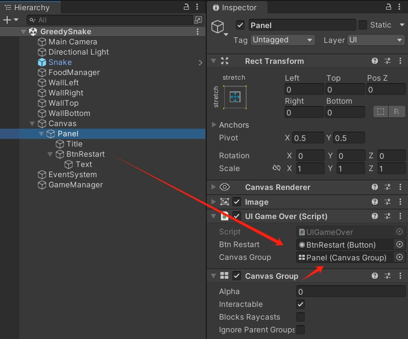

创建一个 `GameManager.cs` 脚本，引用命名空间 `System`，创建单例。

定义一个 `Action` 事件 `showGameOver`，带一个布尔值参数，并对外提供一个接口，用于触发事件。

```csharp
using System;
using UnityEngine;

public class GameManager : MonoBehaviour
{
    public static GameManager instance;
    public event Action<bool> showGameOver;

    void Awake()
    {
        if (instance == null)
        {
            instance = this;
        }
        else
        {
            Destroy(gameObject);
        }
    }

    public void TriggerGameOver(bool isShow)
    {
        showGameOver.Invoke(isShow);
    }
}
```

界面脚本添加事件监听，根据是否显示界面，修改 `canvasGroup` 的参数。

```csharp
using UnityEngine;
using UnityEngine.UI;

public class UIGameOver : MonoBehaviour
{
    public Button btnRestart;
    public CanvasGroup canvasGroup;

    void Start()
    {
        GameManager.instance.showGameOver += (isShow) =>
        {
            canvasGroup.alpha = isShow ? 1 : 0;
            canvasGroup.blocksRaycasts = isShow;
        };
    }
}
```

当蛇碰撞时，触发事件显示游戏失败界面。

```csharp
using System.Collections;
using System.Collections.Generic;
using UnityEngine;

public class Snake : MonoBehaviour
{
    void OnTriggerEnter2D(Collider2D other)
    {
        if (other.CompareTag("Food"))
        {
            // ...
        }
        else if (other.CompareTag("Body") || other.CompareTag("Wall"))
        {
            // 取消定时器
            CancelInvoke(nameof(Move));
            // 显示游戏失败界面
            GameManager.instance.TriggerGameOver(true);
        }
    }
}
```

运行效果：

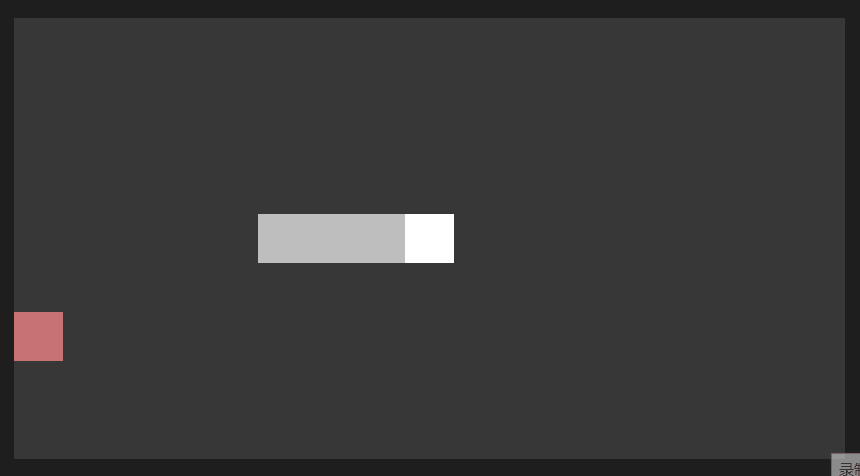

### 重开游戏

在 `UIGameOver.cs` 脚本上添加按钮事件，隐藏失败界面，重新开始游戏。

```csharp
using UnityEngine;
using UnityEngine.UI;

public class UIGameOver : MonoBehaviour
{
    public Button btnRestart;
    public CanvasGroup canvasGroup;

    void Start()
    {
        // ...

        btnRestart.onClick.AddListener(()=>
        {
            GameManager.instance.TriggerGameOver(false);
            GameManager.instance.RestartGame();
        });
    }
}
```

在 `GameManager.cs` 脚本上添加重开游戏的事件和触发接口。

```csharp
using System;
using UnityEngine;

public class GameManager : MonoBehaviour
{
    //...

    public event Action restartGame;

    // ...

    public void RestartGame()
    {
        restartGame.Invoke();
    }
}
```

在 `FoodManager.cs` 脚本上添加重置网格接口，同时定义一个变量记录当前生成的食物，在重置网格时销毁当前食物。

```csharp
using System.Collections;
using System.Collections.Generic;
using UnityEngine;

public class FoodManager : MonoBehaviour
{
    // ...
    
    public GameObject currentFood;
    
    public void GenerateFood()
    {
        // ...

        currentFood = obj;
    }
    
    public void ResetGrid()
    {
        gridList.Clear();
        for (int i = 0; i < rowMax; i++)
        {
            for (int j = 0; j < colMax; j++)
            {
                gridList.Add(new Vector3(borderLeft + j, borderTop - i, 0));
            }
        }
        Destroy(currentFood);
    }
}
```

最后，在 `Snake.cs` 脚本上添加事件监听，重置网格、蛇头、蛇身、食物，最后再次开启定时器，让蛇头重新开始移动。

```csharp
using System.Collections;
using System.Collections.Generic;
using UnityEngine;

public class Snake : MonoBehaviour
{
    // ...
    
    void Start()
    {
        // ...
        
        // 重开游戏，重置游戏物体
        GameManager.instance.restartGame += ()=>
        {
            // 重置网格
            FoodManager.instance.ResetGrid();

            // 销毁蛇身
            for (int i = 0; i < bodyList.Count; i++)
            {
                Destroy(bodyList[i]);
            }
            bodyList.Clear();

            // 重置蛇头位置和方向
            transform.position = Vector3.zero;
            FoodManager.instance.MarkGridList(transform.position, true);
            direction = Vector2.right;
            lastDirection = Vector2.right;
            firstDirection = Vector2.right;

            initPos = transform.position;

            // 初始生成身体
            for (int i = 0; i < initBodyCount; i++)
            {
                GenerateBody(true);
            }

            // 初始生成食物
            FoodManager.instance.GenerateFood();

            // 重新开始移动
            InvokeRepeating(nameof(Move), time, time);
        };
    }
}
```

运行效果：

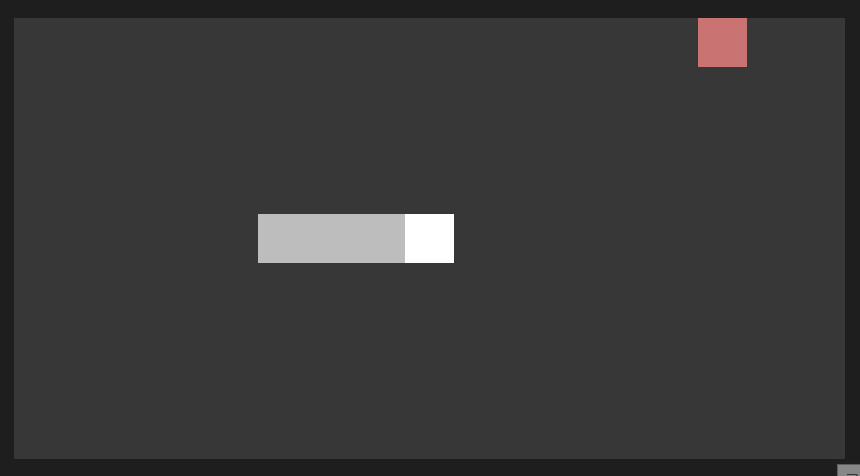
