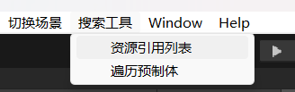
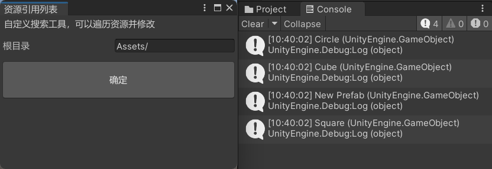
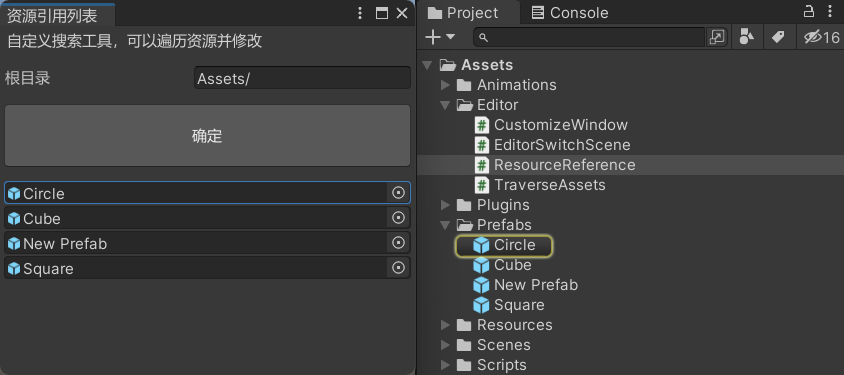
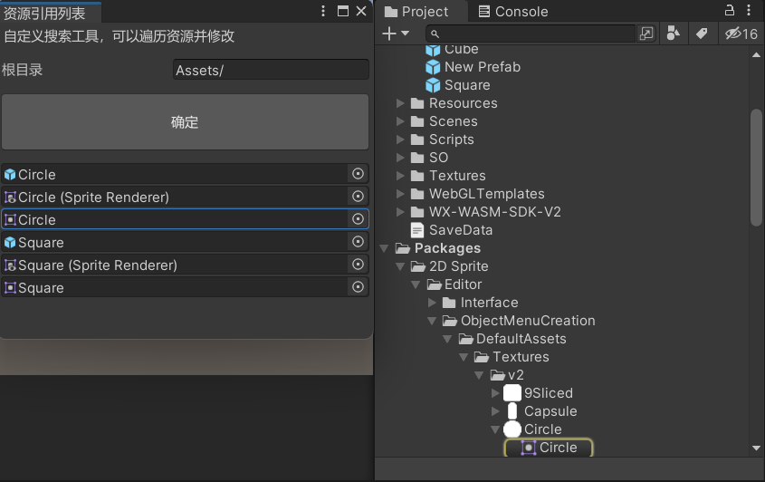
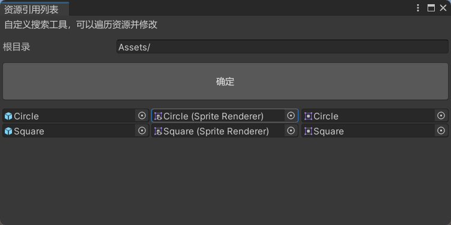
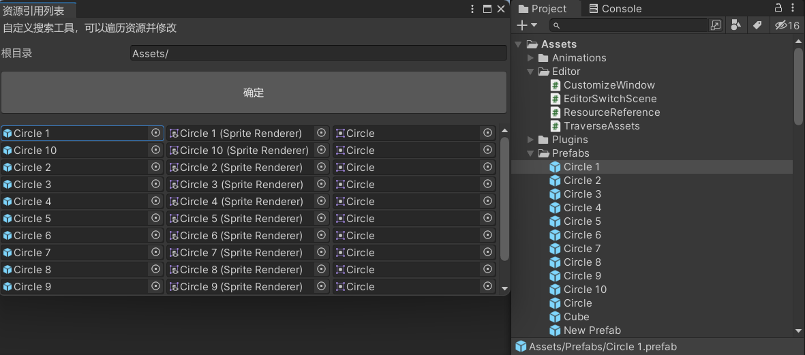
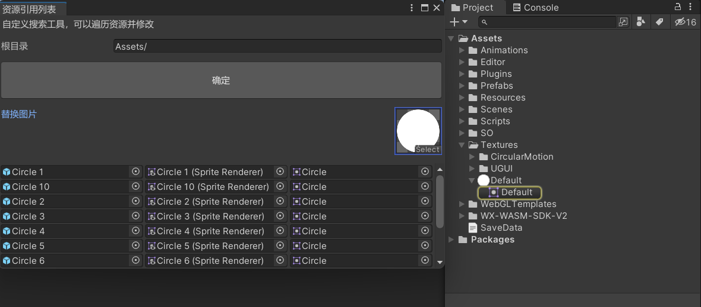
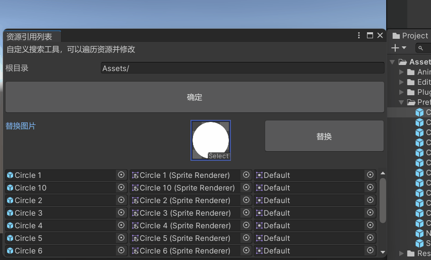

Unity3D 窗口绘制资源引用列表。

<!--more-->

# 资源引用列表

我们可以在自定义窗口上绘制一个资源引用列表，筛选资源，点击引用，快速定位到资源文件夹的某个资源。

关于自定义窗口的基本实现，可以参考之前的文章《Unity3D 自定义窗口》。

## 获取资源引用

在 Editor 文件夹中，创建脚本 `ResourceReference.cs`。

参考之前的文章《Unity3D 遍历预制体》，遍历 Assets 文件夹下的预制体，获取一些资源引用，存储到 objects 列表中。

```csharp
using System.Collections;
using System.Collections.Generic;
using System.IO;
using UnityEngine;
using UnityEditor;

public class ResourceReference : EditorWindow
{
    public static string path = "Assets/";
    public static List<Object> objects = new List<Object>();

    [MenuItem("搜索工具/资源引用列表")]
    public static void OpenWindow()
    {
        // 创建窗口对象
        ResourceReference window = GetWindow<ResourceReference>();

        // 设置窗口标题
        window.titleContent = new GUIContent("资源引用列表");

        // 显示窗口
        window.Show();
    }

    void OnGUI()
    {
        GUILayout.Label("自定义搜索工具，可以遍历资源并修改");

        GUILayout.Space(10);

        path = EditorGUILayout.TextField("根目录", path);

        GUILayout.Space(10);

        if (GUILayout.Button("确定", GUILayout.Height(50)))
        {
            objects.Clear();
            TraversePrefab();
        }
    }

    public static void TraversePrefab()
    {
        var allfiles = Directory.GetFiles(path, "*.prefab", SearchOption.AllDirectories);

        foreach (var file in allfiles)
        {
            GameObject go = AssetDatabase.LoadAssetAtPath<GameObject>(file);
            if (go)
            {
                Debug.Log(go);
                objects.Add(go);
            }
        }
    }
}
```

点击菜单栏按钮，打开窗口。



点击窗口内的按钮，可以看到打印的信息，此时资源已经被添加到 objects 列表中，暂时看不到。



> 注意：每次点击按钮时，要调用 `objects.Clear()` 清空列表，防止重复添加。

## 绘制单个资源引用

使用 `EditorGUILayout.ObjectField` 绘制一个资源引用，传入需要显示的 object 以及它可以被赋值的类型（直接用它本身的类型 Object 即可），第三个布尔参数表示可以赋值场景中的物体。

```csharp
using System.Collections;
using System.Collections.Generic;
using System.IO;
using UnityEngine;
using UnityEditor;

public class ResourceReference : EditorWindow
{
    // ...

    void OnGUI()
    {
        // ...

        GUILayout.Space(10);

        DrawNode();
    }

    // ...

    public static void DrawNode()
    {
        for (int i = 0; i < objects.Count; i++)
        {
            Object obj = objects[i];
            EditorGUILayout.ObjectField(obj, obj.GetType(), true);
        }
    }
}
```

现在窗口里就显示了被添加到 objects 列表中的预制体资源引用，点击它们还可以快速定位到 Assets 文件夹的资源。




## 定义链表节点

现在列表中只能展示预制体，如果要展示预制体中的某个节点或组件，为了让视图更加清晰地展示预制体与其节点的关联性，我们可以使用链表结构。

首先，定义链表节点，每个节点包含数据、类型、指针，并提供 Add 方法，在节点尾端链接下一个节点。

```csharp
/// <summary>
/// 链表节点
/// </summary>
public class Node
{
    public Object data;   // 链表数据
    public string type;   // 链表类型
    public Node next;     // 链表指针

    public Node(Object data, string type)
    {
        this.data = data;
        this.type = type;
    }

    /// <summary>
    /// 链表尾插法
    /// </summary>
    /// <param name="data">链表数据</param>
    public Node Add(Object data, string type)
    {
        Node node = new Node(data, type);
        this.next = node;
        return node;
    }
}
```


## 绘制链式资源引用

修改一下 objects 列表的类型，改成 Node。

在 `TraversePrefab` 方法中，尝试去获取 `SpriteRenderer` 组件，如果存在，则生成一个 Node 节点，先把预制体 go 存入，并记录它的类型是 `"prefab"`。

接着，还可以使用 Node 节点的 Add 方法，继续添加它的下一个节点，把 `"SpriteRenderer"` 和 `"sprite"` 都添加到节点链接中。

在 `DrawNode` 方法中，使用 `do while` 先绘制首个节点的内容（prefab），然后获取它的下一个节点，如果存在，就继续绘制，直到没有下一个节点为止。

```csharp
// ...

public class ResourceReference : EditorWindow
{
    // ...
    public static List<Node> objects = new List<Node>();

    // ...

    public static void TraversePrefab()
    {
        var allfiles = Directory.GetFiles(path, "*.prefab", SearchOption.AllDirectories);

        foreach (var file in allfiles)
        {
            GameObject go = AssetDatabase.LoadAssetAtPath<GameObject>(file);
            if (go)
            {
                SpriteRenderer sr = go.GetComponent<SpriteRenderer>();
                if (sr)
                {
                    Node node = new Node(go, "prefab");
                    node.Add(sr, "SpriteRenderer").Add(sr.sprite, "sprite");
                    objects.Add(node);
                }
            }
        }
    }

    public static void DrawNode()
    {
        for (int i = 0; i < objects.Count; i++)
        {
            Node node = objects[i];
            do
            {
                EditorGUILayout.ObjectField(node.data, node.data.GetType(), true);
                node = node.next;
            } while (node != null);
        }
    }
}
```

现在重新点确定按钮，可以看到列表的内容发生了改变，筛选了包含 `SpriteRenderer` 组件的预制体，并且把它引用的图片也展示了出来，点击 Sprite 图片也可以快速定位到资源。



不过现在列表的内容是单列绘制的，改成三列才能很好地达到预期的效果。

只需要在 DrawNode 方法中，绘制每个 prefab 节点时，加上水平布局。

```csharp
// ...

public class ResourceReference : EditorWindow
{
    // ...

    public static void DrawNode()
    {
        for (int i = 0; i < objects.Count; i++)
        {
            EditorGUILayout.BeginHorizontal();

            Node node = objects[i];
            do
            {
                EditorGUILayout.ObjectField(node.data, node.data.GetType(), true);
                node = node.next;
            } while (node != null);

            EditorGUILayout.EndHorizontal();
        }
    }
}
```

现在列表就是三列的布局了。




## 绘制滚动视图

目前列表里只有两行资源引用，如果项目里有很多资源的话，就需要使用滚动视图来展示。

先定义一个 `Vector2 scrollPos` 记录滚动视图当前的位置。

然后在 `DrawNode` 方法前后添加滚动视图代码。

```csharp
// ...

public class ResourceReference : EditorWindow
{
    // ...

    Vector2 scrollPos = Vector2.zero;

    void OnGUI()
    {
        // ...

        scrollPos = EditorGUILayout.BeginScrollView(scrollPos);

        DrawNode();

        EditorGUILayout.EndScrollView();
    }
}
```

多复制几个预制体，视图就丰富起来了。



## 简单应用：批量替换图片

### 绘制图片资源引用

首先，在窗口上绘制一个图片资源引用，可以手动选择要替换成哪张图片。

需要定义一个 `Sprite replaceSprite` 变量，在 `OnFocus` 方法中，加载一张默认的图片进行赋值。

在 `OnGUI` 方法中，判断 `replaceSprite` 是否为空，然后再进行绘制，末尾加上 `as Sprite` 把 Object 类型转换成 Sprite。

> 注意：如果传入 `EditorGUILayout.ObjectField` 的对象未赋值，窗口绘制时会报错，在 OnFocus 方法中进行赋值，每次聚焦到窗口时就能保证 replaceSprite 不为空。

```csharp
// ...

public class ResourceReference : EditorWindow
{
    // ...

    public static Sprite replaceSprite;
    
    void OnFocus()
    {
        if (replaceSprite == null)
        {
            replaceSprite = AssetDatabase.LoadAssetAtPath<Sprite>("Assets/Textures/Default.png");
        }
    }

    void OnGUI()
    {
        // ...

        GUILayout.Space(10);

        if (replaceSprite != null)
        {
            replaceSprite = EditorGUILayout.ObjectField("替换图片", replaceSprite,
                replaceSprite.GetType(), true) as Sprite;
        }

        GUILayout.Space(10);

        // ...
    }
}
```

现在窗口里就出现了一张默认的替换图片，点击图片还可以打开图片选择窗口，自由选择其他图片。



### 替换图片

首先，绘制一个替换按钮，把图片资源引用和替换按钮放在一个水平布局中。

替换按钮调用 `ReplaceSprite` 方法。

```csharp
// ...

public class ResourceReference : EditorWindow
{
    // ...

    void OnGUI()
    {
        // ...

        GUILayout.Space(10);

        EditorGUILayout.BeginHorizontal();

        if (replaceSprite != null)
        {
            replaceSprite = EditorGUILayout.ObjectField("替换图片", replaceSprite,
                replaceSprite.GetType(), true) as Sprite;
        }

        GUILayout.Space(50);

        if (GUILayout.Button("替换", GUILayout.Height(50)))
        {
            ReplaceSprite();
        }

        EditorGUILayout.EndHorizontal();

        GUILayout.Space(10);

        // ...
    }
}
```

接着实现 `ReplaceSprite` 方法。

可以先判断一下 `replaceSprite` 和 `objects` 列表是否为空，如果为空，就弹窗提示。

然后遍历 objects 列表，先取出 prefab 数据，在 `do while` 中查找 `"SpriteRenderer"` 类型的数据，修改它的 sprite 属性，同时修改 `"sprite"` 类型的数据，让窗口列表的第三列数据能够刷新。

完成图片替换后，使用 `PrefabUtility.SavePrefabAsset` 保存预先取出的 prefab 数据，让 Assets 文件夹中的预制体资源同步修改，然后使用 `AssetDatabase.Refresh` 刷新 Assets 文件夹。

最后可以给一个弹窗提示，表示已经完成了图片的替换。

```csharp
// ...

public class ResourceReference : EditorWindow
{
    // ...

    public static void ReplaceSprite()
    {
        if (replaceSprite == null)
        {
            EditorUtility.DisplayDialog("温馨提示", "替换图片为空", "okk");
            return;
        }
        
        if (objects.Count == 0)
        {
            EditorUtility.DisplayDialog("温馨提示", "节点列表为空", "okk");
            return;
        }

        for (int i = 0; i < objects.Count; i++)
        {
            Node node = objects[i];
            GameObject prefab = node.data as GameObject;
            do
            {
                if (node.type == "SpriteRenderer")
                {
                    SpriteRenderer sr = node.data as SpriteRenderer;
                    sr.sprite = replaceSprite;
                }
                else if (node.type == "sprite")
                {
                    node.data = replaceSprite;
                }
                node = node.next;
            } while (node != null);

            PrefabUtility.SavePrefabAsset(prefab);
        }

        AssetDatabase.Refresh();

        EditorUtility.DisplayDialog("温馨提示", "替换图片成功", "okk");
    }
}
```

替换图片演示：


