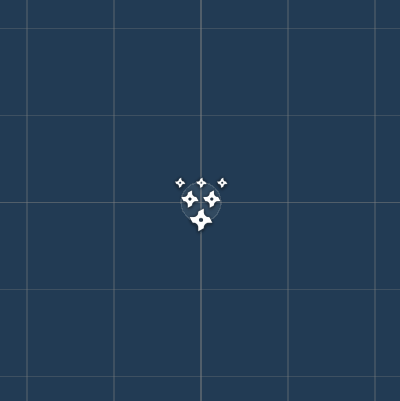
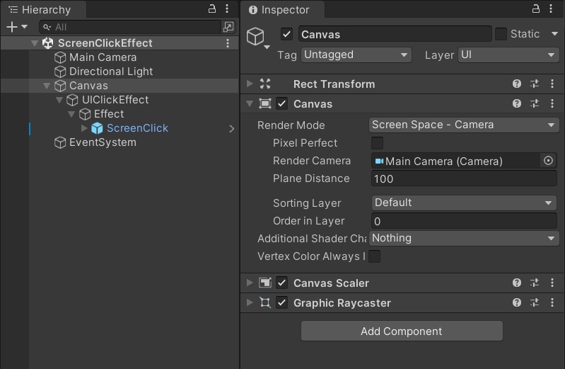
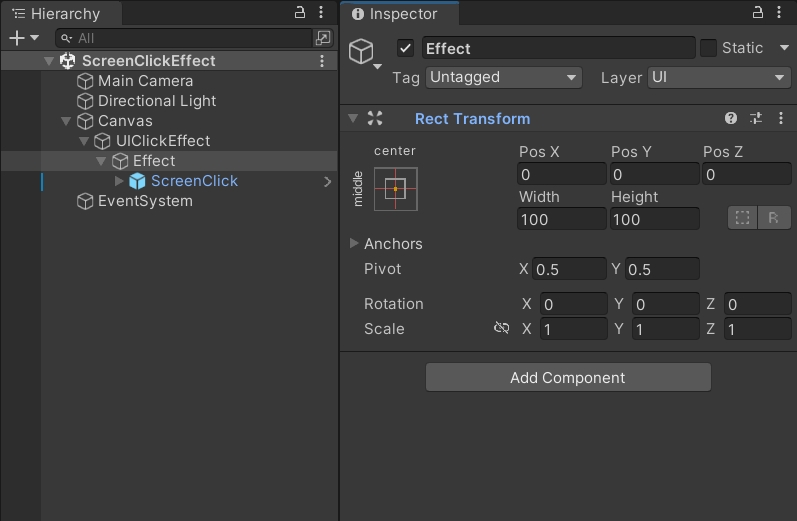
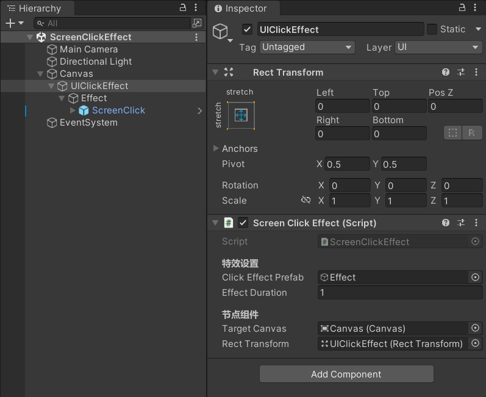

实现点击屏幕任意位置播放点击特效。

<!--more-->

# 屏幕点击特效

## 需求

现有一个需求，点击屏幕任意位置，播放一个点击特效。

美术已经做好了特效，效果如图：



## 特效容器

首先，画布是 Camera 模式，画布底下有一个 UIClickEffect 界面。

界面底下有一个 Effect 空节点，它带有 RectTransform 组件，后续会通过这个空节点设置特效的位置。

Effect 空节点底下则是美术制作好的特效。





## 创建脚本

### 检测输入

创建 `ScreenClickEffect.cs` 脚本，添加特效设置相关的字段。

在 `Start` 的时候把特效预制体默认隐藏，防止初始化时会播放一次特效。

在 `Update` 中检测鼠标和触摸输入，把点击的位置 `clickPosition` 传入 `PlayClickEffect` 方法中。

```csharp
using UnityEngine;

public class ScreenClickEffect : MonoBehaviour
{
    [Header("特效设置")]
    public GameObject clickEffectPrefab;  // 特效预制体
    public float effectDuration = 1f;     // 特效持续时间
    
    void Start()
    {
        if (clickEffectPrefab != null)
            clickEffectPrefab.SetActive(false);
    }
    
    void Update()
    {
        HandleInput();
    }
    
    void HandleInput()
    {
        Vector3 clickPosition = Vector3.zero;
        bool hasInput = false;
        
        // 检测鼠标点击
        if (Input.GetMouseButtonDown(0))
        {
            clickPosition = Input.mousePosition;
            hasInput = true;
        }
        
        // 检测触摸输入（移动设备）
        if (Input.touchCount > 0)
        {
            Touch touch = Input.GetTouch(0);
            if (touch.phase == TouchPhase.Began)
            {
                clickPosition = touch.position;
                hasInput = true;
            }
        }
        
        if (hasInput)
        {
            PlayClickEffect(clickPosition);
        }
    }
    
    void PlayClickEffect(Vector3 screenPosition)
    {
        if (clickEffectPrefab == null)
        {
            Debug.LogWarning("点击特效预制体未设置！");
            return;
        }
    }
}
```

### 实例化特效

添加节点组件字段，获得画布和界面的变换组件。

继续完善 `PlayClickEffect` 方法，使用 `RectTransformUtility.ScreenPointToLocalPointInRectangle` 把屏幕坐标转换成当前界面内的本地坐标，把转换后的 `localPosition` 赋值给实例化出来的特效对象。

最后，延迟 `effectDuration` 秒后销毁特效。

```csharp
using UnityEngine;

public class ScreenClickEffect : MonoBehaviour
{
    // ...
    
    [Header("节点组件")]
    public Canvas targetCanvas;           // 画布
    public RectTransform rectTransform;   // 界面变换组件
    
    void Start()
    {
        // ...

        if (targetCanvas == null)
            targetCanvas = FindObjectOfType<Canvas>();

        if (rectTransform == null)
            rectTransform = GetComponent<RectTransform>();
    }
    
    // ...
    
    void PlayClickEffect(Vector3 screenPosition)
    {
        if (clickEffectPrefab == null)
        {
            Debug.LogWarning("点击特效预制体未设置！");
            return;
        }
        
        if (targetCanvas == null)
        {
            Debug.LogWarning("目标Canvas未设置！");
            return;
        }
        
        if (RectTransformUtility.ScreenPointToLocalPointInRectangle(
            rectTransform, screenPosition, targetCanvas.worldCamera, out Vector2 localPosition))
        {
            // 实例化特效
            GameObject effectInstance;
            effectInstance = Instantiate(clickEffectPrefab, transform);
            effectInstance.SetActive(true);
            
            // 设置位置
            if (effectInstance.TryGetComponent<RectTransform>(out var effectRect))
            {
                effectRect.localPosition = localPosition;
            }
            else
            {
                effectInstance.transform.localPosition = (Vector3)localPosition;
            }
            
            // 延迟销毁特效
            Destroy(effectInstance, effectDuration);
        }
    }
}
```

节点组件的引用如图：



运行游戏效果：


### 对象池优化

因为屏幕点击特效会比较频繁地创建和销毁，可以使用 Unity 内置的对象池进行优化。

这里定义了一个 `useObjectPool` 字段，可以自行选择是否启用对象池，如果不用的话，就还是以创建销毁的方式播放点击特效。

关于对象池的容量设置，可参考以下建议：

- 休闲游戏，容量4-8，启用对象池，平衡性能和内存
- 音游/快节奏，容量10-20，启用对象池，优先保证流畅度
- 低端设备，容量2-4，可关闭对象池，减少内存占用

```csharp
using System.Collections;
using UnityEngine;
using UnityEngine.Pool;

public class ScreenClickEffect : MonoBehaviour
{
    // ...

    [Header("对象池设置")]
    public bool useObjectPool = true;     // 是否使用对象池
    public int defaultCapacity = 4;       // 对象池默认容量
    public int maxSize = 8;               // 对象池最大容量
    
    private ObjectPool<GameObject> effectPool;
    
    void Start()
    {
        // ...

        if (useObjectPool)
            SetupObjectPool();
    }
    
    // ...
    
    void SetupObjectPool()
    {
        if (clickEffectPrefab == null)
        {
            Debug.LogWarning("无法设置对象池：特效预制体未设置！");
            return;
        }
        
        effectPool = new ObjectPool<GameObject>(
            createFunc: CreateEffect,
            actionOnGet: OnGetEffect,
            actionOnRelease: OnReleaseEffect,
            actionOnDestroy: OnDestroyEffect,
            collectionCheck: true,
            defaultCapacity: defaultCapacity,
            maxSize: maxSize
        );
    }
    
    GameObject CreateEffect()
    {
        GameObject effect = Instantiate(clickEffectPrefab, transform);
        effect.SetActive(false);
        return effect;
    }
    
    void OnGetEffect(GameObject effect)
    {
        effect.SetActive(true);
        
        // 重置粒子系统
        if (effect.TryGetComponent<ParticleSystem>(out var particles))
        {
            particles.Clear();
            particles.Play();
        }
    }
    
    void OnReleaseEffect(GameObject effect)
    {
        if (effect != null)
        {
            effect.SetActive(false);
            
            // 停止粒子系统
            if (effect.TryGetComponent<ParticleSystem>(out var particles))
            {
                particles.Stop();
                particles.Clear();
            }
        }
    }
    
    void OnDestroyEffect(GameObject effect)
    {
        if (effect != null)
        {
            Destroy(effect);
        }
    }
    
    void OnDestroy()
    {
        // 清理对象池
        effectPool?.Dispose();
    }
    
    void PlayClickEffect(Vector3 screenPosition)
    {
        // ...
        
        if (RectTransformUtility.ScreenPointToLocalPointInRectangle(
            rectTransform, screenPosition, targetCanvas.worldCamera, out Vector2 localPosition))
        {
            GameObject effectInstance;
            
            // 使用对象池或传统方式创建特效
            if (useObjectPool && effectPool != null)
            {
                effectInstance = effectPool.Get();
            }
            else
            {
                effectInstance = Instantiate(clickEffectPrefab, transform);
                effectInstance.SetActive(true);
            }
            
            // 设置位置
            if (effectInstance.TryGetComponent<RectTransform>(out var effectRect))
            {
                effectRect.localPosition = localPosition;
            }
            else
            {
                effectInstance.transform.localPosition = (Vector3)localPosition;
            }
            
            // 处理特效生命周期
            if (useObjectPool && effectPool != null)
            {
                // 使用对象池，延迟归还
                StartCoroutine(ReleaseEffectAfterDelay(effectInstance, effectDuration));
            }
            else
            {
                // 传统方式销毁
                Destroy(effectInstance, effectDuration);
            }
        }
    }
    
    IEnumerator ReleaseEffectAfterDelay(GameObject effect, float delay)
    {
        yield return new WaitForSeconds(delay);
        if (effect != null && effectPool != null)
        {
            effectPool.Release(effect);
        }
    }
}
```

## 完整代码

`ScreenClickEffect.cs`

```csharp
using System.Collections;
using UnityEngine;
using UnityEngine.Pool;

public class ScreenClickEffect : MonoBehaviour
{
    [Header("特效设置")]
    public GameObject clickEffectPrefab;  // 特效预制体
    public float effectDuration = 1f;     // 特效持续时间

    [Header("节点组件")]
    public Canvas targetCanvas;           // 画布
    public RectTransform rectTransform;   // 界面变换组件

    [Header("对象池设置")]
    public bool useObjectPool = true;     // 是否使用对象池
    public int defaultCapacity = 4;       // 对象池默认容量
    public int maxSize = 8;               // 对象池最大容量

    private ObjectPool<GameObject> effectPool;

    void Start()
    {
        if (clickEffectPrefab != null)
            clickEffectPrefab.SetActive(false);

        if (targetCanvas == null)
            targetCanvas = FindObjectOfType<Canvas>();

        if (rectTransform == null)
            rectTransform = GetComponent<RectTransform>();

        if (useObjectPool)
            SetupObjectPool();
    }

    void SetupObjectPool()
    {
        if (clickEffectPrefab == null)
        {
            Debug.LogWarning("无法设置对象池：特效预制体未设置！");
            return;
        }
        
        effectPool = new ObjectPool<GameObject>(
            createFunc: CreateEffect,
            actionOnGet: OnGetEffect,
            actionOnRelease: OnReleaseEffect,
            actionOnDestroy: OnDestroyEffect,
            collectionCheck: true,
            defaultCapacity: defaultCapacity,
            maxSize: maxSize
        );
    }

    GameObject CreateEffect()
    {
        GameObject effect = Instantiate(clickEffectPrefab, transform);
        effect.SetActive(false);
        return effect;
    }

    void OnGetEffect(GameObject effect)
    {
        effect.SetActive(true);
        
        // 重置粒子系统
        if (effect.TryGetComponent<ParticleSystem>(out var particles))
        {
            particles.Clear();
            particles.Play();
        }
    }

    void OnReleaseEffect(GameObject effect)
    {
        if (effect != null)
        {
            effect.SetActive(false);
            
            // 停止粒子系统
            if (effect.TryGetComponent<ParticleSystem>(out var particles))
            {
                particles.Stop();
                particles.Clear();
            }
        }
    }

    void OnDestroyEffect(GameObject effect)
    {
        if (effect != null)
        {
            Destroy(effect);
        }
    }

    void Update()
    {
        HandleInput();
    }

    void HandleInput()
    {
        Vector3 clickPosition = Vector3.zero;
        bool hasInput = false;
        
        // 检测鼠标点击
        if (Input.GetMouseButtonDown(0))
        {
            clickPosition = Input.mousePosition;
            hasInput = true;
        }
        
        // 检测触摸输入（移动设备）
        if (Input.touchCount > 0)
        {
            Touch touch = Input.GetTouch(0);
            if (touch.phase == TouchPhase.Began)
            {
                clickPosition = touch.position;
                hasInput = true;
            }
        }
        
        if (hasInput)
        {
            PlayClickEffect(clickPosition);
        }
    }

    void PlayClickEffect(Vector3 screenPosition)
    {
        if (clickEffectPrefab == null)
        {
            Debug.LogWarning("点击特效预制体未设置！");
            return;
        }
        
        if (targetCanvas == null)
        {
            Debug.LogWarning("目标Canvas未设置！");
            return;
        }

        if (RectTransformUtility.ScreenPointToLocalPointInRectangle(
            rectTransform, screenPosition, targetCanvas.worldCamera, out Vector2 localPosition))
        {
            GameObject effectInstance;
            
            // 使用对象池或传统方式创建特效
            if (useObjectPool && effectPool != null)
            {
                effectInstance = effectPool.Get();
            }
            else
            {
                effectInstance = Instantiate(clickEffectPrefab, transform);
                effectInstance.SetActive(true);
            }
            
            // 设置位置
            if (effectInstance.TryGetComponent<RectTransform>(out var effectRect))
            {
                effectRect.localPosition = localPosition;
            }
            else
            {
                effectInstance.transform.localPosition = (Vector3)localPosition;
            }
            
            // 处理特效生命周期
            if (useObjectPool && effectPool != null)
            {
                // 使用对象池，延迟归还
                StartCoroutine(ReleaseEffectAfterDelay(effectInstance, effectDuration));
            }
            else
            {
                // 传统方式销毁
                Destroy(effectInstance, effectDuration);
            }
        }
    }

    IEnumerator ReleaseEffectAfterDelay(GameObject effect, float delay)
    {
        yield return new WaitForSeconds(delay);
        if (effect != null && effectPool != null)
        {
            effectPool.Release(effect);
        }
    }

    void OnDestroy()
    {
        // 清理对象池
        effectPool?.Dispose();
    }
}
```
