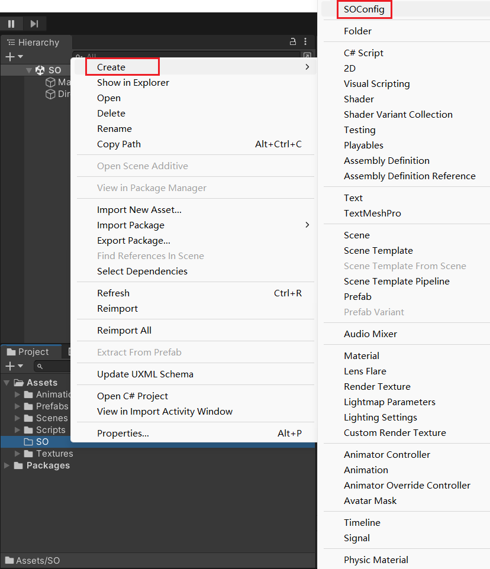
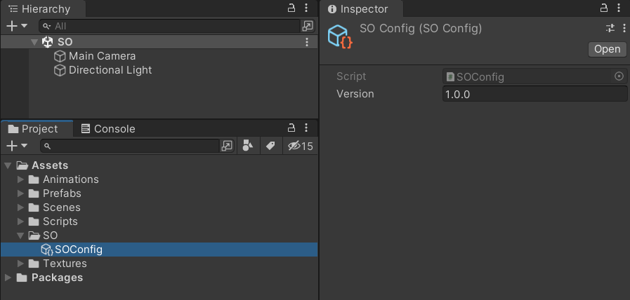
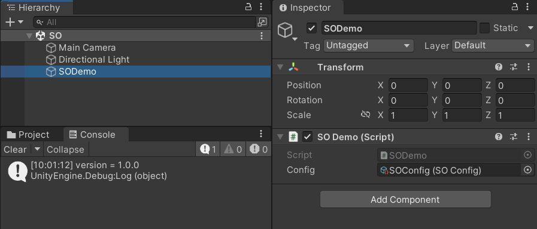
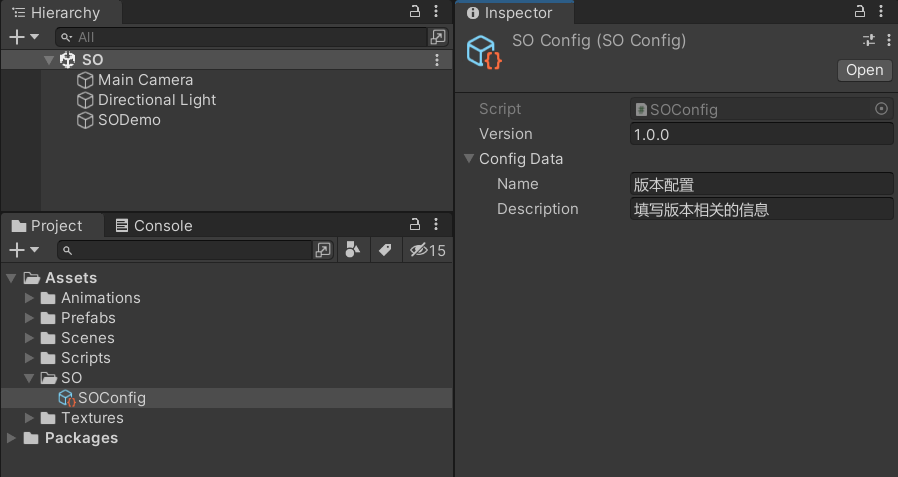
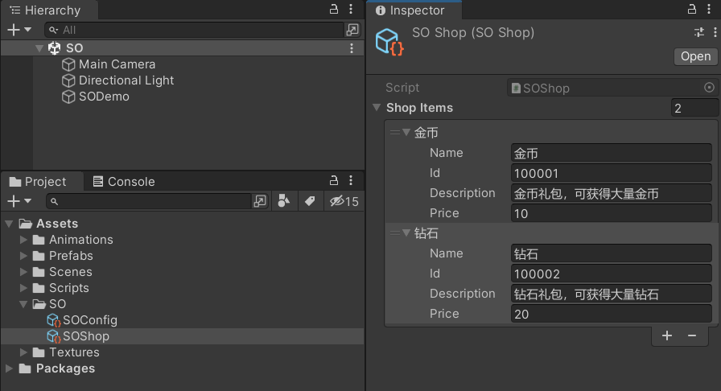
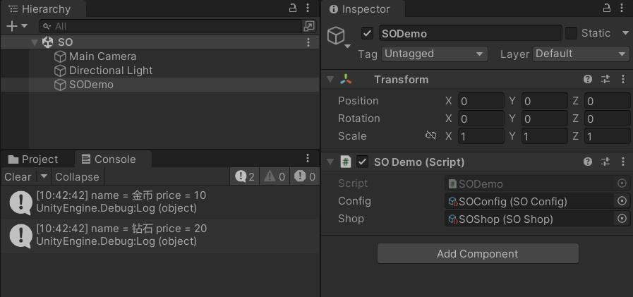
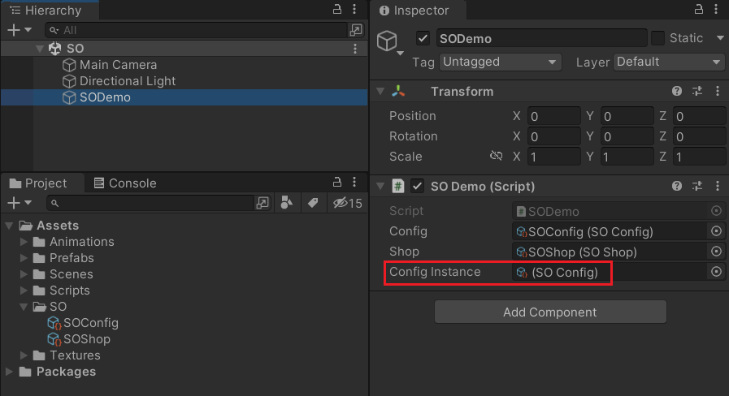
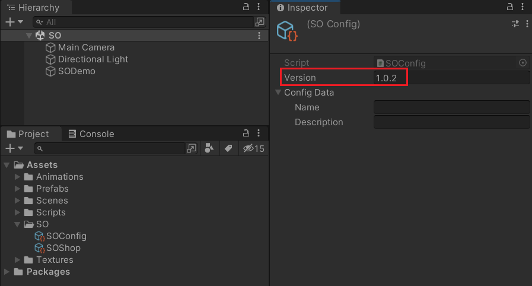

Unity3D ScriptableObject 的使用。

<!--more-->

# 创建 SO

ScriptableObject 是 unity 提供的一个数据存储类。

使用时，只需创建一个类继承 ScriptableObject，加上创建菜单代码，就可以在资源文件夹创建 SO 脚本对应的数据文件。

```c#
using UnityEngine;

[CreateAssetMenu(fileName = "SOConfig", menuName = "SOConfig", order = 0)]
public class SOConfig : ScriptableObject
{
    public string version;
}
```


创建数据文件：




填写数据：



# 获取 SO 数据

可以直接引用数据文件。

```c#
using UnityEngine;

public class SODemo : MonoBehaviour
{
    public SOConfig config;

    void Start()
    {
        Debug.Log($"version = {config.version}");
    }
}
```


运行效果：



# 序列化类

除了在 SO 脚本中定义单一的字段，也可以使用类来组织数据结构。这个类是需要打上 Serializable 的标签。

```c#
using System;
using UnityEngine;

[CreateAssetMenu(fileName = "SOConfig", menuName = "SOConfig", order = 0)]
public class SOConfig : ScriptableObject
{
    public string version;
    public ConfigData configData;
}

[Serializable]
public class ConfigData
{
    public string name;
    public string description;
}
```


SO 数据文件的变化：



# 简单的游戏配置

对于一些简单的小游戏来说，使用 SO 做配置表，会比较简单快捷。

例如，一个商店的商品列表：

```c#
using System;
using System.Collections.Generic;
using UnityEngine;

[CreateAssetMenu(fileName = "SOShop", menuName = "SOShop", order = 1)]
public class SOShop : ScriptableObject
{
    public List<SOShopItem> shopItems;

    public SOShopItem GetItem(int id)
    {
        return shopItems.Find(x => x.id == id);
    }
}

[Serializable]
public class SOShopItem
{
    public string name;
    public int id;
    public string description;
    public int price;
}
```


配置数据：




使用配置：

```c#
using UnityEngine;

public class SODemo : MonoBehaviour
{
    public SOConfig config;
    public SOShop shop;

    void Start()
    {
        for (int i = 0; i < shop.shopItems.Count; i++)
        {
            SOShopItem item = shop.shopItems[i];
            Debug.Log($"name = {item.name} price = {item.price}");
        }
    }
}
```


运行效果：



# 动态修改配置

SO 文件中填写的数据是可以在代码中赋值的。

```c#
using UnityEngine;

public class SODemo : MonoBehaviour
{
    public SOConfig config;
    public SOShop shop;

    void Start()
    {
        config.version = "1.0.1";
    }
}
```


运行之后 version 就变成了 1.0.1，并且这个修改是持久化的，新值覆盖了旧值。

如果只想在运行时修改，不想覆盖旧值，可以让 SO 创建实例。

```c#
using UnityEngine;

public class SODemo : MonoBehaviour
{
    public SOConfig config;
    public SOShop shop;

    public SOConfig configInstance;

    void Start()
    {
        configInstance = ScriptableObject.CreateInstance<SOConfig>();
        configInstance.version = "1.0.2";
    }
}
```


运行后，可以看到有一个 SO 实例。




双击查看实例数据，可以看到 SO 实例的 version 是 1.0.2，本地文件的 version 还是 1.0.1。


