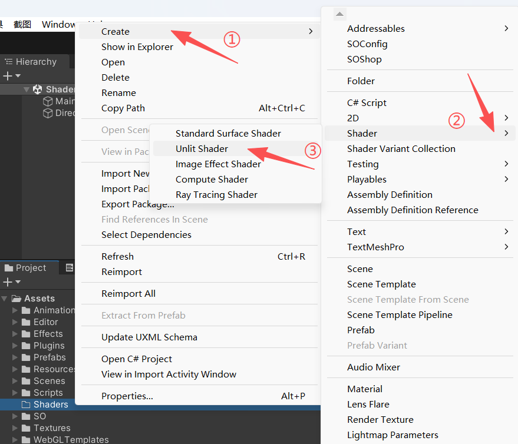
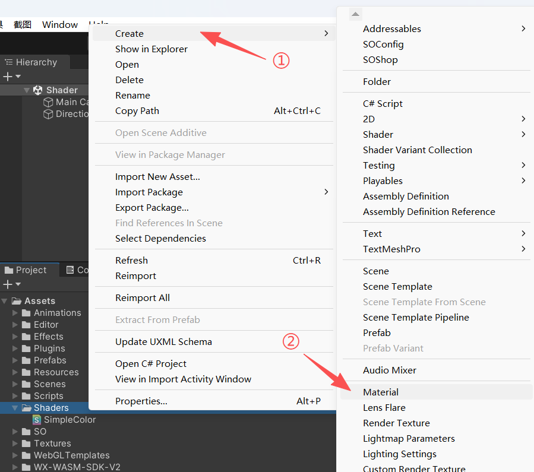
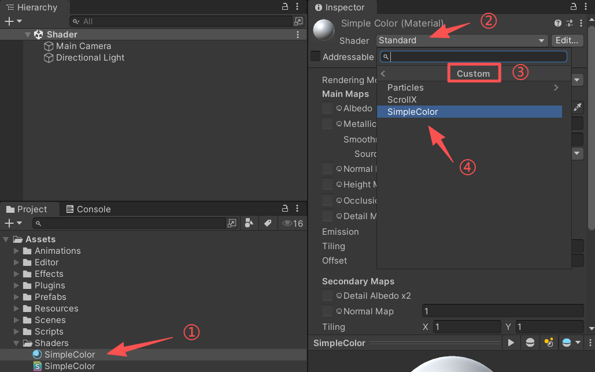

Unity3D Shader 入门知识详解。

<!--more-->

# Unity3D Shader 入门知识

Shader（着色器）对很多 Unity 初学者来说像是“黑魔法”。

实际上，Shader 并没有那么神秘，它本质上就是一段运行在 GPU 上的小程序，用来控制 **屏幕上每个像素的颜色和显示效果**。

本文会写一个最简单的 Shader，并逐步讲解 Shader 的基本结构。

## 什么是 Shader

在 Unity 中，Shader 是材质的核心，它告诉 GPU 如何去渲染一个物体。

我们平常看到的各种特效（发光、透明、水波、卡通描边）都是 Shader 在发挥作用。

Unity 的 Shader 常见有三类：

- **Surface Shader**：Unity 封装的高层次写法，适合快速实现光照材质。
- **Vertex/Fragment Shader**：底层控制方式，可以完全自定义顶点和像素的渲染。
- **Shader Graph**：可视化编辑，拖拽节点即可拼接 Shader。

本文我们先用 **最简单的 Unlit Shader**（无光照）入门。

## Shader 的基本结构

在 Unity 中，一个最基础的 Shader 结构长这样：

```c
Shader "Custom/SimpleColor"
{
    Properties
    {
        _Color ("Main Color", Color) = (1,1,1,1)
    }

    SubShader
    {
        Tags { "RenderType"="Opaque" }
        Pass
        {
            CGPROGRAM
            #pragma vertex vert
            #pragma fragment frag
            #include "UnityCG.cginc"

            fixed4 _Color;

            struct appdata
            {
                float4 vertex : POSITION;
            };

            struct v2f
            {
                float4 pos : SV_POSITION;
            };

            v2f vert (appdata v)
            {
                v2f o;
                o.pos = UnityObjectToClipPos(v.vertex);
                return o;
            }

            fixed4 frag (v2f i) : SV_Target
            {
                return _Color;
            }
            ENDCG
        }
    }
}
```

## 代码解读

### 命名

```c
Shader "Custom/SimpleColor"
```

每个 Shader 都需要一个唯一的名字，格式通常是 `Shader "路径/名字"`。

这里并不是文件路径，而是 **Unity 内部的命名空间**。

在材质球 (Material) 的 **Shader 下拉菜单** 里，这个名字会决定 Shader 的显示位置。

### Properties 块

```c
Properties
{
    _Color ("Main Color", Color) = (1,1,1,1)
}
```

这里定义了材质面板中可调的属性。

- `_Color`：变量名（在 Shader 代码里使用）
- `"Main Color"`：在 Inspector 面板显示的名字
- `Color`：属性类型
- `(1,1,1,1)`：默认值（RGBA = 白色）


### SubShader 与 Pass

- `SubShader`：真正的渲染逻辑写在这里。Unity 会根据显卡选择合适的 SubShader。
- `Pass`：一次渲染指令。复杂 Shader 可能包含多个 Pass，比如一次渲染边缘，一次渲染本体。

### Tags

```c
Tags { "RenderType"="Opaque" }
```

它是一个 **键值对** 集合，用来告诉 Unity 的渲染管线，**这个 Shader 应该被如何分类、排序和处理**。

`"RenderType"` 是 Unity 内置的一个 Shader Tag，用于描述 **材质的大类渲染方式**。

常见取值有：

- `"Opaque"`：**不透明物体**（默认）
- `"Transparent"`：**透明物体**（如玻璃、粒子、UI）
- `"TransparentCutout"`：**透明裁剪物体**（如树叶、围栏，透明部分直接裁掉，没有半透明）

这里使用 `"Opaque"`，Unity 会把它放到 **不透明队列（Queue = Geometry, 2000 左右）** 里进行渲染。

### CGPROGRAM 块

这是 HLSL/CG 代码的区域，包裹在 CGPROGRAM 和 ENDCG 之间。

- `#pragma vertex vert`：指定顶点着色器函数（vert）
- `#pragma fragment frag`：指定片元着色器函数（frag）
- `#include "UnityCG.cginc"`：引入 Unity 提供的一个 HLSL 公共函数/宏库，相当于 C# 里的 `using`，例如下面用到的 `UnityObjectToClipPos` 就是这个库里的函数，把 **模型空间** 转换成 **裁剪空间**，几乎每个 Shader 顶点着色器都要用到。

```c
fixed4 _Color;
```

在代码区域定义的 `_Color` 变量，使用的是 `Properties` 定义的 `_Color` 属性，名称要一致才能获取到。

### 顶点数据 appdata

```c
struct appdata
{
    float4 vertex : POSITION;
};
```

`appdata` 是一个 **输入结构体**，表示从 **CPU → GPU** 传递过来的信息（网格顶点数据），是 GPU **渲染管线的入口数据**。

这里的 **语义标识符**（`: POSITION`）告诉 GPU，`vertex` 对应的是顶点坐标。

Mesh 的每个顶点都会生成一个 `appdata`，送入顶点着色器。

### 顶点着色器 vert

```c
struct v2f
{
    float4 pos : SV_POSITION;
};

v2f vert (appdata v)
{
    v2f o;
    o.pos = UnityObjectToClipPos(v.vertex);
    return o;
}
```

- 输入 `appdata`：包含了模型的顶点数据（位置、法线、UV 等）。
- `UnityObjectToClipPos`：把模型空间的坐标转换到屏幕空间（必须操作）。
- 输出 `v2f`：传递给片元着色器的数据（同 `appdata`，是一个结构体）。


### 片元着色器 frag

```c
fixed4 frag (v2f i) : SV_Target
{
    return _Color;
}
```

- `frag` 决定屏幕上这个像素最终是什么颜色。
- 这里直接返回 `_Color`，所以整个模型就是一块纯色。


## 在 Unity 中测试

新建一个 **Shader 文件**，命名为 `SimpleColor`，粘贴上面的代码。



新建一个 **材质（Material）**，把 Shader 设置为 `Custom/SimpleColor`。





创建一个 Cube，把材质拖到 Cube 上。


在 Inspector 面板调整 `Main Color`，模型就会变成对应的颜色。


