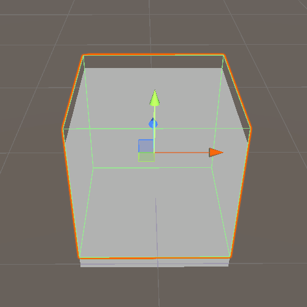
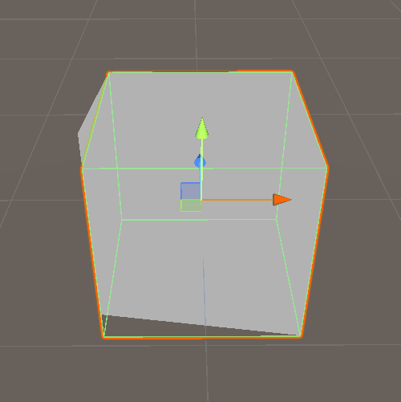

Unity3D Shader 顶点动画示例。

<!--more-->

# Unity3D Shader 顶点动画 呼吸和水波

## 前言

在前面的文章中，我们已经理解了：

- 顶点着色器（vert）负责处理**顶点**
- v2f 是**顶点到片段的数据桥梁**

那么问题来了：

> **既然顶点位置是在 vert 里算的，那我能不能“动”顶点？**

答案是：

**不仅可以，而且这是 Shader 中最常见、性能也很友好的动画方式之一。**

本篇我们将从零开始，实现两个经典效果：

- **呼吸（整体起伏）效果**
- **水波效果**

## 什么是顶点动画

核心思想：**在顶点着色器中，动态修改顶点的位置（vertex），从而让模型“动起来”。**

关键点只有一个：

```c
v.vertex.xyz += 偏移量;
```

这个偏移量，通常和：

- 时间（Time）
- 位置（Position / UV）
- 正弦函数（sin / cos）

有关。

## 最基础的顶点动画框架

我们先看一个**最小可用结构**，在此基础上逐步加效果。

```c
v2f vert(appdata v)
{
    v2f o;

    float4 pos = v.vertex;

    // 在这里修改 pos.xyz
    // pos.y += ...

    o.pos = UnityObjectToClipPos(pos);
    return o;
}
```

注意：**所有顶点动画都发生在 `UnityObjectToClipPos` 之前。**

## 时间变量 _Time

Unity 在 `UnityCG.cginc` 中已经帮我们定义了 `_Time`：

```c
_Time.x = t / 20
_Time.y = t
_Time.z = t * 2
_Time.w = t * 3
```

最常用的是：

```c
_Time.y   // 实际时间（秒）
```

## 示例一：最简单的“呼吸效果”

### 1 思路

- 整个模型 **上下起伏**
- 所有顶点位移相同
- 使用 `sin(Time)`

### 2 Shader 示例（呼吸效果）

```c
Shader "Custom/VertexBreathing"
{
    Properties
    {
        _Amplitude ("Amplitude", Float) = 0.1
        _Speed ("Speed", Float) = 1
        _Color ("Color", Color) = (1,1,1,1)
    }

    SubShader
    {
        Pass
        {
            CGPROGRAM
            #pragma vertex vert
            #pragma fragment frag
            #include "UnityCG.cginc"

            struct appdata
            {
                float4 vertex : POSITION;
            };

            struct v2f
            {
                float4 pos : SV_POSITION;
            };

            float _Amplitude;
            float _Speed;
            fixed4 _Color;

            v2f vert (appdata v)
            {
                v2f o;

                float4 pos = v.vertex;

                // 呼吸动画
                pos.y += sin(_Time.y * _Speed) * _Amplitude;

                o.pos = UnityObjectToClipPos(pos);
                return o;
            }

            fixed4 frag (v2f i) : SV_Target
            {
                return _Color;
            }
            ENDCG
        }
    }
}
```

### 3 效果说明

- `_Amplitude`：起伏高度（幅度）
- `_Speed`：呼吸速度
- 非常适合：
  - UI 图标呼吸
  - Buff 提示
  - 可交互物体高亮



## 示例二：水波效果（顶点错位）

呼吸是“整体动”，水波则是：

**不同位置的顶点，动得不一样**

### 1 核心思路

- 根据 **顶点的 X / Z 位置**
- 叠加 sin 波
- 产生“错位”的波动

```c
sin(Time + position)
```

### 2 Shader 示例（水波）

```c
Shader "Custom/VertexWave"
{
    Properties
    {
        _WaveAmplitude ("Wave Amplitude", Float) = 0.2
        _WaveFrequency ("Wave Frequency", Float) = 2
        _WaveSpeed ("Wave Speed", Float) = 1
        _Color ("Color", Color) = (0.3, 0.6, 1, 1)
    }

    SubShader
    {
        Pass
        {
            CGPROGRAM
            #pragma vertex vert
            #pragma fragment frag
            #include "UnityCG.cginc"

            struct appdata
            {
                float4 vertex : POSITION;
            };

            struct v2f
            {
                float4 pos : SV_POSITION;
            };

            float _WaveAmplitude;
            float _WaveFrequency;
            float _WaveSpeed;
            fixed4 _Color;

            v2f vert (appdata v)
            {
                v2f o;
                float4 pos = v.vertex;

                float wave =
                    sin(pos.x * _WaveFrequency + _Time.y * _WaveSpeed) *
                    sin(pos.z * _WaveFrequency + _Time.y * _WaveSpeed);

                pos.y += wave * _WaveAmplitude;

                o.pos = UnityObjectToClipPos(pos);
                return o;
            }

            fixed4 frag (v2f i) : SV_Target
            {
                return _Color;
            }
            ENDCG
        }
    }
}
```

### 3 效果特点

- 顶点位置不同 → 相位不同
- 形成连续波浪
- 非常适合：
  - 水面
  - 能量场
  - 地面扰动



## 进阶技巧：让边缘动得更小（更自然）

有时你会发现：

> **整个模型一起上下抖，有点“塑料感”**

可以引入一个 **衰减因子**，例如基于高度或 UV。

根据高度衰减：

```c
float factor = saturate(pos.y);
pos.y += wave * factor * _WaveAmplitude;
```

这样：

- 底部几乎不动
- 上部波动更明显


