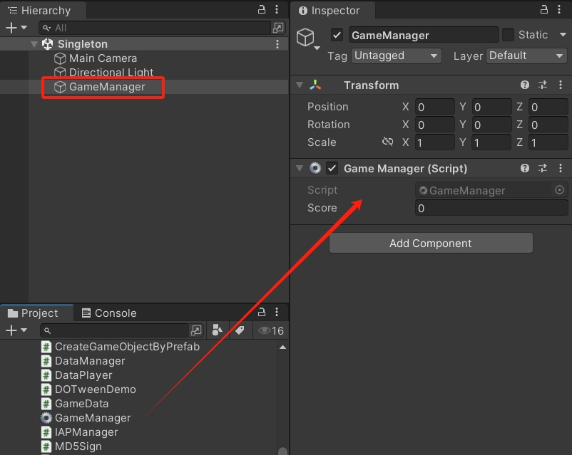
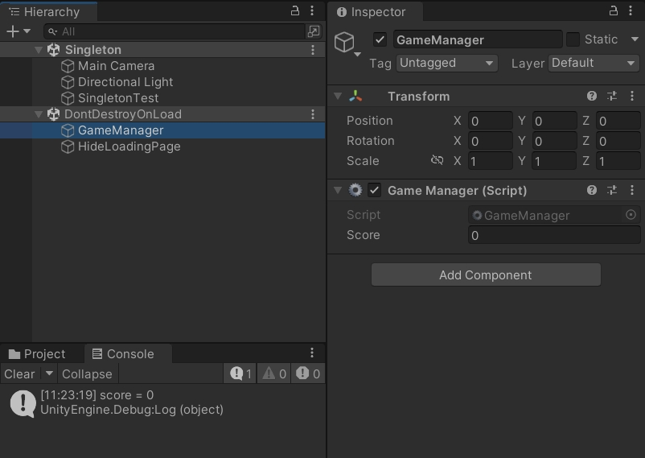
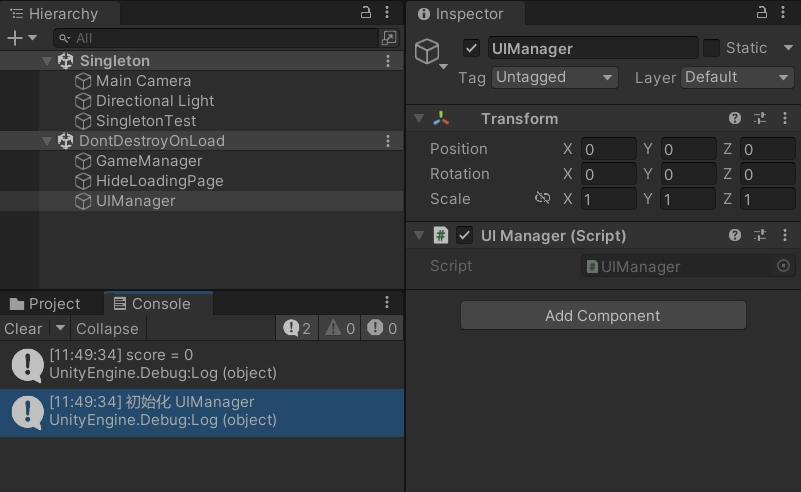

Unity3D 泛型单例

<!--more-->

# 单例模式

单例模式是一种创建型设计模式，能够保证一个类只有一个实例，提供访问实例的全局节点。

通常会把一些管理类设置成单例，例如 `GameManager`、`UIManager` 等，可以很方便地使用这些管理类单例，存储变量和调用接口。

## 手动挂载的泛型单例

创建 `SingletonMono.cs` 脚本，在类名后面添加泛型和约束，定义泛型变量，并且在 `Awake` 方法中对变量进行赋值。

这里的 `Awake` 方法是虚方法，当有管理类继承这个 `SingletonMono` 时，可以重写 `Awake` 方法进行额外的操作。

```csharp
using System.Collections;
using System.Collections.Generic;
using UnityEngine;

public class SingletonMono<T> : MonoBehaviour where T : MonoBehaviour
{
    static T instance;  // 私有静态实例
    public static T Instance { get { return instance; } }  // 公开实例属性

    protected virtual void Awake()
    {
        if (instance == null)
        {
            instance = this as T;
            // 切换场景时不销毁这个游戏物体
            DontDestroyOnLoad(gameObject);
        }
        else
        {
            // 切换场景时，如果场景里有单例游戏物体，在已经创建单例的情况下，销毁多余的游戏物体
            Destroy(gameObject);
        }
    }
}
```

创建 `GameManager.cs` 脚本，继承 `SingletonMono` 这个类。

```csharp
using System.Collections;
using System.Collections.Generic;
using UnityEngine;

public class GameManager : SingletonMono<GameManager>
{
    public int score;

    protected override void Awake()
    {
        // 调用基类的 Awake 方法
        base.Awake();
        // 可以进行额外的初始化操作
        score = 0;
    }

    void Start()
    {
        
    }

    void Update()
    {
        
    }
}
```

在场景中创建游戏物体，把 `GameManager` 脚本手动挂载到游戏物体上。



创建 `SingletonTest.cs` 脚本，简单使用一下 `GameManager.Instance` 单例的变量。

```csharp
using System.Collections;
using System.Collections.Generic;
using UnityEngine;

public class SingletonTest : MonoBehaviour
{
    void Start()
    {
        int score = GameManager.Instance.score;
        Debug.Log($"score = {score}");
    }
}
```

运行游戏，可以看到 `GameManager` 在 `DontDestroyOnLoad` 场景中，可以获取到 `score` 变量进行打印。



## 自动挂载的泛型单例

创建 `SingletonMonoAuto.cs` 脚本，在类名后面添加泛型和约束，定义泛型变量。

因为它并不需要在场景中手动创建游戏物体，也不会通过 `Awake` 方法对变量进行赋值。

所以在获取 Instance 属性时，如果属性为空，就通过代码创建一个不会销毁的游戏物体，并自动挂载单例组件。

```csharp
using System.Collections;
using System.Collections.Generic;
using UnityEngine;

public class SingletonMonoAuto<T> : MonoBehaviour where T : MonoBehaviour
{
    static T instance;  // 私有静态实例

    // 公开实例属性
    public static T Instance
    {
        get
        {
            if (instance == null)
            {
                // 创建一个新的游戏物体
                GameObject obj = new GameObject();
                // 根据类型进行重命名
                obj.name = typeof(T).ToString();
                // 自动挂载单例组件
                instance = obj.AddComponent<T>();
                // 不可销毁
                DontDestroyOnLoad(obj);
            }
            // 返回实例
            return instance;
        }
    }
}
```

创建一个 `UIManager.cs` 脚本，继承 `SingletonMonoAuto` 这个类。

```csharp
using System.Collections;
using System.Collections.Generic;
using UnityEngine;

public class UIManager : SingletonMonoAuto<UIManager>
{
    void Awake()
    {
        Debug.Log("初始化 UIManager");
    }

    void Start()
    {
        
    }

    void Update()
    {
        
    }
}
```

在 `SingletonTest.cs` 脚本，简单使用一下 `UIManager.Instance` 单例。

```csharp
using System.Collections;
using System.Collections.Generic;
using UnityEngine;

public class SingletonTest : MonoBehaviour
{
    void Start()
    {
        int score = GameManager.Instance.score;
        Debug.Log($"score = {score}");

        UIManager uiManager = UIManager.Instance;
    }
}
```

运行游戏，可以看到 `UIManager` 在 `DontDestroyOnLoad` 场景中自动创建。


