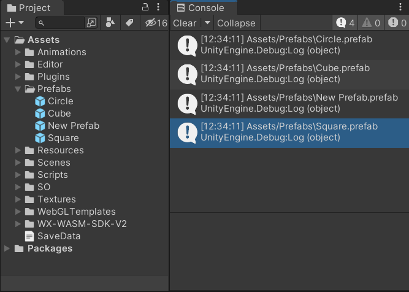
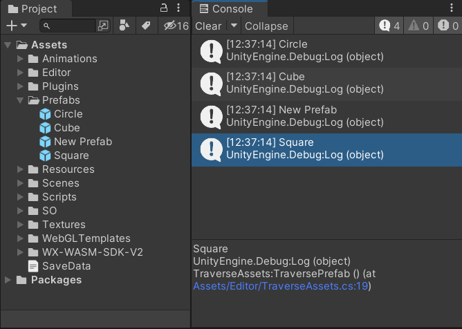
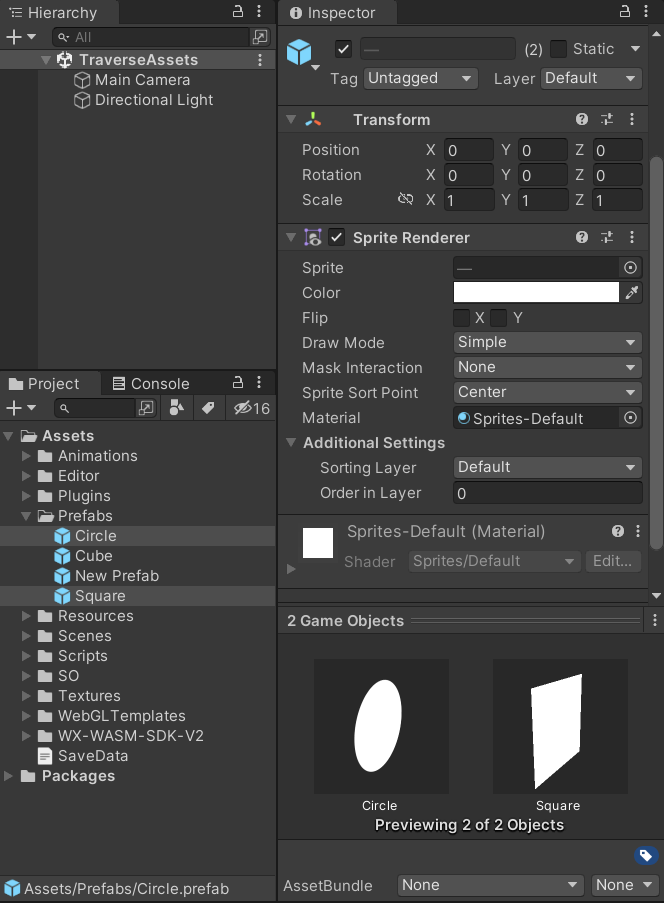
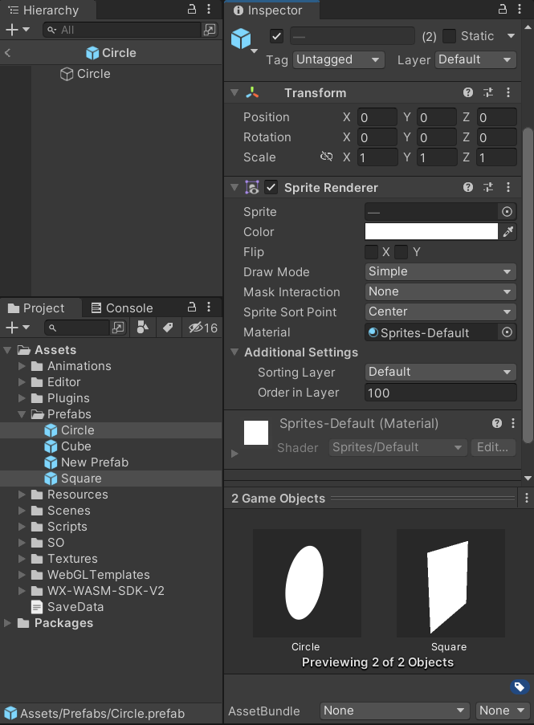
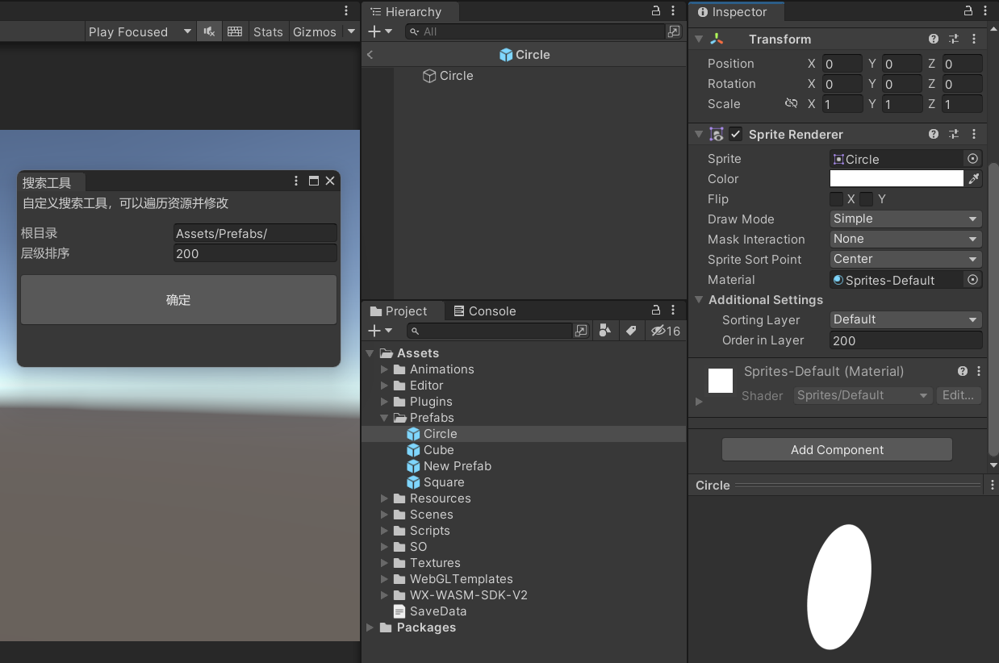

Unity3D 遍历预制体进行批量化处理。

<!--more-->

# 遍历预制体

有时候，我们需要对一些预制体资源进行批量化处理，如果每一个预制体都手动处理，就会耗费很多时间精力，也容易出错。

我们可以写一个脚本遍历预制体，对预制体进行修改，然后保存。

## 遍历文件路径

在 `Editor` 文件夹下创建一个脚本 `TraverseAssets.cs`，包含一个方法 `TraversePrefab`，加上 `MenuItem` 创建一个菜单栏按钮。

使用 `Directory.GetFiles` 方法，传入根目录的路径 path 和通配符 `*.prefab`，表示从 Assets 文件夹下获取所有以 `.prefab` 结尾的文件路径。

```csharp
using System.IO;
using UnityEngine;
using UnityEditor;

public class TraverseAssets
{
    public static string path = "Assets/";

    [MenuItem("搜索工具/遍历预制体")]
    public static void TraversePrefab()
    {
        var allfiles = Directory.GetFiles(path, "*.prefab", SearchOption.AllDirectories);

        foreach (var file in allfiles)
        {
            Debug.Log(file);
        }
    }
}
```

此时，菜单栏就有了<kbd>搜索工具</kbd>-><kbd>遍历预制体</kbd>按钮了。


点击按钮，可以看到控制台打印了预制体的路径信息。



接下来，根据路径信息，加载预制体。

使用 `AssetDatabase.LoadAssetAtPath` 方法，把路径传入，就可以得到一个 `GameObject`。

```csharp
using System.IO;
using UnityEngine;
using UnityEditor;

public class TraverseAssets
{
    public static string path = "Assets/";

    [MenuItem("搜索工具/遍历预制体")]
    public static void TraversePrefab()
    {
        var allfiles = Directory.GetFiles(path, "*.prefab", SearchOption.AllDirectories);

        foreach (var file in allfiles)
        {
            GameObject go = AssetDatabase.LoadAssetAtPath<GameObject>(file);
            if (go)
            {
                Debug.Log(go.name);
            }
        }
    }
}
```

再次点击菜单栏按钮，可以看到控制台打印的是已加载预制体的名称了。



## 修改预制体并保存

假设现在有个需求，搜索带有 `SpriteRenderer` 组件的预制体，把组件上的 `Order in Layer` 统一改成 100。

目前工程中，有两个预制体带有该组件，并且目标参数此时的值为 0。另外两个预制体没有该组件。



修改一下脚本，从加载出来的 `GameObject` 上获取 `SpriteRenderer` 组件，如果存在，则对 `sortingOrder` 进行修改，然后使用 `PrefabUtility.SavePrefabAsset` 方法保存预制体。

在循环结束后，使用 `AssetDatabase.Refresh` 对资源进行刷新。

```csharp
using System.IO;
using UnityEngine;
using UnityEditor;

public class TraverseAssets
{
    public static string path = "Assets/";

    [MenuItem("搜索工具/遍历预制体")]
    public static void TraversePrefab()
    {
        var allfiles = Directory.GetFiles(path, "*.prefab", SearchOption.AllDirectories);

        foreach (var file in allfiles)
        {
            GameObject go = AssetDatabase.LoadAssetAtPath<GameObject>(file);
            if (go)
            {
                SpriteRenderer sr = go.GetComponent<SpriteRenderer>();
                if (sr)
                {
                    sr.sortingOrder = 100;
                }
            }
            PrefabUtility.SavePrefabAsset(go);
        }
        
        AssetDatabase.Refresh();
    }
}
```

点击菜单栏按钮，可以看到预制体已经被修改了，`Order in Layer` 都变成了 100。



至此，我们已经能够遍历资源文件夹，找出预制体，对它们统一进行需求上的处理，并保存修改。

## 编辑窗口

结合上一篇文章《Unity3D 自定义窗口》，我们可以制作一个窗口，把脚本里的一些参数提取出来，方便编辑。

主要是使用 `EditorGUILayout.TextField` 把参数呈现到文本输入框，例如 path 和 sortingOrder，在用户修改了文本输入框的内容后，这两个变量参数也会随之修改，在具体逻辑处使用这两个变量参数即可。

> 注意：因为文本输入框的内容是 string 类型，这里的 sortingOrder 需要使用 `int.Parse` 进行类型转换。

```csharp
using System.IO;
using UnityEngine;
using UnityEditor;

public class TraverseAssets : EditorWindow
{
    public static string path = "Assets/";
    public static string sortingOrder = "100";

    [MenuItem("搜索工具/遍历预制体")]
    public static void OpenWindow()
    {
        // 创建窗口对象
        TraverseAssets window = GetWindow<TraverseAssets>();

        // 设置窗口标题
        window.titleContent = new GUIContent("搜索工具");

        // 显示窗口
        window.Show();
    }

    void OnGUI()
    {
        GUILayout.Label("自定义搜索工具，可以遍历资源并修改");

        GUILayout.Space(10);

        path = EditorGUILayout.TextField("根目录", path);
        sortingOrder = EditorGUILayout.TextField("层级排序", sortingOrder);

        GUILayout.Space(10);

        if (GUILayout.Button("确定", GUILayout.Height(50)))
        {
            TraversePrefab();
        }
    }

    public static void TraversePrefab()
    {
        var allfiles = Directory.GetFiles(path, "*.prefab", SearchOption.AllDirectories);

        foreach (var file in allfiles)
        {
            GameObject go = AssetDatabase.LoadAssetAtPath<GameObject>(file);
            if (go)
            {
                SpriteRenderer sr = go.GetComponent<SpriteRenderer>();
                if (sr)
                {
                    sr.sortingOrder = int.Parse(sortingOrder);
                }
            }
            PrefabUtility.SavePrefabAsset(go);
        }
        
        AssetDatabase.Refresh();
    }
}
```

现在点击菜单栏按钮，就会打开一个编辑窗口，可以修改参数，点击确定按钮就会对预制体进行修改并保存。

我们可以修改根目录，指定某个文件夹路径，对部分预制体进行修改，也可以指定层级排序，不需要修改脚本。



# 小结

使用的方法：

- 遍历资源文件 `Directory.GetFiles`
- 根据路径加载资源 `AssetDatabase.LoadAssetAtPath`
- 保存预制体 `PrefabUtility.SavePrefabAsset`
- 刷新资源 `AssetDatabase.Refresh`

可以制作一个编辑窗口，让参数的编辑更加方便。

除了修改层级排序，还可以替换图片、修改材质等，可以自行扩展功能。
