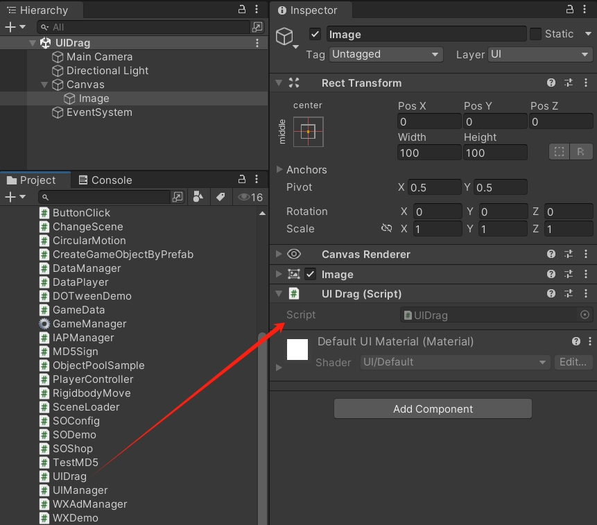
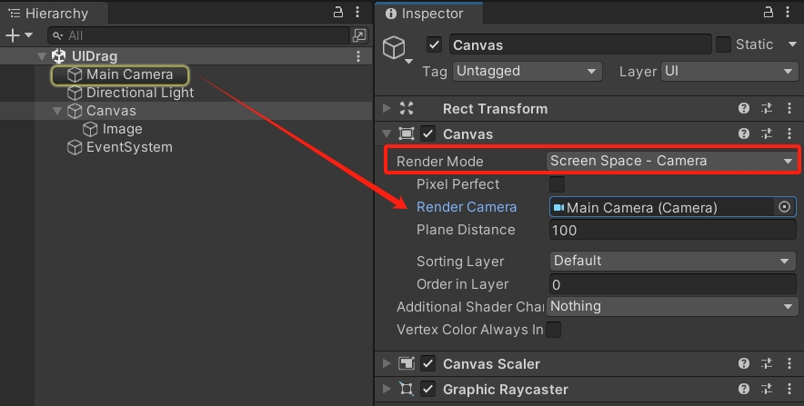
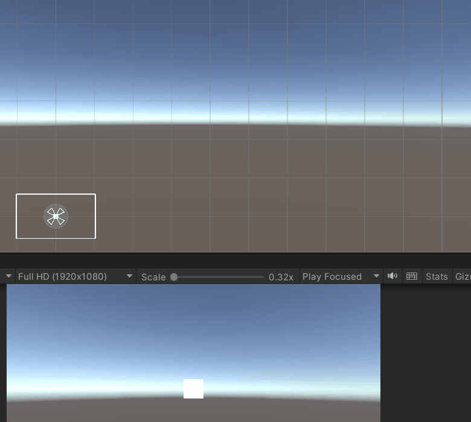
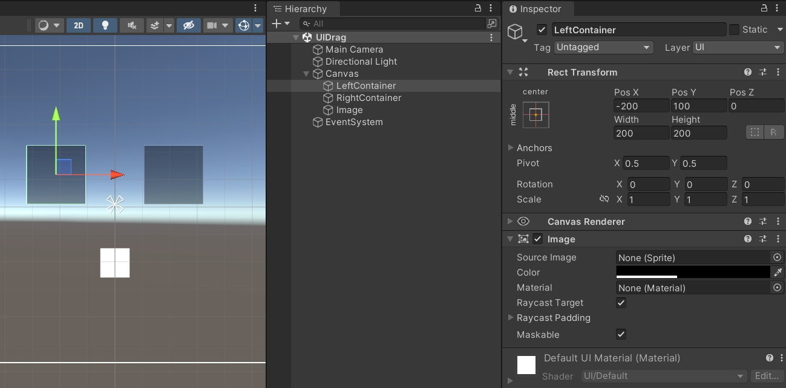
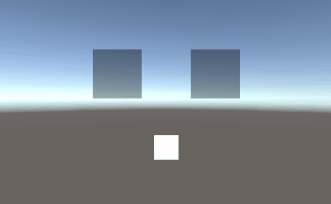

Unity3D 实现 UI 元素拖拽功能。

<!--more-->

# UI 拖拽

通常画布上的 UI 元素都是固定位置的，我们可以通过实现拖拽接口，让 UI 元素可以被拖拽到其他位置。

## 拖拽接口

创建一个脚本 `UIDrag.cs`，在默认继承的 `MonoBehaviour` 后面，再继承三个接口。

- `IBeginDragHandler`（开始拖拽）
- `IDragHandler`（拖拽中）
- `IEndDragHandler`（结束拖拽）

继承接口之后，要在脚本中实现接口中定义的方法，即 `OnBeginDrag`、`OnDrag`、`OnEndDrag`。

```csharp
using UnityEngine;
using UnityEngine.EventSystems;

public class UIDrag : MonoBehaviour, IBeginDragHandler, IDragHandler, IEndDragHandler
{
    public void OnBeginDrag(PointerEventData eventData)
    {
        
    }

    public void OnDrag(PointerEventData eventData)
    {
        transform.position = eventData.position;
    }

    public void OnEndDrag(PointerEventData eventData)
    {
        
    }
}
```

这里先在 `OnDrag` 方法中，把 `eventData.position` 赋值给 `transform.position`。

然后创建一个 Image，把 `UIDrag` 脚本拖拽到 Image 上。



运行游戏，点击拖拽图片。


## 画布渲染模式

上述的拖拽实现，是基于画布的 Overlay 模式。


如果把画布渲染模式改成 Camera 模式，上述的代码实现就会出现问题。

因为 Camera 模式的画布会被缩小到相机的视野范围内，坐标的数值会变得很小。



此时的运行效果，拖拽后图片飞到了离画布很远的位置，坐标错误。



所以我们需要对拖拽时获得的坐标位置进行转换。

## 坐标转换

首先，定义一个 `RectTransform` 变量，在 `Awake` 时进行赋值。

然后利用 `RectTransformUtility.ScreenPointToWorldPointInRectangle` 方法，把自身的 `rect`、`eventData.position`、`eventData.pressEventCamera` 传入，如果坐标转换正常，则会返回转换后的 `worldPoint`，把这个坐标赋值给 `rect.position` 就可以了。

这个方法可以把屏幕空间坐标转换成 UI 元素所在的世界坐标。

```csharp
using UnityEngine;
using UnityEngine.EventSystems;

public class UIDrag : MonoBehaviour, IBeginDragHandler, IDragHandler, IEndDragHandler
{
    RectTransform rect;

    void Awake()
    {
        rect = GetComponent<RectTransform>();
    }

    public void OnBeginDrag(PointerEventData eventData)
    {

    }

    public void OnDrag(PointerEventData eventData)
    {
        if (RectTransformUtility.ScreenPointToWorldPointInRectangle(rect, eventData.position,
        eventData.pressEventCamera, out Vector3 worldPoint))
        {
            rect.position = worldPoint;
        }
    }

    public void OnEndDrag(PointerEventData eventData)
    {
        
    }
}
```

修改代码后，无论画布是 Overlay 还是 Camera 模式，都可以正常拖拽。


## 开始与结束拖拽

单纯的拖拽，只需要 `OnDrag` 方法，而 `OnBeginDrag` 和 `OnEndDrag` 可以为拖拽操作添加更多的逻辑处理。

例如，在场景中添加两个 Image，修改名字，改变颜色和不透明度，放置到左右两边。



然后在代码中添加更多的逻辑，添加一个 `raycastResults` 用于保存射线检测到的 UI 元素列表，通过 `EventSystem.current.RaycastAll` 方法，把鼠标经过的 UI 元素都添加到列表中（包含 Image 自己）。

如果鼠标经过的 UI 元素的名字包含 Container，就把目标元素赋值给 `target`；如果列表中只有 Image 自己，则 `target` 为空。

我们可以在 `OnBeginDrag` 中，把 Image 原来的位置保存起来。在 `OnEndDrag` 中，检查 `target` 为空时，把原来的位置赋值给 Image，回到原位。只有在 `target` 不为空时，Image 才会移动到目标容器位置。

```csharp
using System.Collections.Generic;
using UnityEngine;
using UnityEngine.EventSystems;

public class UIDrag : MonoBehaviour, IBeginDragHandler, IDragHandler, IEndDragHandler
{
    RectTransform rect;

    List<RaycastResult> raycastResults;
    GameObject target;
    Vector3 originPos;

    void Awake()
    {
        rect = GetComponent<RectTransform>();

        raycastResults = new List<RaycastResult>();
    }

    public void OnBeginDrag(PointerEventData eventData)
    {
        originPos = transform.position;
    }

    public void OnDrag(PointerEventData eventData)
    {
        if (RectTransformUtility.ScreenPointToWorldPointInRectangle(rect, eventData.position,
        eventData.pressEventCamera, out Vector3 worldPoint))
        {
            rect.position = worldPoint;
        }

        // 清空上一次的射线检测结果
        raycastResults.Clear();

        // 进行射线检测
        EventSystem.current.RaycastAll(eventData, raycastResults);
        
        // 包含两个 UI 元素以上
        if (raycastResults.Count > 1)
        {
            // 遍历检测结果
            foreach (RaycastResult result in raycastResults)
            {
                // 跳过自身对象的检测
                if (result.gameObject == gameObject) continue;

                // 检测到目标容器
                if (result.gameObject.name.Contains("Container"))
                {
                    target = result.gameObject;
                }
            }
        }
        // 只包含自己，没有目标
        else
        {
            target = null;
        }
    }

    public void OnEndDrag(PointerEventData eventData)
    {
        if (target == null)
        {
            transform.position = originPos;
        }
        else
        {
            transform.position = target.transform.position;
        }
    }
}
```

运行效果：


