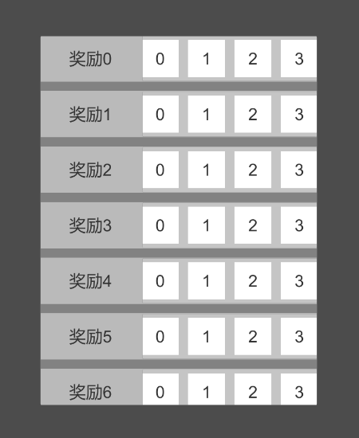

Unity3D 解决 UI 嵌套滚动视图滑动问题。

<!--more-->

# 嵌套滚动视图

## 滑动问题

在游戏开发中，我们常常会遇到一种情况，在一个滚动视图列表中，每个 item 还包含了一个内嵌的滚动视图。

这样，当我们在滑动外层的滚动视图时，如果点击位置在内嵌的滚动视图上，很可能滑不动，内外层滚动视图的滑动事件出现了冲突。

如下图所示，点击位置在奖励文本上时，是可以正常滑动的。但是，点击位置在奖励列表时，滑动方向变成了左右，而不是期望的上下滑动。



## 解决方案

通常的解决方案是，根据拖拽的增量，判断滑动的方向，如果方向与内层的方向相同，则优先滑动内层；如果方向不同，则传递滑动事件给外层的滚动视图。

为此，我们创建一个脚本 `CustomScrollRect.cs`，继承 `ScrollRect`，并重写它的一些方法。

```csharp
using UnityEngine;
using UnityEngine.EventSystems;
using UnityEngine.UI;

public class CustomScrollRect : ScrollRect
{
    protected override void Awake()
    {
        base.Awake();
    }

    public override void OnBeginDrag(PointerEventData eventData)
    {
        base.OnBeginDrag(eventData);
    }

    public override void OnDrag(PointerEventData eventData)
    {
        base.OnDrag(eventData);
    }

    public override void OnEndDrag(PointerEventData eventData)
    {
        base.OnEndDrag(eventData);
    }
    
    public override void OnScroll(PointerEventData eventData)
    {
        base.OnScroll(eventData);
    }
}
```

首先，在 `Awake` 中，获取父节点的 `CustomScrollRect` 组件。

这里使用的 `GetComponentInParent`，会从当前节点开始查找，递归遍历其父节点。

所以要从 `transform.parent` 开始遍历，避免获取到自己身上的 `CustomScrollRect` 组件。

```csharp
using UnityEngine;
using UnityEngine.EventSystems;
using UnityEngine.UI;

public class CustomScrollRect : ScrollRect
{
    CustomScrollRect parent;

    protected override void Awake()
    {
        base.Awake();

        if (parent == null)
        {
            parent = transform.parent.GetComponentInParent<CustomScrollRect>();
        }
    }
    
    // ...
}
```

同时，在类内部定义一个方向枚举，在 `Awake` 时，记录当前的方向。

这里仅判断是水平还是垂直，通常不会有两个方向都能滑动的情况。

```csharp
using UnityEngine;
using UnityEngine.EventSystems;
using UnityEngine.UI;

public class CustomScrollRect : ScrollRect
{
    CustomScrollRect parent;

    enum Direction
    {
        horizontal,
        vertical
    }

    Direction curDirection;
    Direction dragDirection;

    protected override void Awake()
    {
        base.Awake();

        if (parent == null)
        {
            parent = transform.parent.GetComponentInParent<CustomScrollRect>();
        }

        curDirection = horizontal ? Direction.horizontal : Direction.vertical;
    }
    
    // ..
}
```

然后在开始拖拽时，根据 `eventData.delta` 的 `x` 和 `y` 变量增幅哪个较大，判断滑动的方向。

当拖拽的方向和当前方向不同，且有外层滚动视图时，把 `beginDragHandler` 传递给外层，如果不符合条件，则执行自身的 `OnBeginDrag` 事件。

```csharp
using UnityEngine;
using UnityEngine.EventSystems;
using UnityEngine.UI;

public class CustomScrollRect : ScrollRect
{
    // ...

    public override void OnBeginDrag(PointerEventData eventData)
    {
        // 判断拖拽的方向
        dragDirection = Mathf.Abs(eventData.delta.x) > Mathf.Abs(eventData.delta.y)
        ? Direction.horizontal : Direction.vertical;

        // 拖拽的方向和当前方向不同，且有外层滚动视图
        if (dragDirection != curDirection && parent != null)
        {
            // 把 beginDragHandler 传递给外层
            ExecuteEvents.Execute(parent.gameObject, eventData,
            ExecuteEvents.beginDragHandler);

            // 不执行自身的 OnBeginDrag 事件
            return;
        }

        // 执行自身的 OnBeginDrag 事件
        base.OnBeginDrag(eventData);
    }
}
```

依此类推，在其他方法中也加上这样的判断（`dragDirection` 可以仅在开始拖拽时赋值）。

需要注意的是，

- `OnBeginDrag` 方法传递的事件是 `beginDragHandler`
- `OnDrag` 方法传递的事件是 `dragHandler`
- `OnEndDrag` 方法传递的事件是 `endDragHandler`
- `OnScroll` 方法传递的事件是 `scrollHandler`

```csharp
using UnityEngine;
using UnityEngine.EventSystems;
using UnityEngine.UI;

public class CustomScrollRect : ScrollRect
{
    // ...

    public override void OnDrag(PointerEventData eventData)
    {
        if (dragDirection != curDirection && parent != null)
        {
            ExecuteEvents.Execute(parent.gameObject, eventData,
            ExecuteEvents.dragHandler);
            return;
        }
        base.OnDrag(eventData);
    }

    public override void OnEndDrag(PointerEventData eventData)
    {
        if (dragDirection != curDirection && parent != null)
        {
            ExecuteEvents.Execute(parent.gameObject, eventData,
            ExecuteEvents.endDragHandler);
            return;
        }
        base.OnEndDrag(eventData);
    }

    public override void OnScroll(PointerEventData eventData)
    {
        if (dragDirection != curDirection && parent != null)
        {
            ExecuteEvents.Execute(parent.gameObject, eventData,
            ExecuteEvents.scrollHandler);
            return;
        }
        base.OnScroll(eventData);
    }
}
```

## 使用说明

移除掉原来的 `ScrollRect` 组件，换上 `CustomScrollRect` 组件。

记得要拖拽 Viewport 和 Content 节点。

内外层滚动视图都需要换上 `CustomScrollRect` 组件。


最终效果如图：


## 完整代码

`CustomScrollRect.cs`

```csharp
using UnityEngine;
using UnityEngine.EventSystems;
using UnityEngine.UI;

public class CustomScrollRect : ScrollRect
{
    CustomScrollRect parent;

    enum Direction
    {
        horizontal,
        vertical
    }

    Direction curDirection;
    Direction dragDirection;

    protected override void Awake()
    {
        base.Awake();

        if (parent == null)
        {
            parent = transform.parent.GetComponentInParent<CustomScrollRect>();
        }

        curDirection = horizontal ? Direction.horizontal : Direction.vertical;
    }

    public override void OnBeginDrag(PointerEventData eventData)
    {
        // 判断拖拽的方向
        dragDirection = Mathf.Abs(eventData.delta.x) > Mathf.Abs(eventData.delta.y)
        ? Direction.horizontal : Direction.vertical;

        // 拖拽的方向和当前方向不同，且有外层滚动视图
        if (dragDirection != curDirection && parent != null)
        {
            // 把 beginDragHandler 传递给外层
            ExecuteEvents.Execute(parent.gameObject, eventData,
            ExecuteEvents.beginDragHandler);

            // 不执行自身的 OnBeginDrag 事件
            return;
        }

        // 执行自身的 OnBeginDrag 事件
        base.OnBeginDrag(eventData);
    }

    public override void OnDrag(PointerEventData eventData)
    {
        if (dragDirection != curDirection && parent != null)
        {
            ExecuteEvents.Execute(parent.gameObject, eventData,
            ExecuteEvents.dragHandler);
            return;
        }
        base.OnDrag(eventData);
    }

    public override void OnEndDrag(PointerEventData eventData)
    {
        if (dragDirection != curDirection && parent != null)
        {
            ExecuteEvents.Execute(parent.gameObject, eventData,
            ExecuteEvents.endDragHandler);
            return;
        }
        base.OnEndDrag(eventData);
    }

    public override void OnScroll(PointerEventData eventData)
    {
        if (dragDirection != curDirection && parent != null)
        {
            ExecuteEvents.Execute(parent.gameObject, eventData,
            ExecuteEvents.scrollHandler);
            return;
        }
        base.OnScroll(eventData);
    }
}
```
