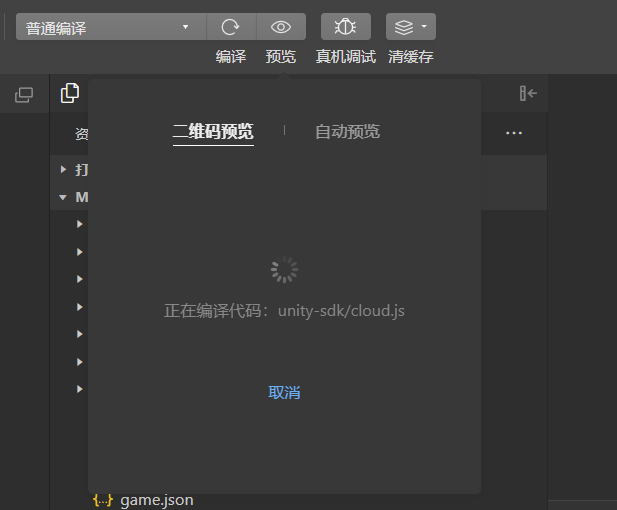

Unity3D 转换微信小游戏指引系列（第一期）

<!--more-->

# 搭建环境

## 安装 WebGL 模块

首先，Unity 要安装<kbd>WebGL Build Support</kbd>模块。

在 Hub 找到安装的引擎，点击设置按钮，点击<kbd>Add modules</kbd>添加模块。

勾选<kbd>WebGL Build Support</kbd>，点击<kbd>Install</kbd>按钮进行下载安装，这里显示已经安装好了。

## 安装微信小游戏转换插件

打开[官方文档](https://gitee.com/wechat-minigame/minigame-unity-webgl-transform)，在<kbd>安装与使用</kbd>一栏，下载 Unity 转换小游戏插件，导入到项目中。

Unity 菜单栏会出现<kbd>微信小游戏</kbd>，点击<kbd>转换小游戏</kbd>可以打开转换窗口。

## 安装微信开发者工具

下载 [微信开发者工具](https://developers.weixin.qq.com/miniprogram/dev/devtools/download.html)，稳定版 [Stable Build](https://developers.weixin.qq.com/miniprogram/dev/devtools/stable.html) (1.06.2405020) [Windows 64](https://dldir1.qq.com/WechatWebDev/release/be1ec64cf6184b0fa64091919793f068/wechat_devtools_1.06.2405020_win32_x64.exe) 即可。

# 注册小程序

在转换窗口可以看到，需要填很多信息。

其中<kbd>游戏 AppID</kbd>需要在[小程序](https://mp.weixin.qq.com/)官网申请注册一个账号。

注册成功后，在<kbd>首页</kbd>-><kbd>小程序发布流程</kbd>-><kbd>小程序类目</kbd>，添加<kbd>服务类目</kbd>，例如休闲游戏。

> 注意：如果没有填写服务类目，打包出来的项目很可能没有小游戏模式，也就没有 `game.js` 文件。

在<kbd>开发管理</kbd>-><kbd>开发设置</kbd>-><kbd>开发者 ID</kbd>可以找到 `AppID`。

# 转换小游戏

把打包平台切换为 `WebGL`。

打开转换窗口，填写<kbd>小游戏项目名</kbd>，<kbd>导出路径</kbd>，<kbd>首包资源加载方式</kbd>改为<kbd>小游戏包内</kbd>。

点击<kbd>生成并转换</kbd>，打包小游戏。

打包完成后，会有两个文件夹，其中 `minigame` 是需要使用<kbd>微信开发者工具</kbd>打开的工程文件，`webgl` 是 Unity 打包 webgl 平台生成的文件。

# 导入项目

打开微信开发者工具，微信扫码登录，选择<kbd>小游戏</kbd>，点击<kbd>导入</kbd>按钮。

导入之后会自动识别在 Unity 转换窗口中填写的 `AppID`。

这里暂时还不需要购买微信云开发，可以先勾选<kbd>不使用云服务</kbd>，点击<kbd>确定</kbd>按钮导入项目。

打开项目，等待编译，就可以看到 Unity 的场景了。

> 注意：如果是第一次使用转换插件，调试器会有报错提示<kbd>插件未授权使用</kbd>，并提供了一个超链接<kbd>添加插件</kbd>，点击超链接开通<kbd>Unity适配插件</kbd>即可。

# 预览

点击上方的<kbd>预览</kbd>按钮，等待编译，完成后会生成一个临时的二维码，微信扫码即可预览。

