Unity3D 转换微信小游戏指引系列（第二期）

<!--more-->

# 云开发

当小游戏打包后的首包占用内存比较大（大约是 14M 左右），<kbd>首包资源加载方式</kbd>就不能选择<kbd>小游戏包内</kbd>了。

这时就需要购买服务器，把首包放到服务器上，在小游戏转换窗口填写<kbd>游戏资源CDN</kbd>。

微信提供了配套的云开发，可以比较方便地购买和使用。

## 购买云开发

在微信开发者工具左上角，找到<kbd>云开发</kbd>按钮，点击打开云开发控制台。

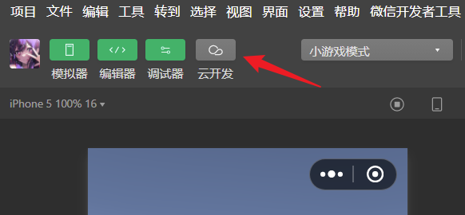

如果是初次开通，可以免费体验一个月。

填写环境名称，选择支付方式，点击<kbd>免费体验 1 个月</kbd>即可。

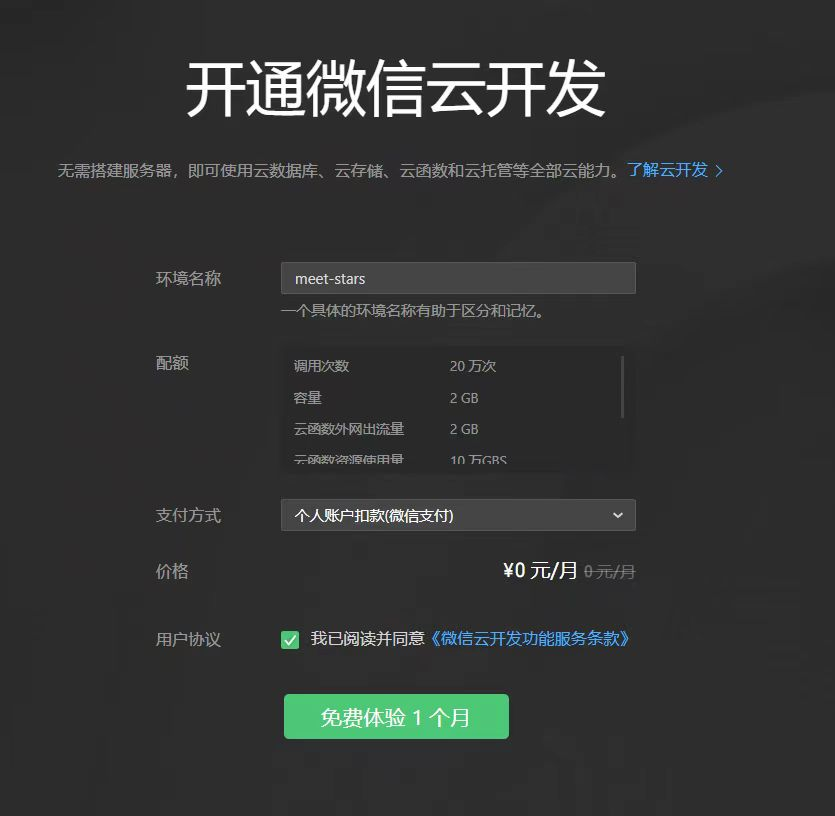

如果没有免费体验，则是每个月 19.9 元。

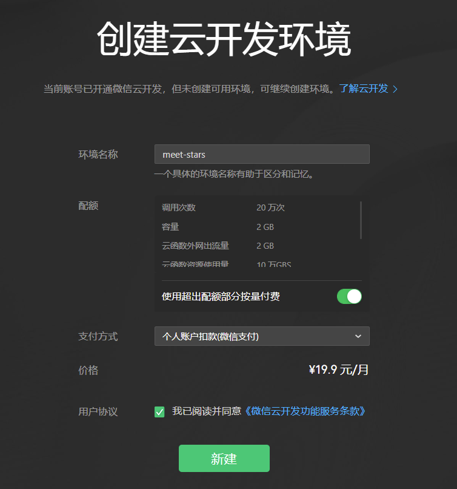

创建好云开发环境后，就可以看到云开发控制台了。

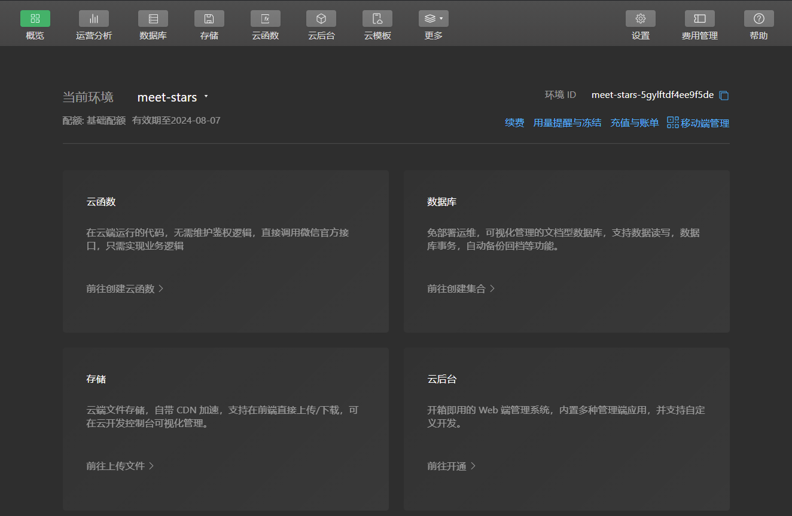

## 查看云开发域名

如果要查看云开发的域名地址，可以先在<kbd>存储</kbd>页面上传一个文件。

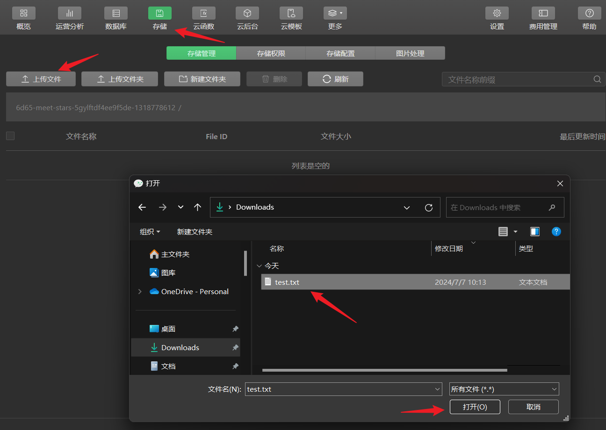

上传后如果页面没有内容，可以点击<kbd>刷新</kbd>按钮。

看到已经上传的文件后，右键点击这个文件，选择<kbd>查看详情</kbd>。

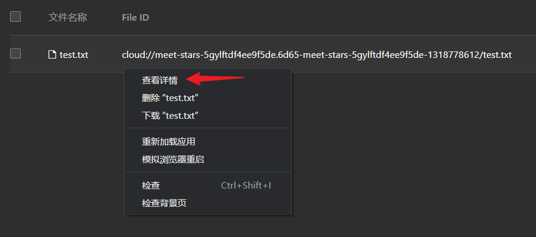

在这个文件的详情页中，可以找到下载地址。

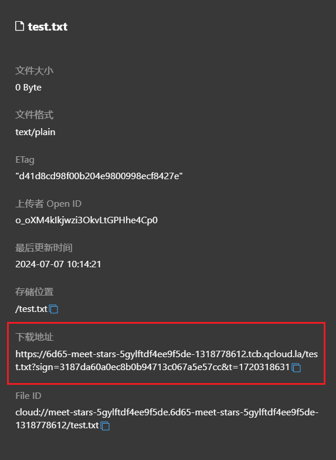

其中，从 https 开头，一直到 .la 结尾，这个地址就是云开发的域名地址了。

```
https://6d65-meet-stars-5gylftdf4ee9f5de-1318778612.tcb.qcloud.la
```

## 设置服务器域名

在[小程序](https://mp.weixin.qq.com/)后台页面，找到<kbd>开发管理</kbd>-><kbd>开发设置</kbd>-><kbd>服务器域名</kbd>，把云开发的域名地址填写到以下几个位置：

- `request` 合法域名
- `uploadFile` 合法域名
- `downloadFile` 合法域名


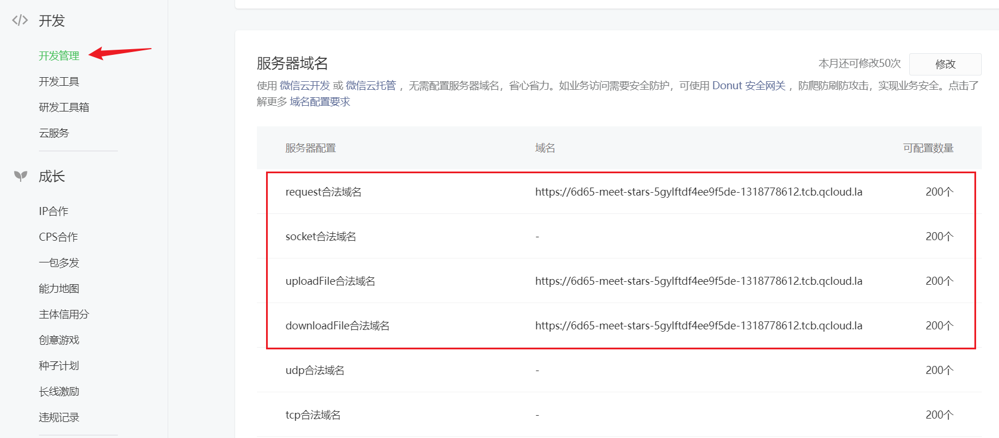

如果没有填写的话，小游戏可能会无法下载到资源，但是打开调试模式又可以下载到资源，<kbd>调试模式</kbd>的区别就是<kbd>不校验域名</kbd>。

> 注意：后续如果有在客户端发起任何网络请求，需要访问外部域名的，都需要在这里添加合法域名的白名单。
>
> 否则，网络请求无效。

## 填写游戏资源 CDN

可以在云开发创建文件夹，区分小游戏版本。

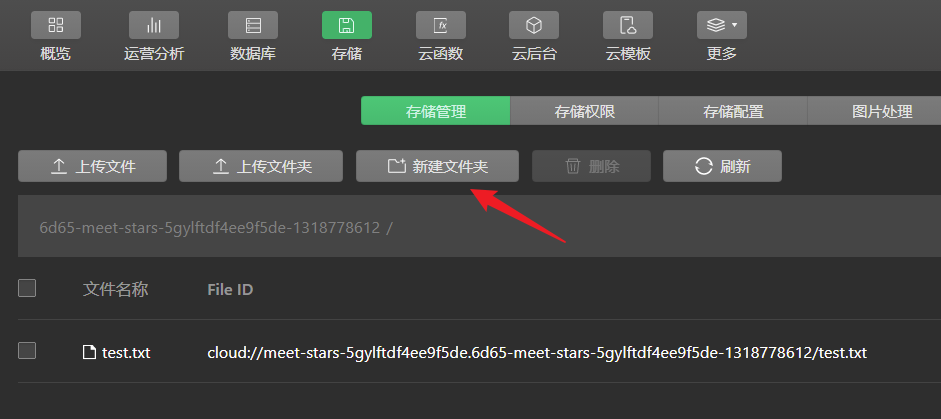

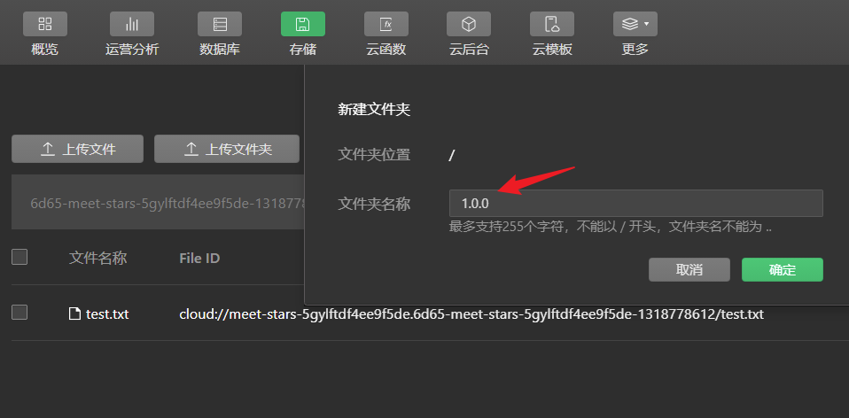

然后在 Unity 的小游戏转换窗口，填写游戏资源 CDN，把<kbd>首包资源加载方式</kbd>改成<kbd>CDN</kbd>。

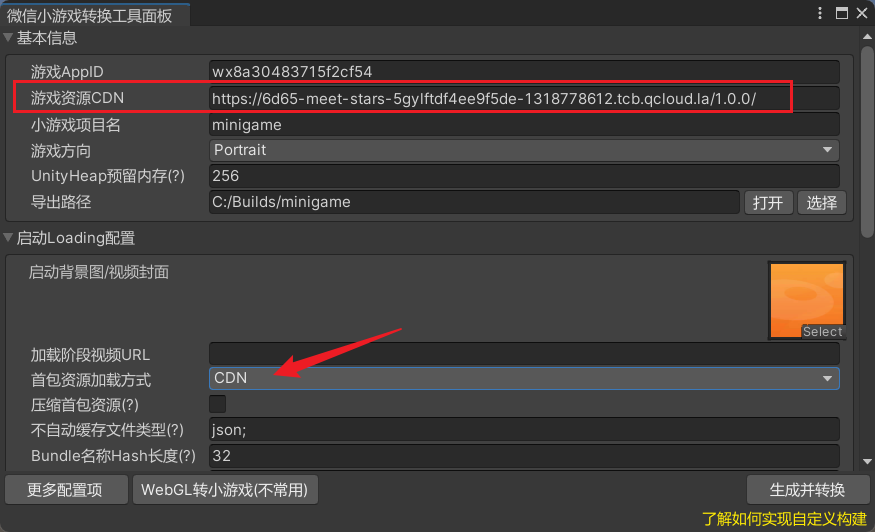

## 上传首包资源

改成 CDN 之后，打包小游戏，就需要在云开发控制台上传首包资源。

在 webgl 文件夹，找到后缀名是 .bin.txt 的文件，上传到 `1.0.0` 文件夹中。

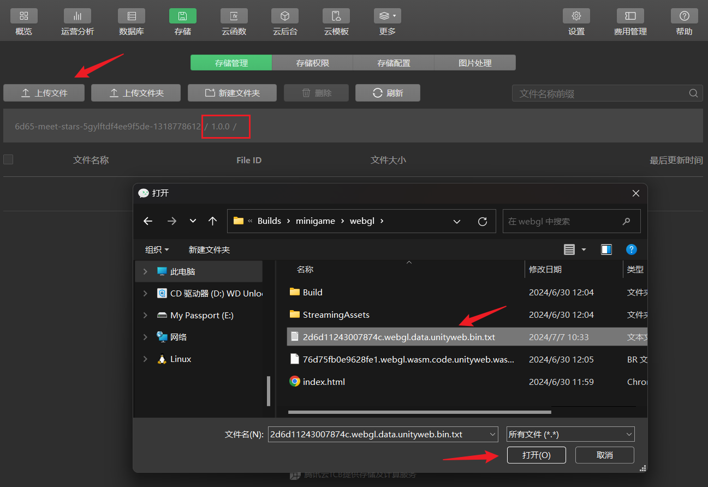

每次更新版本时，都可以创建一个文件夹，例如 `1.0.1`，把新版本的首包资源上传到对应的文件夹中。

# 上传项目

## 开发版本

在微信开发者工具上方的按钮中找到上传按钮，填写<kbd>版本号</kbd>和<kbd>项目备注</kbd>，就可以把项目上传到小游戏账号上了。

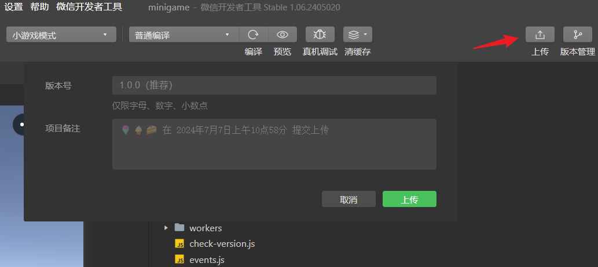

在[小程序](https://mp.weixin.qq.com/)后台页面，找到<kbd>管理</kbd>-><kbd>版本管理</kbd>-><kbd>开发版本</kbd>可以看到已经上传的版本。

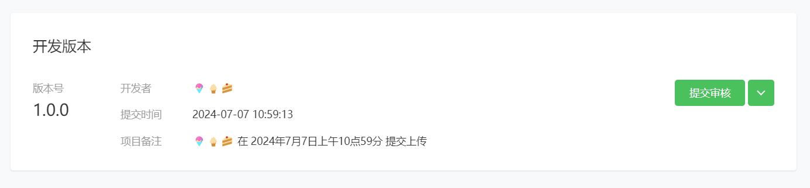

## 体验版本

点击开发版本右侧的下拉按钮，可以看到<kbd>选为体验版本</kbd>的选项。

开发版本只有自己和开发成员可以预览，而体验版本可以给体验成员预览。

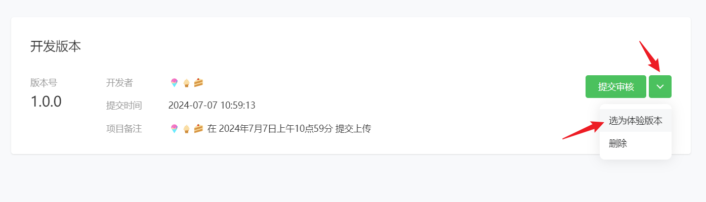

体验版设置可以暂时忽略，直接提交。

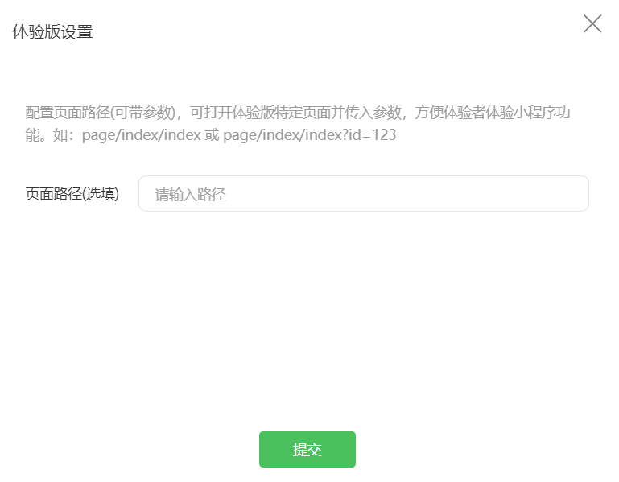

提交后，可以在体验版按钮查看二维码。

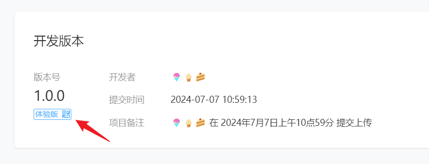

扫码之后打开体验版页面，点击<kbd>前往体验版</kbd>会打开小游戏。

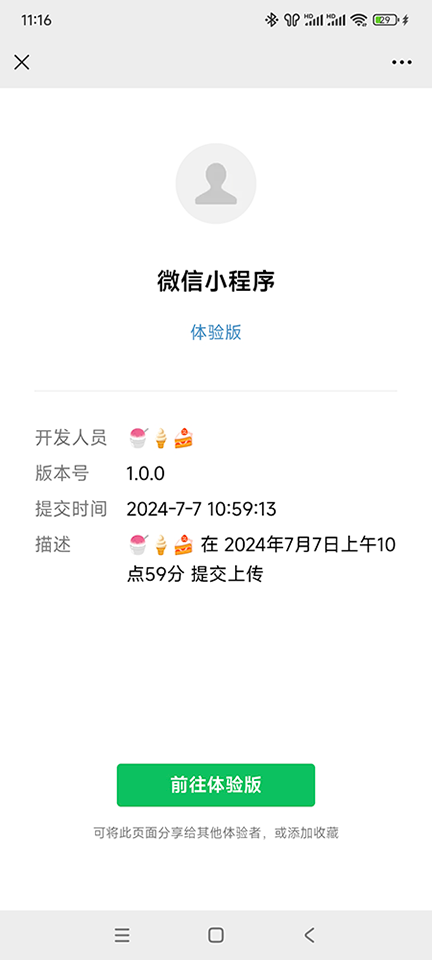

## 添加体验成员

在<kbd>管理</kbd>-><kbd>成员管理</kbd>-><kbd>体验成员</kbd>，可以输入微信号，添加一些体验成员，上限为 15 人。

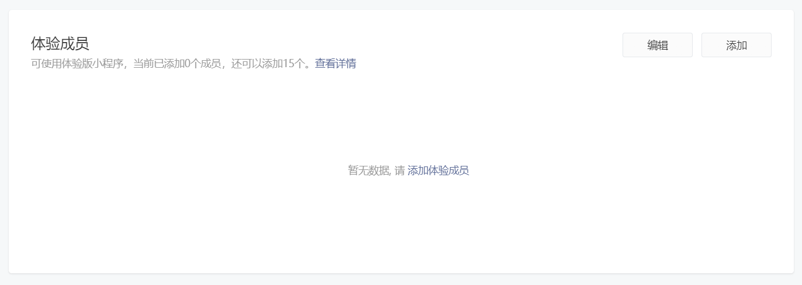

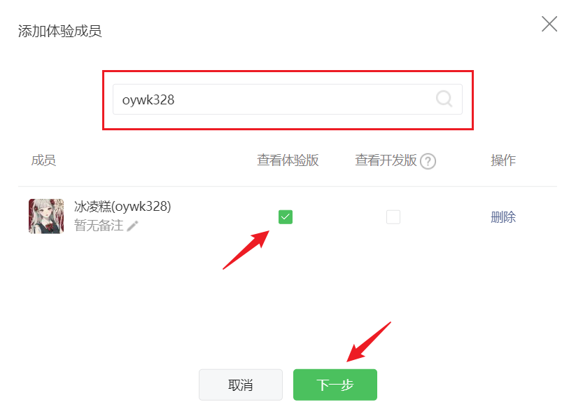

体验成员添加后是不会有通知的，需要自行通知。

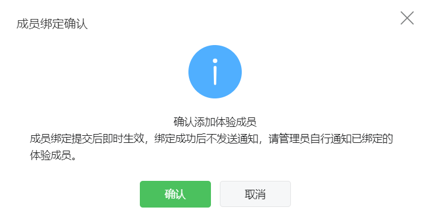

添加成功。

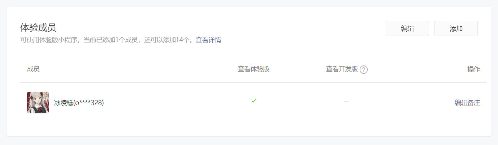
