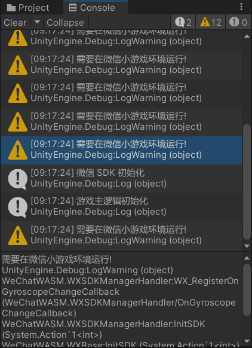
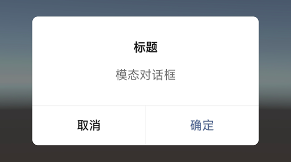
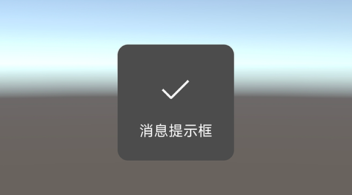

Unity3D 转换微信小游戏指引系列（第三期）

<!--more-->

# 微信SDK

## 初始化

首先，进行 SDK 初始化，需要引用命名空间 `using WeChatWASM`，调用 `WX.InitSDK`，在回调函数中进行游戏主逻辑的初始化。

```c#
using System.Collections;
using System.Collections.Generic;
using UnityEngine;
using WeChatWASM;

public class WXDemo : MonoBehaviour
{
    void Start()
    {
        WX.InitSDK((int code)=>
        {
            Debug.Log("微信 SDK 初始化");
            GameInit();
        });
    }

    void GameInit()
    {
        Debug.Log("游戏主逻辑初始化");
    }
}
```

运行之后，会发现控制台打印了黄色警告。



在 Unity 编辑器中调用微信 SDK 接口，有一些是会报错的，需要加上宏定义。

测试的时候需要打包出来，在微信小游戏环境中运行。

```c#
using System.Collections;
using System.Collections.Generic;
using UnityEngine;

#if UNITY_WEBGL
using WeChatWASM;
#endif

public class WXDemo : MonoBehaviour
{
    void Start()
    {
// 编辑器环境
#if UNITY_EDITOR
        GameInit();
#else

// WebGL 环境
#if UNITY_WEBGL
        WX.InitSDK((int code)=>
        {
            Debug.Log("微信 SDK 初始化");
            GameInit();
        });
#endif

#endif
    }

    void GameInit()
    {
        Debug.Log("游戏主逻辑初始化");
    }
}
```

## 监听切前台或后台事件

切前台事件使用 `OnShow` 监听，切后台事件使用 `OnHide` 监听，只需要绑定一次监听事件。

具体返回的参数 result 可以看接口的注释。

```c#
// WebGL 环境
#if UNITY_WEBGL
        WX.InitSDK((int code)=>
        {
            Debug.Log("微信 SDK 初始化");
            GameInit();
        });

        WX.OnShow((OnShowListenerResult result)=>
        {
            Debug.Log("微信切前台事件");
        });

        WX.OnHide((GeneralCallbackResult result)=>
        {
            Debug.Log("微信切后台事件");
        });
#endif
```

## 获取系统参数

获取运行时系统的信息，例如获取系统平台（android 或 ios），有成功、失败、完成三个回调。

```c#
// WebGL 环境
#if UNITY_WEBGL
        // ...
        WX.GetSystemInfo(new GetSystemInfoOption
        {
            // 成功回调
            success = (systemInfo)=>
            {
                Debug.Log($"系统平台 {systemInfo.platform}");
            },
            // 失败回调
            fail = (generalCallbackResult)=>
            {
                Debug.Log($"获取系统信息失败，错误信息 {generalCallbackResult.errMsg}");
            },
            // 完成回调（不论成功或失败都会执行）
            complete = (generalCallbackResult)=>
            {
                Debug.Log($"获取系统信息完成，是否有错误信息 {generalCallbackResult.errMsg}");
            }
        });
#endif
```

## 询问用户授权

询问用户是否授权用户信息，先通过 `WX.GetSetting` 获取用户的当前设置，判断是否授权过。

若没有授权，再调用 `WX.Authorize` 发起授权弹窗询问，填写 scope 的参数（具体填什么参数可以参考 [scope 列表](https://developers.weixin.qq.com/minigame/dev/guide/base-ability/authorize.html#scope-%E5%88%97%E8%A1%A8)）。

```c#
// WebGL 环境
#if UNITY_WEBGL
        // ...
        // 获取用户的当前设置
        WX.GetSetting(new GetSettingOption
        {
            // 成功回调
            success = (res)=>
            {
                bool hasUserInfo = res.authSetting.ContainsKey("scope.userInfo");
                // 接受过授权
                if (hasUserInfo)
                {
                    Debug.Log("用户已经接受过授权了");
                }
                // 没有接受过授权
                else
                {
                    // 发起授权询问
                    WX.Authorize(new AuthorizeOption
                    {
                        // 需要获取的权限
                        scope = "scope.userInfo",
                        // 成功回调
                        success = (generalCallbackResult)=>
                        {
                            Debug.Log($"获取授权成功，是否有错误信息 {generalCallbackResult.errMsg}");
                        },
                        // 失败回调
                        fail = (generalCallbackResult)=>
                        {
                            Debug.Log($"获取授权失败，错误信息 {generalCallbackResult.errMsg}");
                        },
                        // 完成回调（不论成功或失败都会执行）
                        complete = (generalCallbackResult)=>
                        {
                            Debug.Log($"获取授权完成，是否有错误信息 {generalCallbackResult.errMsg}");
                        }
                    });
                }
            },
            // 失败回调
            fail = (generalCallbackResult)=>
            {
                Debug.Log($"获取用户的当前设置失败，错误信息 {generalCallbackResult.errMsg}");
            },
            // 完成回调（不论成功或失败都会执行）
            complete = (generalCallbackResult)=>
            {
                Debug.Log($"获取用户的当前设置完成，是否有错误信息 {generalCallbackResult.errMsg}");
            }
        });
#endif
```


> 注：这里需要注意，如果代码里有调用授权接口，就需要到[小程序](https://mp.weixin.qq.com/)官网，找到<kbd>设置</kbd>-><kbd>基本设置</kbd>-><kbd>服务内容声明</kbd>，填写<kbd>用户隐私保护指引</kbd>。
>
> 如果在指定期限内没有填写，小游戏的部分功能会被限制使用。

## 提示框

`WX.ShowModal` 可以弹出一个模态对话框，附带一个确定和一个取消按钮。

`WX.ShowToast` 可以弹出一个消息提示框，没有按钮。

```c#
// WebGL 环境
#if UNITY_WEBGL
        WX.ShowModal(new ShowModalOption
        {
            title = "标题",
            content = "模态对话框",
            success = (res)=>
            {
                if (res.confirm)
                {
                    Debug.Log("点击了确定按钮");
                    WX.ShowToast(new ShowToastOption
                    {
                        title = "消息提示框"
                    });
                }
                else if (res.cancel)
                {
                    Debug.Log("点击了取消按钮");
                }
            }
        });
#endif
```

模态对话框



消息提示框


