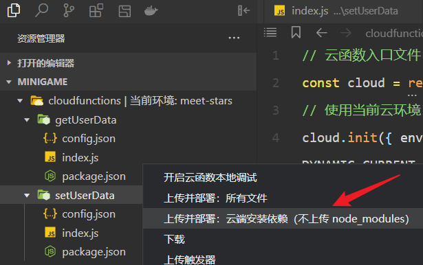

Unity3D 转换微信小游戏指引系列（第四期）

<!--more-->

# 云存档

## 数据库集合

在云开发页面打开<kbd>数据库</kbd>，在左侧栏创建一个集合，例如 `UserData`。


## 云函数配置

### 添加文件夹

在微信开发者工具打开的项目文件中找到 `project.config.json`，添加一个字段：

```json
{
  ...
  "cloudfunctionRoot": "cloudfunctions/"
}
```

添加位置如图：


然后在项目中创建一个 `cloudfunctions` 文件夹。


### 新建云函数

右键点击 `cloudfunctions` 文件夹，选择<kbd>新建 Node.js 云函数</kbd>，设置云函数名称，例如 `setUserData`、`getUserData`。


创建云函数后，它的文件夹下会有三个文件：

- `config.json`
- `index.js`
- `package.json`

### 云函数代码

打开 `setUserData` 的 `index.js`，修改代码：

```javascript
// 云函数入口文件
const cloud = require('wx-server-sdk')
// 使用当前云环境
cloud.init({ env: cloud.DYNAMIC_CURRENT_ENV })

// 获取数据库
const db = cloud.database();
const userData = db.collection('UserData');

// 云函数入口函数
exports.main = async (event, context) => {
  const wxContext = cloud.getWXContext()

  // 查询用户是否已经保存过数据
  let hasData = await userData.where({
    openid: wxContext.OPENID
  }).get();

  // 没有数据，首次保存
  if (hasData.data.length == 0){
    let addData = {
      openid: wxContext.OPENID,
      gamedata: event
    }
    let isAdd = await userData.add({
      data: addData
    })
    return{
      code: 0,
      res: isAdd,
      data: addData
    }
  }
  // 有数据，更新
  else{
    return await userData.where({
      openid: wxContext.OPENID
    }).update({
      data: {
        openid: wxContext.OPENID,
        gamedata: event
      }
    })
  }
}
```

打开 `getUserData` 的 `index.js`，修改代码：

```javascript
// 云函数入口文件
const cloud = require('wx-server-sdk')
// 使用当前云环境
cloud.init({ env: cloud.DYNAMIC_CURRENT_ENV })

// 获取数据库
const db = cloud.database();
const userData = db.collection('UserData');

// 云函数入口函数
exports.main = async (event, context) => {
  const wxContext = cloud.getWXContext()

  // 查询用户是否已经保存过数据
  let hasData = await userData.where({
    openid: wxContext.OPENID
  }).get();

  // 没有数据，返回 code 0
  if (hasData.data.length == 0){
    return{
      code: 0
    }
  }
  // 有数据，返回存档
  else{
    return{
      data: hasData.data[0]
    }
  }
}
```

> 注意：云函数代码中有一行 `const userData = db.collection('UserData');`
>
> 这里传入的集合名称 UserData 要和最开始创建的集合名称一致。

### 上传并部署

保存好 `index.js` 代码之后，右键点击云函数文件夹，选择<kbd>上传并部署：云端安装依赖</kbd>，之后就可以在云开发的<kbd>云函数</kbd>页面看到上传的云函数了。




## 调用云函数

有了数据库集合和云函数之后，还需要在 C# 代码里初始化云环境，并通过接口调用云函数。

在调用云函数之前，必须先 `初始化云函数`，填入 `云开发的环境 ID`。

```c#
WX.cloud.Init(new CallFunctionInitParam()
{
    env = "meet-stars-5gylftdf4ee9f5de",
    traceUser = false
});
```

这里的 `云开发的环境 ID`，在云开发概览页面，可以找到。


### 上传存档

在需要上传存档时，可以调用 `setUserData`，把玩家数据转成 json，传入 data 中。

```c#
string json = "{ \"player_id\": 1001 }";
WX.cloud.CallFunction(new CallFunctionParam()
{
    name = "setUserData",
    data = json,
});
```

调用成功后，可以看到数据库中就生成了一份存档。


### 下载存档

在需要下载存档时，可以调用 `getUserData`，在 success 回调函数中，获得 `res.result`。

> 注意：下载存档时，data 参数是没有作用的，但是需要传一个 json，否则会报错。

```c#
WX.cloud.CallFunction(new CallFunctionParam()
{
    name = "getUserData",
    data = "{\"player_data\":0}",  // 这里的 data 需要随便传一个 json，否则会报错
    success = (res) => 
    {
        Debug.Log($"获取云存档成功 {res.result}");
    },
    fail = (res) =>
    {
        Debug.Log($"获取云存档失败 {res.result}");
    },
});
```

打印出来的 `res.result` 的结构如下，这个结构其实是在写云函数时定义的，在 data 中包含了 openid 和 gamedata，其他字段是自动生成的。

```json
{
    "data": {
        "_id": "3f275c25669c7a3a001f15ce7106ca54",
        "openid": "...",
        "gamedata": {
            "player_id": 1001,
            "tcbContext": {},
            "userInfo": {
                "appId": "...",
                "openId": "..."
            }
        }
    }
}
```

由于上传存档时，只是上传了一个包含 player_id 的 json，存放在 gamedata 字段中，实际取用时，应该把 gamedata 解析出来。

可以使用 LitJson 库，调用 `JsonMapper.ToObject` 方法把 json 字符串转成 `JsonData` 对象，判断对象的字典中是否存在 data 字段，以此来判断是否拿到了完整的云存档，并从中取出 gamedata 对应的值。

```c#
using LitJson;  // 需要引用命名空间

WX.cloud.CallFunction(new CallFunctionParam()
{
    name = "getUserData",
    data = "{\"player_data\":0}",
    success = (res) => 
    {
        Debug.Log($"获取云存档成功 {res.result}");
        var jsonData = JsonMapper.ToObject(res.result);
        // 云存档有 data，解析 json 并取出 gamedata
        if (jsonData.ContainsKey("data"))
        {
            var allData = jsonData["data"];
            // 取出 gamedata
            var gameData = allData["gamedata"].ToJson();
            Debug.Log($"gameData = {gameData}");
        }
        // 云存档没有 data，说明数据库没有存档
        else
        {
            Debug.Log("云存档没有 data，说明数据库没有存档");
        }
    },
    fail = (res) =>
    {
        Debug.Log($"获取云存档失败 {res.result}");
    },
});
```

