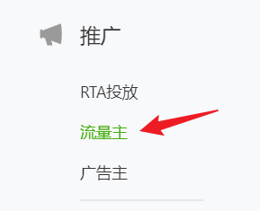
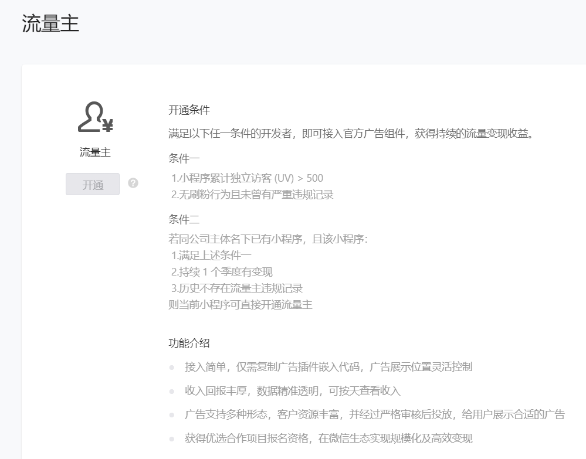
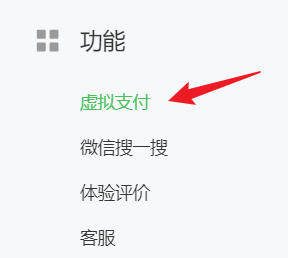
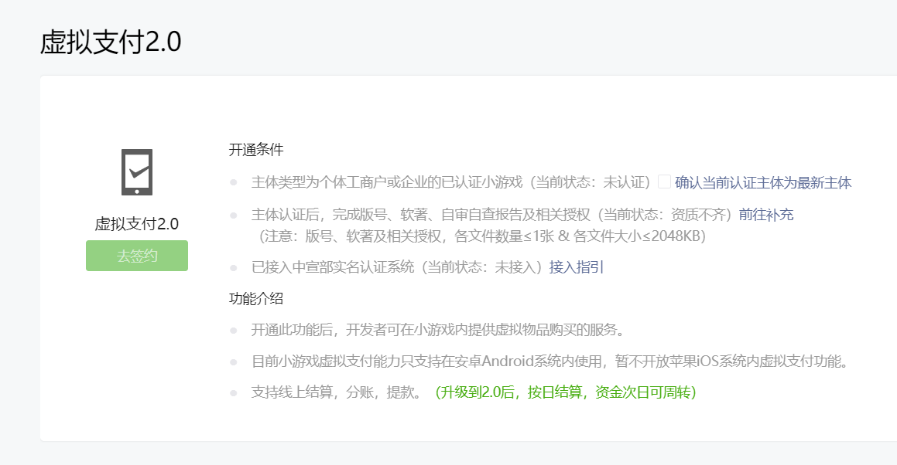

Unity3D 转换微信小游戏指引系列（第五期 完结）

<!--more-->

# 广告

在小程序后台页面找到<kbd>推广</kbd>-><kbd>流量主</kbd>



开通条件如下：



开通之后，需要接入广告组件。

调用创建广告组件的接口时，需要传入参数 `adUnitId`，这个是开通流量主之后可以获得的。

> 注意：广告组件是一个单例，仅需创建一次，监听事件也仅需注册一次，否则会有多次回调。

可以创建一个 `WXAdManager`，提供初始化、显示广告的接口，关闭广告时，判断广告是否完整播放，并调用奖励回调。

```c#
using System;
using System.Collections;
using System.Collections.Generic;
using UnityEngine;
using WeChatWASM;

public class WXAdManager : MonoBehaviour
{
    static WXAdManager instance;
    public static WXAdManager Instance
    {
        get { return instance; }
    }

    WXRewardedVideoAd ad;    // 广告单例
    Action rewardCallback;   // 奖励回调

    void Awake()
    {
        if (instance != null)
        {
            Destroy(gameObject);
        }
        else
        {
            instance = this;
        }
    }

    public void Init()
    {
        ad = WX.CreateRewardedVideoAd(new WXCreateRewardedVideoAdParam()
        {
            adUnitId = "..." // 自己申请的广告单元 ID
        });

        ad.OnLoad((res) =>
        {
            Debug.Log($"广告加载 = {res.errMsg}");
        });
        ad.OnError((res) =>
        {
            Debug.Log($"广告错误 = {res.errMsg}");
        });
        ad.OnClose((res) =>
        {
            Debug.Log($"广告关闭  是否看完 = {res.isEnded}");
            OnPlayEnd(res.isEnded);
        });
    }

    /// <summary>
    /// 显示广告
    /// </summary>
    /// <param name="callback">看完广告后的回调</param>
    public void ShowAd(Action callback)
    {
        Debug.Log("显示广告");
        ad.Show();
        rewardCallback = callback;
    }

    /// <summary>
    /// 广告看完回调
    /// </summary>
    /// <param name="isEnd">是否看完</param>
    void OnPlayEnd(bool isEnd)
    {
        if (isEnd)
        {
            Debug.Log("完整看完广告");
            rewardCallback?.Invoke();
        }
        else
        {
            Debug.Log("没有看完广告");
        }
    }
}
```

使用时，先进行初始化，要在微信 SDK 初始化之后调用。

```c#
using System.Collections;
using System.Collections.Generic;
using UnityEngine;
using WeChatWASM;

public class WXDemo : MonoBehaviour
{
    void Start()
    {
        WX.InitSDK((int code)=>
        {
            Debug.Log("微信 SDK 初始化");
            WXAdManager.Instance.Init();
            GameInit();
        });
    }

    void GameInit()
    {
        Debug.Log("游戏主逻辑初始化");
    }
}
```

在具体逻辑的位置，调用显示广告的接口，并传入奖励回调函数。

```c#
WXAdManager.Instance.ShowAd(()=>
{
    // 奖励回调
    Debug.Log("广告完整播放，发放奖励");
});
```

# 内购

在小程序后台页面找到<kbd>功能</kbd>-><kbd>虚拟支付</kbd>



开通条件如下：



开通之后，可以接入米大师安卓支付，iOS 系统暂时不支持。

可以创建一个 `IAPManager`，提供购买的接口，支付成功时，根据产品 ID 发放奖励，也可以调用奖励回调。

> 这里需要判断运行平台 `platform` 是安卓，如何获取 `platform` 参数，可以参考之前的文章《Unity3D 转换微信小游戏指引 03 微信SDK》里面的<kbd>获取系统参数</kbd>部分。

在调用支付接口时，参数 `offerId` 是开通虚拟支付后可以获得的。

需要特别注意的是，参数 `buyQuantity` 是有限制的，具体限制可以参考 [buyQuantity 限制说明](https://developers.weixin.qq.com/minigame/dev/api/midas-payment/wx.requestMidasPayment.html#buyQuantity-%E9%99%90%E5%88%B6%E8%AF%B4%E6%98%8E)。

```c#
using System;
using System.Collections;
using System.Collections.Generic;
using UnityEngine;
using WeChatWASM;

public class IAPManager : MonoBehaviour
{
    static IAPManager instance;
    public static IAPManager Instance
    {
        get { return instance; }
    }

    public string platform;          // 运行平台
    public int buyQuantityMul = 10;  // 购买数量的倍数
    Action rewardCallback;           // 奖励回调

    void Awake()
    {
        if (instance != null)
        {
            Destroy(gameObject);
        }
        else
        {
            instance = this;
        }
    }

    /// <summary>
    /// 发起支付
    /// </summary>
    /// <param name="productID">产品 ID</param>
    /// <param name="callback">支付成功的回调函数</param>
    public void Purchase(string productID, Action callback)
    {
        rewardCallback = callback;

        // 安卓平台
        if ("android".Equals(platform))
        {
            // 价格需要读表，此处只做演示
            double price = 1;

            // 规则：buyQuantity * 游戏币单价（0.1元） = 限定的价格等级
            // 例如：购买价格为 1 元，需要乘以 10，计算出 buyQuantity = 10
            // 此时 buyQuantity = 10 满足上述规则，即 10 * 0.1 = 1（限定的价格等级）
            double quantity = price * buyQuantityMul;

            // 米大师支付
            WX.RequestMidasPayment(new RequestMidasPaymentOption()
            {
                currencyType = "CNY",      // 币种
                mode = "game",             // 类型
                offerId = "...",           // 在米大师侧申请的应用 id
                buyQuantity = quantity,    // 购买数量 mode=game 时必填
                env = 0,                   // 0: 米大师正式环境  1: 米大师沙箱环境
                success = (res) =>
                {
                    PurchaseSuccessful(productID);
                },
                fail = (res) =>
                {
                    Debug.Log($"购买失败 = {res.errMsg}");
                }
            });
        }
        else
        {
            Debug.Log("暂不支持内购");
        }
    }

    /// <summary>
    /// 购买成功
    /// </summary>
    /// <param name="productID">产品 ID</param>
    void PurchaseSuccessful(string productID)
    {
        Debug.Log($"购买 {productID} 成功，发放奖励");
        rewardCallback?.Invoke();
    }
}
```

在具体逻辑的位置，调用发起支付的接口，并传入支付成功的回调函数。

```c#
IAPManager.Instance.Purchase("1001", ()=>
{
    // 奖励回调
    Debug.Log("支付成功，发放奖励");
});
```
